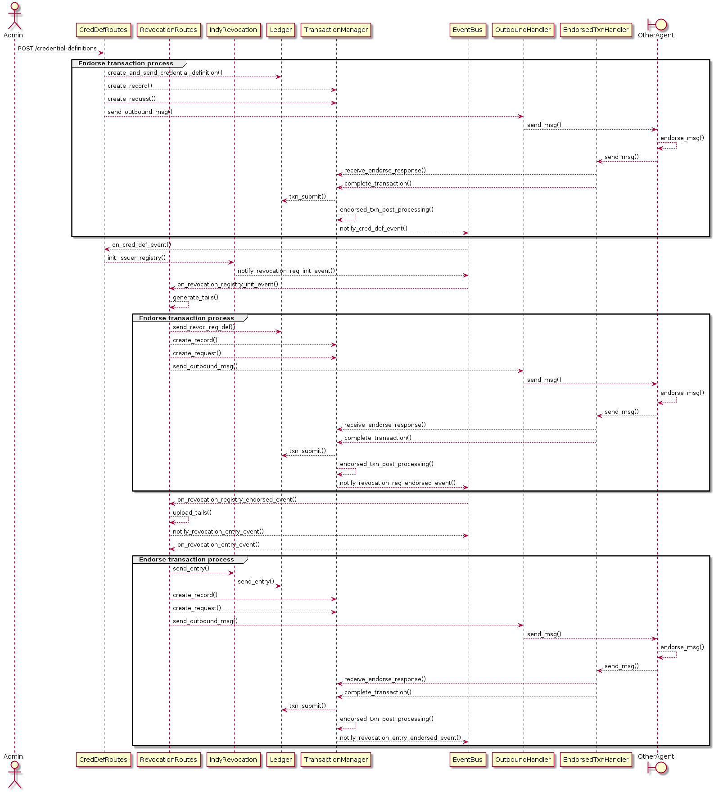

# Transaction Endorser Support

ACA-Py supports an [Endorser Protocol](https://github.com/hyperledger/aries-rfcs/pull/586), that allows an un-privileged agent (an "Author") to request another agent (the "Endorser") to sign their transactions so they can write these transactions to the ledger.  This is required on Indy ledgers, where new agents will typically be granted only "Author" privileges.

Transaction Endorsement is built into the protocols for Schema, Credential Definition and Revocation, and endorsements can be explicitely requested, or ACA-Py can be configured to automate the endorsement workflow.

## Setting up Connections between Authors and Endorsers

Since endorsement involves message exchange between two agents, these agents must establish and configure a connection before any endorsements can be provided or requested.

Once the connection is established and `active`, the "role" (either Author or Endorser) is attached to the connection using the `/transactions/{conn_id}/set-endorser-role` endpoint.  For Authors, they must additionally configure the DID of the Endorser as this is required when the Author signs the transaction (prior to sending to the Endorser for endorsement) - this is done using the `/transactions/{conn_id}/set-endorser-info` endpoint.

## Requesting Transaction Endorsement

Transaction Endorsement is built into the protocols for Schema, Credential Definition and Revocation.  When executing one of the endpoints that will trigger a ledger write, an endorsement protocol can be explicitely requested by specifying the `connection_id` (of the Endorser connection) and `create_transaction_for_endorser`.

(Note that endorsement requests can be automated, see the secion on "Configuring ACA-Py" below.)

If transaction endorsement is requested, then ACA-Py will create a transaction record (this will be returned by the endpoint, rather than the Schema, Cred Def, etc) and the following endpoints must be invoked:

| Protocol Step       | Author                          | Endorser                          |
| -------------       | ------                          | --------                          |
| Request Endorsement | `/transactions/create-request`  |                                   |
| Endorse Transaction |                                 | `/transactions/{tran_id}/endorse` |
| Write Transaction   | `/transactions/{tran_id}/write` |                                   |

Additional endpoints allow the Endorser to reject the endorsement request, or for the Author to re-submit or cancel a request.

Web hooks will be triggered to notify each ACA-Py agent of any transaction request, endorsements, etc to allow the controller to react to the event, or the process can be automated via command-line parameters (see below).

## Configuring ACA-Py for Auto or Manual Endorsement

The following start-up parameters are supported by ACA-Py:

```
Endorsement:
  --endorser-protocol-role <endorser-role>
                        Specify the role ('author' or 'endorser') which this agent will participate. Authors will request transaction endorement from an Endorser. Endorsers will endorse transactions from
                        Authors, and may write their own transactions to the ledger. If no role (or 'none') is specified then the endorsement protocol will not be used and this agent will write transactions to
                        the ledger directly. [env var: ACAPY_ENDORSER_ROLE]
  --endorser-public-did <endorser-public-did>
                        For transaction Authors, specify the the public DID of the Endorser agent who will be endorsing transactions. Note this requires that the connection be made using the Endorser's public
                        DID. [env var: ACAPY_ENDORSER_PUBLIC_DID]
  --endorser-alias <endorser-alias>
                        For transaction Authors, specify the the alias of the Endorser connection that will be used to endorse transactions. [env var: ACAPY_ENDORSER_ALIAS]
  --auto-request-endorsement
                        For Authors, specify whether to automatically request endorsement for all transactions. (If not specified, the controller must invoke the request endorse operation for each
                        transaction.) [env var: ACAPY_AUTO_REQUEST_ENDORSEMENT]
  --auto-endorse-transactions
                        For Endorsers, specify whether to automatically endorse any received endorsement requests. (If not specified, the controller must invoke the endorsement operation for each transaction.)
                        [env var: ACAPY_AUTO_ENDORSE_TRANSACTIONS]
  --auto-write-transactions
                        For Authors, specify whether to automatically write any endorsed transactions. (If not specified, the controller must invoke the write transaction operation for each transaction.) [env
                        var: ACAPY_AUTO_WRITE_TRANSACTIONS]
  --auto-create-revocation-transactions
                        For Authors, specify whether to automatically create transactions for a cred def's revocation registry. (If not specified, the controller must invoke the endpoints required to create
                        the revocation registry and assign to the cred def.) [env var: ACAPY_CREATE_REVOCATION_TRANSACTIONS]
  --auto-promote-author-did
                        For Authors, specify whether to automatically promote a DID to the wallet public DID after writing to the ledger. [env var: ACAPY_AUTO_PROMOTE_AUTHOR_DID]
```

## How Aca-py Handles Endorsements

Internally, the Endorsement functionality is implemented as a protocol, and is implemented consistently with other protocols:

- a [routes.py](https://github.com/hyperledger/aries-cloudagent-python/blob/main/aries_cloudagent/protocols/endorse_transaction/v1_0/routes.py) file exposes the admin endpoints
- [handler files](https://github.com/hyperledger/aries-cloudagent-python/tree/main/aries_cloudagent/protocols/endorse_transaction/v1_0/handlers) implement responses to any received Endorse protocol messages
- a [manager.py](https://github.com/hyperledger/aries-cloudagent-python/blob/main/aries_cloudagent/protocols/endorse_transaction/v1_0/manager.py) file implements common functionality that is called from both the routes.py and handler classes (as well as from other classes that need to interact with Endorser functionality)

The Endorser makes use of the [Event Bus](https://github.com/hyperledger/aries-cloudagent-python/blob/main/CHANGELOG.md#july-14-2021) (links to the PR which links to a hackmd doc) to notify other protocols of any Endorser events of interest.  For example, after a Credential Definition endorsement is received, the TransactionManager writes the endorsed transaction to the ledger and uses the Event Bus to notify the Credential Defintition manager that it can do any required post-processing (such as writing the cred def record to the wallet, initiating the revocation registry, etc.).

The overall architecture can be illustrated as:


### Create Credential Definition and Revocation Registry

An example of an Endorser flow is as follows, showing how a credential definition endorsement is received and processed, and optionally kicks off the revocation registry process:



You can see that there is a standard endorser flow happening each time there is a ledger write (illustrated in the "Endorser" process).

At the end of each endorse sequence, the TransactionManager sends a notification via the EventBus so that any dependant processing can continue.  Each Router is responsible for listening and responding to these notifications if necessary.

For example:

- Once the credential definition is created, a revocation registry must be created (for revocable cred defs)
- Once the revocation registry is created, a revocation entry must be created
- Potentially, the cred def status could be updated once the revocation entry is completed

Using the EventBus decouples the event sequence.  Any functions triggered by an event notification are typically also available directly via Admin endpoints.

### Create DID and Promote to Public

... and an example of creating a DID and promoting it to public (and creating an ATTRIB for the endpoint:


You can see the same endorsement processes in this sequence.

Once the DID is written, the DID can (optionally) be promoted to the public DID, which will also invoke an ATTRIB transaction to write the endpoint.
