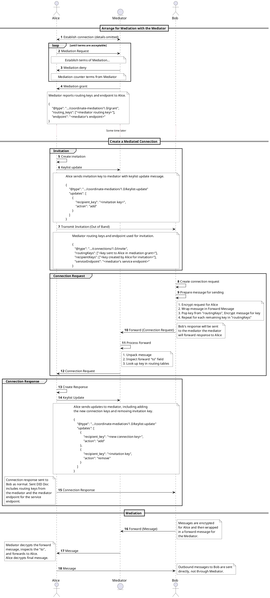

# Mediation docs

## Concepts
* **DIDComm Message Forwarding** - Sending an encrypted message to its recipient by first sending it to a third party responsible for forwarding the message on. Message contents are encrypted once for the recipient then wrapped in a [forward message](https://github.com/hyperledger/aries-rfcs/blob/master/concepts/0094-cross-domain-messaging/README.md#corerouting10forward) encrypted to the third party.
* **Mediator** - An agent that forwards messages to a client over a DIDComm connection.
* **Mediated Agent** or **Mediation client** - The agent(s) to which a mediator is willing to forward messages.
* **Mediation Request** - A message from a client to a mediator requesting mediation or forwarding.
* **Keylist** - The list of public keys used by the mediator to lookup to which connection a forward message should be sent. Each mediated agent is responsible for maintaining the keylist with the mediator.
* **Keylist Update** - A message from a client to a mediator informing the mediator of changes to the keylist.
* **Default Mediator** - A mediator to be used with with every newly created DIDComm connection. 
* **Mediation Connection** - Connection between the mediator and the mediated agent or client. Agents can use as many mediators as the identity owner sees fit. Requests for mediation are handled on a per connection basis.
* See [Aries RFC 0211: Coordinate Mediation Protocol](https://github.com/hyperledger/aries-rfcs/blob/master/features/0211-route-coordination/README.md) for additional details on message attributes and more.

## Command Line Arguments

* `--open-mediation` - Instructs mediators to automatically grant all incoming mediation requests.
* `--mediator-invitation` - Receive invitation, send mediation request and set as default mediator.
* `--default-mediator-id` - Set pre-existing mediator as default mediator.
* `--clear-default-mediator` - Clear the stored default mediator.

The minimum set of arguments *required* to enable mediation are:

```bash=
aca-py start ... \
    --open-mediation
```

To automate the mediation process on startup, *additionally* specify the following argument on the *mediated* agent (not the mediator):

```bash=
aca-py start ... \
    --mediator-invitation "<a multi-use invitation url from the mediator>"
```

If a default mediator has already been established, then the `--default-mediator-id` argument can be used *instead* of the `--mediator-invitation`.

## DIDComm Messages

See [Aries RFC 0211: Coordinate Mediation Protocol](https://github.com/hyperledger/aries-rfcs/blob/master/features/0211-route-coordination/README.md).
 
## Admin API

* `GET mediation/requests`
    * Return a list of all mediation records. Filter by `conn_id`, `state`, `mediator_terms` and `recipient_terms`.
* `GET mediation/requests/{mediation_id}`
    * Retrieve a mediation record by id.
* `DELETE mediation/requests/{mediation_id}`
    * Delete mediation record by id.
* `POST mediation/requests/{mediation_id}/grant`
    * As a mediator, grant a stored mediation request and send `granted` message to client.
* `POST mediation/requests/{mediation_id}/deny`
    * As a mediator, deny a stored mediation request and send `denied` message to client.
* `POST mediation/request/{conn_id}`
    * Send a mediation request to connection identified by the given connection ID.
* `GET mediation/keylists`
    * Returns key list associated with a connection. Filter on `client` for keys mediated by other agents and `server` for keys mediated by this agent.
* `POST mediation/keylists/{mediation_id}/send-keylist-update`
    * Send keylist update message to mediator identified by the given mediation ID. Updates contained in body of request.
* `POST mediation/keylists/{mediation_id}/send-keylist-query`
    * Send keylist query message to mediator identified by the given mediation ID.
* `GET mediation/default-mediator` **(PR pending)**
    * Retrieve the currently set default mediator.
* `PUT mediation/{mediation_id}/default-mediator` **(PR pending)**
    * Set the mediator identified by the given mediation ID as the default mediator.
* `DELETE mediation/default-mediator` **(PR pending)**
    * Clear the currently set default mediator (mediation status is maintained and remains functional, just not used as the default).

## Mediator Message Flow Overview



## Using a Mediator
After establishing a connection with a mediator also having mediation granted, you can use that mediator id for future did_comm connections.
 When creating, receiving or accepting a invitation intended to be Mediated, you provide `mediation_id` with the desired mediator id. if using a single mediator for all future connections, You can set a default mediation id. If no mediation_id is provided the default mediation id will be used instead.