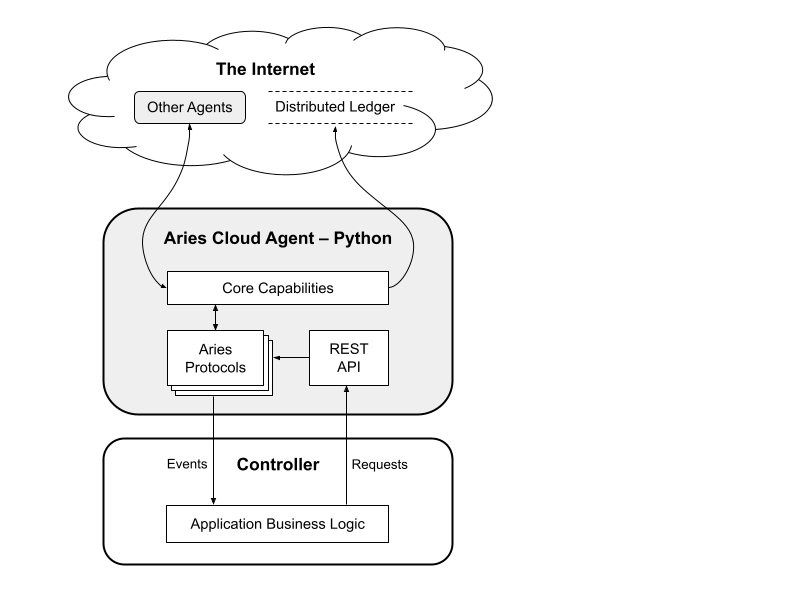

# Hyperledger Aries Cloud Agent - Python  <!-- omit in toc -->

<!--  -->

> An easy to use Aries agent for building SSI services using any language that supports sending/receiving HTTP requests.

## Overview

Hyperledger Aries Cloud Agent Python (ACA-Py) is a foundation for building Verifiable Credential (VC) ecosystems. It operates in the second and third layers of the [Trust Over IP framework (PDF)](https://trustoverip.org/wp-content/uploads/sites/98/2020/05/toip_050520_primer.pdf) using [DIDComm messaging](https://github.com/hyperledger/aries-rfcs/tree/master/concepts/0005-didcomm) and [Hyperledger Aries](https://www.hyperledger.org/use/aries) protocols. The "cloud" in the name means that ACA-Py runs on servers (cloud, enterprise, IoT devices, and so forth), but is not designed to run on mobile devices.

ACA-Py is built on the Aries concepts and features that make up [Aries Interop Profile (AIP) 1.0](https://github.com/hyperledger/aries-rfcs/tree/master/concepts/0302-aries-interop-profile), as well as many of the protocols that will be in [AIP 2.0](https://github.com/hyperledger/aries-rfcs/pull/579). [ACA-Py’s supported Aries protocols](https://github.com/hyperledger/aries-cloudagent-python/blob/main/SupportedRFCs.md) include, most importantly, protocols for issuing, verifying, and holding VCs that work with a [Hyperledger Indy](https://github.com/hyperledger/indy-sdk) distributed ledger and the Indy "AnonCreds" credential format. Contributors are actively working on adding support for other ToIP Layer 1 DID Utilities, and for other VC formats.

To use ACA-Py you create a business logic controller that "talks to" ACA-Py (sending HTTP requests and receiving webhook notifications), and ACA-Py handles the rest. That controller can be built in any language that supports making and receiving HTTP requests; knowledge of Python is not needed. Together, this means you can focus on building VC solutions using familiar web development technologies, instead of having to learn the nuts and bolts of low-level cryptography and Trust over IP-type protocols.

ACA-Py supports "multi-tenant" scenarios. In these scenarios, one (scalable) instance of ACA-Py uses one database instance, and are together capable of managing separate secure storage (for private keys, DIDs, credentials, etc.) for many different actors. This enables (for example) an "issuer-as-a-service", where an enterprise may have many VC issuers, each with different identifiers, using the same instance of ACA-Py to interact with VC holders as required. Likewise, an ACA-Py instance could be a "cloud wallet" for many holders (e.g. people or organizations) that, for whatever reason, cannot use a mobile device for a wallet. Learn more about multi-tenant deployments [here](./Multitenancy.md).

Startup options allow the use of an ACA-Py as an Aries [mediator](https://github.com/hyperledger/aries-rfcs/tree/master/concepts/0046-mediators-and-relays#summary) using core Aries protocols to coordinate its mediation role. Such an ACA-Py instance receives, stores and forwards messages to Aries  agents that (for example) lack an addressable endpoint on the Internet such as a mobile wallet. A live instance of a public mediator based on ACA-Py is available [here](https://indicio-tech.github.io/mediator/) from Indicio Technologies. Learn more about deploying a mediator [here](./Mediation.md).

ACA-Py supports deployments in scaled environments such as in Kubernetes environments where ACA-Py and its storage components can be horizontally scaled as needed to handle the load.

## Example Uses

The business logic you use with ACA-Py is limited only by your imagination. Possible applications include:

* An interface to a legacy system to issue verifiable credentials
* An authentication service based on the presentation of verifiable credential proofs
* An enterprise wallet to hold and present verifiable credentials about that enterprise
* A user interface for a person to use a wallet not stored on a mobile device
* An application embedded in an IoT device, capable of issuing verifiable credentials about collected data
* A persistent connection to other agents that enables secure messaging and notifications
* Custom code to implement a new service.

## Understanding the Architecture

There is an [architectural deep dive webinar](https://www.youtube.com/watch?v=FXTQEtB4fto&feature=youtu.be) presented by the ACA-Py team, and [slides from the webinar](https://docs.google.com/presentation/d/1K7qiQkVi4n-lpJ3nUZY27OniUEM0c8HAIk4imCWCx5Q/edit#slide=id.g5d43fe05cc_0_77) are also available. The picture below gives a quick overview of the architecture, showing an instance of ACA-Py, a controller and the interfaces between the controller and ACA-Py, and the external paths to other agents and public ledgers on the Internet.

## Installation and Usage

An ["install and go" page for developers](https://github.com/hyperledger/aries-cloudagent-python/blob/main/DevReadMe.md) is available if you are comfortable with Trust over IP and Aries concepts. ACA-Py can be run with Docker without installation (highly recommended), or can be installed [from PyPi](https://pypi.org/project/aries-cloudagent/). In the [/demo directory](/demo) there is a full set of demos for developers to use in getting started, and the [demo read me](/demo/README.md) is a great starting point for developers to use an "in-browser" approach to run a zero-install example. The [Read the Docs](https://aries-cloud-agent-python.readthedocs.io/en/latest/) overview is also a way to reference the modules and APIs that make up an ACA-Py instance.

For those new to SSI, Indy and Aries there is a [Getting Started Guide](/docs/GettingStartedAriesDev/README.md) that will take you from knowing next to nothing about decentralized identity to developing Aries-based business apps and services. You’ll run some Indy apps, ACA-Py apps and developer-oriented demos. The guide has a table of contents so you can skip the parts you already know.

Finally, if you’re not sure where your focus should be—building apps? Aries? Indy? Indy’s Blockchain? Ursa?—then the ["What should I work on?" document](/docs/GettingStartedAriesDev/IndyAriesDevOptions.md) is a good starting point. It goes through the technical stack and shows how the projects fit together, so you can decide where you want to focus your efforts.

## About The API

The [overview of ACA-Py’s API](https://github.com/hyperledger/aries-cloudagent-python/blob/main/AdminAPI.md) is a great starting place for learning about the API.

An ACA-Py instance puts together an OpenAPI-documented REST interface based on the protocols that are loaded. This is used by a controller application (written in any language) to manage the behaviour of the agent. The controller can initiate actions (e.g. issuing a credential) and can respond to agent events (e.g. sending a presentation request after a connection is accepted). Agent events are delivered to the controller as webhooks to a configured URL.

Technical note: the administrative API exposed by the agent for the controller to use must be protected with an API key (using the --admin-api-key command line arg) or deliberately left unsecured using the --admin-insecure-mode command line arg. The latter should not be used other than in development if the API is not otherwise secured.

## Credit

The initial implementation of ACA-Py was developed by the Government of British Columbia’s Digital Trust Team in Canada. To learn more about what’s happening with decentralized identity and digital trust in British Columbia, a new website will be launching in March 2021 and the link will be made available here.

## Contributing

Pull requests are welcome! Please read our [contributions guide](https://github.com/hyperledger/aries-cloudagent-python/blob/main/CONTRIBUTING.md) and submit your PRs. We enforce [developer certificate of origin](https://developercertificate.org/) (DCO) commit signing — [guidance](https://github.com/apps/dco) on this is available. We also welcome issues submitted about problems you encounter in using ACA-Py.

## License

[Apache License Version 2.0](https://github.com/hyperledger/aries-cloudagent-python/blob/main/LICENSE)
