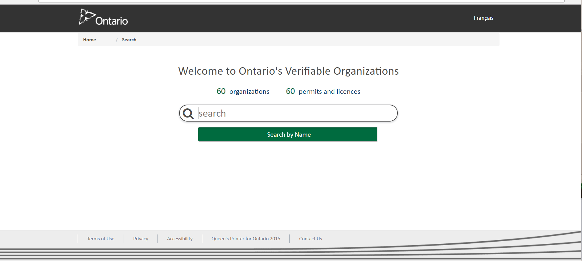

## Theme Support 

TheOrgBook's UI has been divided into four areas/components as shown below and each area can be customized separately. The *app.component* defines the overall page layout and margins.


The theme design elements (i.e. css files, images, html templates) are stored at two places: under the **themes/default** directory that provides default styles and under the directory with the theme name (i.e. themes/ongov) that contains overrides for the default styles. The default styles are pulled from Government of BC design package *mygovbc-bootstrap-theme* that is included as a *node_module* in TheOrgBook app. 

The choice of the active theme is driven by the value of the environmental variable **$TOB_THEME** that has a default value of *bcgov*. At the build time the files from the $TOB_THEME theme directory are copied into the *themes/_active* directory and together with the default styles are used to apply look-n-feel to the running instance of TheOrgBook.

For example, to change the active theme from BC to Ontario, set the value of $TOB_THEME to **ongov** and rebuild the code:

``` export TOB_THEME=ongov ```

For the TheOrgBook instance deployed in OpenShift, set $TOB_THEME value in **. param* files under *tob-web/openshift* directory.

```
angular-build.param
angular-on-nginx-deploy.dev.param
angular-on-nginx-deploy.test.param
angular-on-nginx-deploy.prod.param
```

The component **html** templates in the *default* directory get overwritten with corresponding templates from the *_active* theme directory if present.

The default *scss* files contain an import of a custom scss file at the bottom of each file. 

``` @import "../../_active/app-header/app-header.component.custom"; ```

The custom scss file provides overrides to the styles from the corresponding default scss file. For example, to change the page title font size, add the following style to *app-header.component.custom.scss* file

.title {
    font-size: 25px;
  }


The text content values in English and French as well as all graphics are stored under **assets** directories within each theme.

## Adding a New Theme

To add a new theme with a custom look-n-feel, create a sub-directory with the name of the new theme under *themes* (i.e. ongov).  

Under the new theme directory, create **assets** directory to hold all images and content overrides. It is recommended to copy **i18n** directory with the content file from the default theme and modify as needed.

Create a sub-directory for each of the four areas of TheOrgBook UI that needs to be customized (i.e. app-header) and add component files with custom styles and template overrides as needed.

<i>
ongov<br/>
&nbsp;&nbsp;app-footer<br/>
&nbsp;&nbsp;&nbsp;&nbsp;
app-footer.component.html<br/>
&nbsp;&nbsp;app-header</br>
&nbsp;&nbsp;&nbsp;&nbsp;app-header.component.html<br/>
&nbsp;&nbsp;&nbsp;&nbsp;app-header.component.custom.scss<br/>
...</i>

Modify the theme's main **_theme.scss** file at the root of the new theme, to override default styles as needed. For example, to change the default color of headers on the page that is provided by Government of BC's design package from the mygobbc-bootstrap-theme node_module, add the following style:

```
h1, h2, h3 {
    color: #4d4d4d;
}
```

Customized main page with Ontario look-n-feel:




