# Alice Gets a Mobile Agent! <!-- omit in toc -->

In this demo, we'll again use our familiar Faber ACA-Py agent to issue credentials to Alice, but this time Alice will use a mobile wallet. To do this we need to run the Faber agent on a publicly accessible port, and Alice will need a compatible mobile wallet. We'll provide pointers to where you can get them.

This demo also introduces revocation of credentials.

# Contents <!-- omit in toc -->

- [Getting Started](#getting-started)
  - [Get a mobile agent](#get-a-mobile-agent)
  - [Running Locally in Docker](#running-locally-in-docker)
  - [Running in Play With Docker](#running-in-play-with-docker)
  - [Run an instance of indy-tails-server](#run-an-instance-of-indy-tails-server)
- [Run `faber` With Extra Parameters](#run-faber-with-extra-parameters)
- [Accept the Invitation](#accept-the-invitation)
- [Issue a Credential](#issue-a-credential)
  - [Accept the Credential](#accept-the-credential)
- [Issue a Presentation Request](#issue-a-presentation-request)
- [Present the Proof](#present-the-proof)
- [Review the Proof](#review-the-proof)
- [Revoke the Credential and Send Another Proof Request](#revoke-the-credential-and-send-another-proof-request)
- [Conclusion](#conclusion)


## Getting Started

This demo can be run on your local machine or on Play with Docker (PWD), and will demonstrate credential exchange and proof exchange as well as revocation with a mobile agent.  Both approaches (running locally and on PWD) will be described, for the most part the commands are the same, but there are a couple of different parameters you need to provide when starting up.

If you are not familiar with how revocation is currently implemented in Hyperledger Indy, [this article](https://github.com/hyperledger/indy-hipe/tree/master/text/0011-cred-revocation) provides a good background on the technique. A challenge with revocation as it is currently implemented in Hyperledger Indy is the need for the prover (the agent creating the proof) to download tails files associated with the credentials it holds.


### Get a mobile agent

Of course for this, you need to have a mobile agent. To find, install and setup a compatible mobile agent, follow the instructions [here](https://github.com/bcgov/identity-kit-poc/blob/master/docs/GettingApp.md).


### Running Locally in Docker

Open a new bash shell and in a project directory run the following:

```bash
git clone https://github.com/hyperledger/aries-cloudagent-python.git
cd aries-cloudagent-python/demo
```

We'll come back to this in a minute, when we start the `faber` agent!

There are a couple of extra steps you need to take to prepare to run the Faber agent locally:


#### Install ngrok and jq

[ngrok](https://ngrok.com/) is used to expose public endpoints for services running locally on your computer.

[jq](https://github.com/stedolan/jq) is a json parser that is used to automatically detect the endpoints exposed by ngrok.

You can install ngrok from [here](https://ngrok.com/)

You can download jq releases [here](https://github.com/stedolan/jq/releases)


#### Expose services publicly using ngrok

Note that this is *only required when running docker on your local machine*.  When you run on PWD a public endpoint for your agent is exposed automatically.

Since the mobile agent will need some way to communicate with the agent running on your local machine in docker, we will need to create a publicly accesible url for some services on your machine. The easiest way to do this is with [ngrok](https://ngrok.com/). Once ngrok is installed, create a tunnel to your local machine:

```bash
ngrok http 8020
```

This service is used for your local aca-py agent - it is the endpoint that is advertised for other Aries agents to connect to.

You will see something like this:

```
Forwarding                    http://abc123.ngrok.io -> http://localhost:8020
Forwarding                    https://abc123.ngrok.io -> http://localhost:8020
```

This creates a public url for ports 8020 on your local machine. 

Note that an ngrok process is created automatically for your tails server.

Keep this process running as we'll come back to it in a moment.


### Running in Play With Docker

To run the necessary terminal sessions in your browser, go to the Docker playground service [Play with Docker](https://labs.play-with-docker.com/). Don't know about Play with Docker? Check [this out](https://github.com/cloudcompass/ToIPLabs/blob/master/docs/LFS173x/RunningLabs.md#running-on-play-with-docker) to learn more.

Open a new bash shell and in a project directory run the following:

```bash
git clone https://github.com/hyperledger/aries-cloudagent-python.git
cd aries-cloudagent-python/demo
```

We'll come back to this in a minute, when we start the `faber` agent!


### Run an instance of indy-tails-server

For revocation to function, we need another component running that is used to store what are called tails files.

If you are not running with revocation enabled you can skip this step.

Open a new bash shell, and in a project directory, run:

```bash
git clone https://github.com/bcgov/indy-tails-server.git
cd indy-tails-server/docker
./manage build
GENESIS_URL=http://test.bcovrin.vonx.io/genesis ./manage start
```

This will run the required components for the tails server to function and make a tails server available on port 6543.

This will also automatically start an ngrok server that will expose a public url for your tails server - this is required to support mobile agents.  The docker output will look something like this:

```bash
ngrok-tails-server_1  | t=2020-05-13T22:51:14+0000 lvl=info msg="started tunnel" obj=tunnels name="command_line (http)" addr=http://tails-server:6543 url=http://c5789aa0.ngrok.io
ngrok-tails-server_1  | t=2020-05-13T22:51:14+0000 lvl=info msg="started tunnel" obj=tunnels name=command_line addr=http://tails-server:6543 url=https://c5789aa0.ngrok.io
```

Note the server name in the `url=https://c5789aa0.ngrok.io` parameter (`https://c5789aa0.ngrok.io`) - this is the external url for your tails server.  Make sure you use the `https` url!


### Run `faber` With Extra Parameters

If you are running in a *local bash shell*, navigate to [The demo direcory](/demo) and run:

```bash
TAILS_NETWORK=docker_tails-server LEDGER_URL=http://test.bcovrin.vonx.io ./run_demo faber --revocation --events
```

The `TAILS_NETWORK` parameter lets the demo script know how to connect to the tails server (which should be running in a separate shell on the same machine).

If you are running in *Play with Docker*, navigate to [The demo direcory](/demo) and run:

```bash
PUBLIC_TAILS_URL=https://def456.ngrok.io LEDGER_URL=http://test.bcovrin.vonx.io ./run_demo faber --revocation --events
```

The `PUBLIC_TAILS_URL` parameter lets the demo script know how to connect to the tails server.  This can be running in another PWD session, or even on your local machine - the ngrok endpoint is public and will map to the correct location.

Note that you _must_ use the `https` url for the tails server endpoint.

The `Preparing agent image...` step on the first run takes a bit of time, so while we wait, let's look at the details of the commands. Running Faber is similar to the instructions in the [Aries OpenAPI Demo](./AriesOpenAPIDemo.md) "Play with Docker" section, except:

- We are using the BCovrin Test network because that is a network that the mobile agents can be configured to use.
- We are running in "auto" mode, so we will make no manual acknowledgements.
- The revocation related changes:
  - The `TAILS_NETWORK` parameter tells the `./run_demo` script how to connect to the tails server and determine the public ngrok endpoint.
  - The `PUBLIC_TAILS_URL` environment variable is the address of your tails server (must be `https`).
  - The `--revocation` parameter to the `./run-demo` script activates the ACA-Py revocation issuance.

As part of its startup process, the agent will publish a revocation registry to the ledger.

<details>
    <summary>Click here to view screenshot of the revocation registry on the ledger</summary>
    
</details>


## Accept the Invitation

When the Faber agent starts up it automatically creates an invitation and generates a QR code on the screen. On your mobile app, select "SCAN CODE" (or equivalent) and point your camera at the generated QR code.  The mobile agent should automatically capture the code and ask you to confirm the connection. Confirm it.

<details>
    <summary>Click here to view screenshot</summary>
    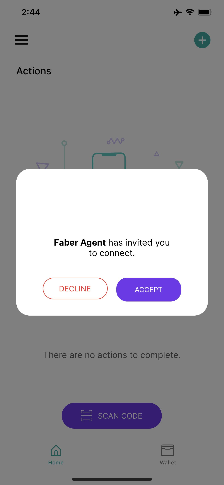
</details>

The mobile agent will give you feedback on the connection process, something like "A connection was added to your wallet".

<details>
    <summary>Click here to view screenshot</summary>
    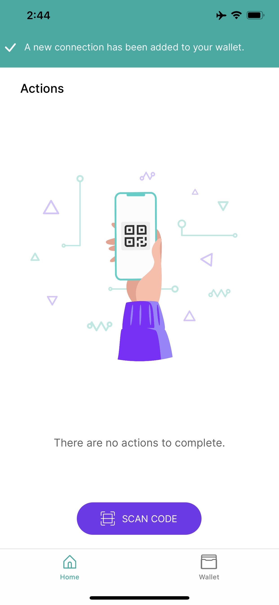
</details>
<details>
    <summary>Click here to view screenshot</summary>
    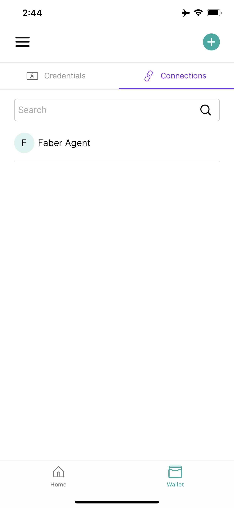
</details>

Switch your browser back to Play with Docker. You should see that the connection has been established, and there is a prompt for what actions you want to take, e.g. "Issue Credential", "Send Proof Request" and so on.

Tip:  If your screen is too small to display the QR code (this can happen in Play With Docker because the shell is only given a small portion of the browser) you can copy the invitation url to a site like https://www.the-qrcode-generator.com/ to convert the invitation url into a QR code that you can scan.  Make sure you select the `URL` option, and copy the `invitation_url`, which will look something like:

```bash
https://abfde260.ngrok.io?c_i=eyJAdHlwZSI6ICJkaWQ6c292OkJ6Q2JzTlloTXJqSGlxWkRUVUFTSGc7c3BlYy9jb25uZWN0aW9ucy8xLjAvaW52aXRhdGlvbiIsICJAaWQiOiAiZjI2ZjA2YTItNWU1Mi00YTA5LWEwMDctOTNkODBiZTYyNGJlIiwgInJlY2lwaWVudEtleXMiOiBbIjlQRFE2alNXMWZwZkM5UllRWGhCc3ZBaVJrQmVKRlVhVmI0QnRQSFdWbTFXIl0sICJsYWJlbCI6ICJGYWJlci5BZ2VudCIsICJzZXJ2aWNlRW5kcG9pbnQiOiAiaHR0cHM6Ly9hYmZkZTI2MC5uZ3Jvay5pbyJ9
```

Or this:

```bash
http://ip10-0-121-4-bquqo816b480a4bfn3kg-8020.direct.play-with-von.vonx.io?c_i=eyJAdHlwZSI6ICJkaWQ6c292OkJ6Q2JzTlloTXJqSGlxWkRUVUFTSGc7c3BlYy9jb25uZWN0aW9ucy8xLjAvaW52aXRhdGlvbiIsICJAaWQiOiAiZWI2MTI4NDUtYmU1OC00YTNiLTk2MGUtZmE3NDUzMGEwNzkyIiwgInJlY2lwaWVudEtleXMiOiBbIkFacEdoMlpIOTJVNnRFRTlmYk13Z3BqQkp3TEUzRFJIY1dCbmg4Y2FqdzNiIl0sICJzZXJ2aWNlRW5kcG9pbnQiOiAiaHR0cDovL2lwMTAtMC0xMjEtNC1icXVxbzgxNmI0ODBhNGJmbjNrZy04MDIwLmRpcmVjdC5wbGF5LXdpdGgtdm9uLnZvbnguaW8iLCAibGFiZWwiOiAiRmFiZXIuQWdlbnQifQ==
```

Note that this will use the ngrok endpoint if you are running locally, or your PWD endpoint if you are running on PWD.


## Issue a Credential

We will use the Faber console to issue a credential. This could be done using the Swagger API as we have done in the connection process. We'll leave that as an exercise to the user.

In the Faber console, select option `1` to send a credential to the mobile agent.

<details>
    <summary>Click here to view screenshot</summary>
    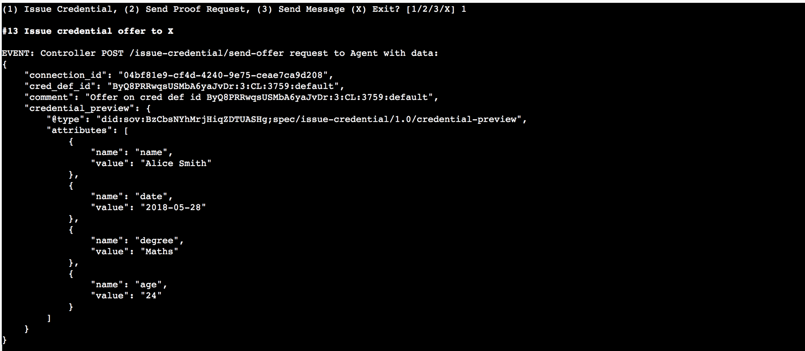
</details>

The Faber agent outputs details to the console; e.g.,

```text
Faber      | Credential: state = credential_issued, credential_exchange_id = bb9bf750-905f-444f-b8aa-42c3a51d9464
Faber      | Revocation registry id: Jt7PhrEc2rYuS4iVcREfoA:4:Jt7PhrEc2rYuS4iVcREfoA:3:CL:44:default:CL_ACCUM:55a13dff-c104-45b5-b633-d3fd1ac43b9a
Faber      | Credential revocation id: 1
Faber      | Credential: state = credential_acked, credential_exchange_id = bb9bf750-905f-444f-b8aa-42c3a51d9464
```

The revocation registry id and credential revocation id only appear if revocation is active. If you are doing revocation, you to need the `Revocation registry id` later, so we recommend that you copy it it now and paste it into a text file or someplace that you can access later. If you don't write it down, you can get the Id from the Admin API using the **`GET /revocation/active-registry/{cred_def_id}`** endpoint, and passing in the credential definition Id (which you can get from the **`GET /credential-definitions/created`** endpoint).

### Accept the Credential

The credential offer should automatically show up in the mobile agent. Accept the offered credential following the instructions provided by the mobile agent. That will look something like this:

<details>
    <summary>Click here to view screenshot</summary>
    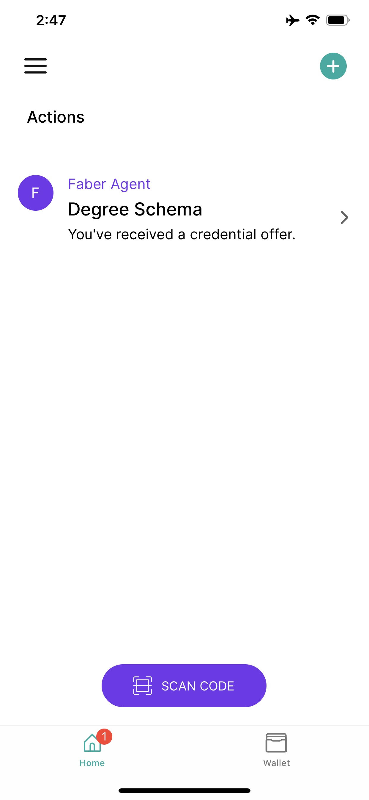
</details>
<details>
    <summary>Click here to view screenshot</summary>
    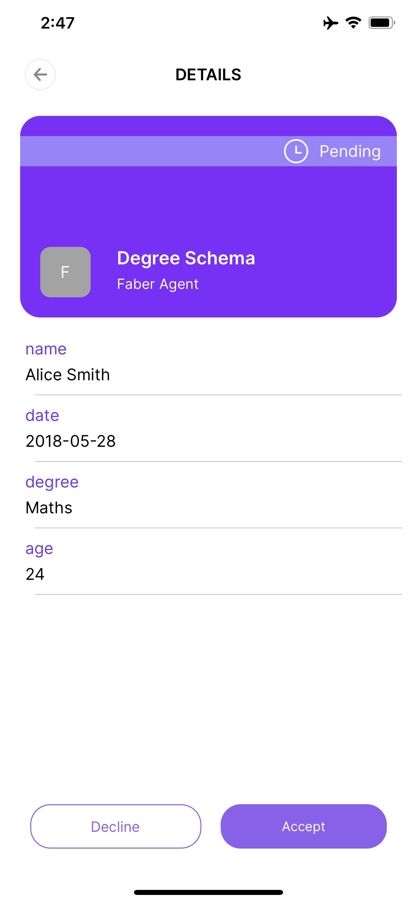
</details>
<details>
    <summary>Click here to view screenshot</summary>
    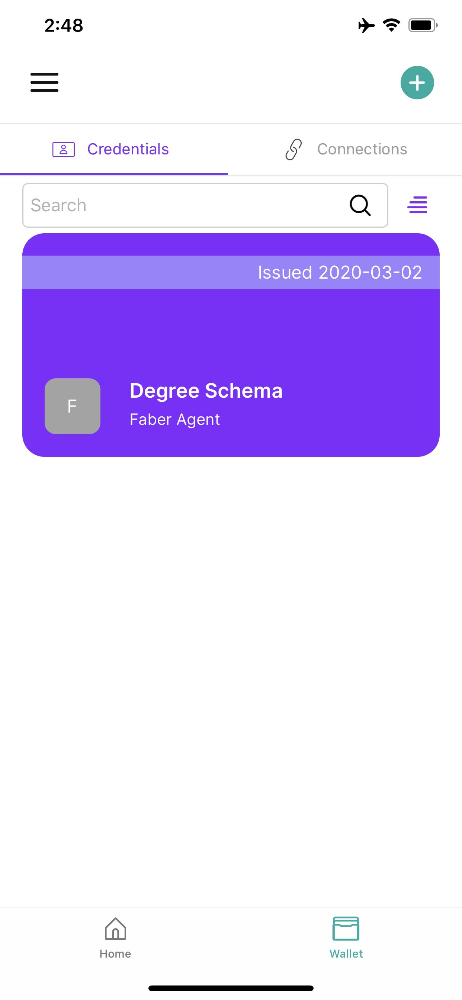
</details>

## Issue a Presentation Request

We will use the Faber console to ask mobile agent for a proof. This could be done using the Swagger API, but we'll leave that as an exercise to the user.

In the Faber console, select option `2` to send a proof request to the mobile agent.

<details>
    <summary>Click here to view screenshot</summary>
    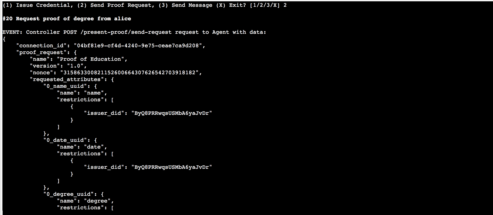
</details>

## Present the Proof

The presentation (proof) request should automatically show up in the mobile agent. Follow the instructions provided by the mobile agent to prepare and send the proof back to Faber. That will look something like this:

<details>
    <summary>Click here to view screenshot</summary>
    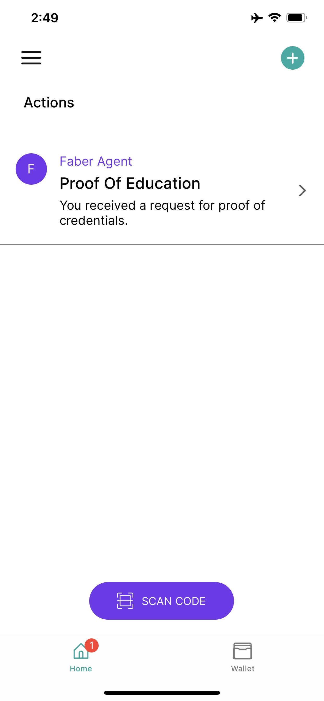
</details>
<details>
    <summary>Click here to view screenshot</summary>
    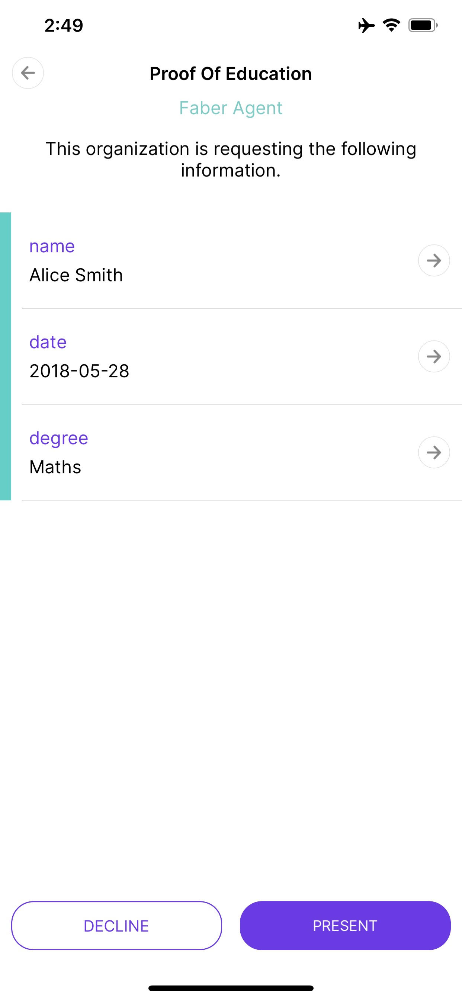
</details>
<details>
    <summary>Click here to view screenshot</summary>
    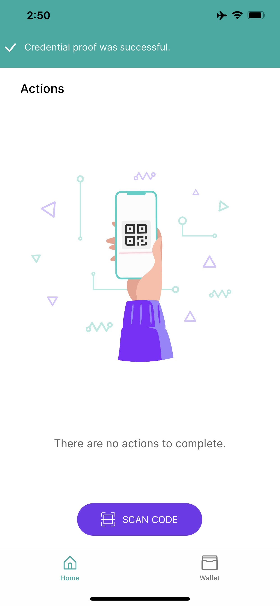
</details>

If the mobile agent is able to successfully prepare and send the proof, you can go back to the Play with Docker terminal to see the status of the proof.

The process should "just work" for the non-revocation use case. If you are using revocation, your results may vary. As of writing this, we get failures on the wallet side with some mobile wallets, and on the Faber side with others (an error in the Indy SDK). As the results improve, we'll update this. Please let us know through GitHub issues if you have any problems running this.

## Review the Proof

In the Faber console window, the proof should be received as validated.

<details>
    <summary>Click here to view screenshot</summary>
    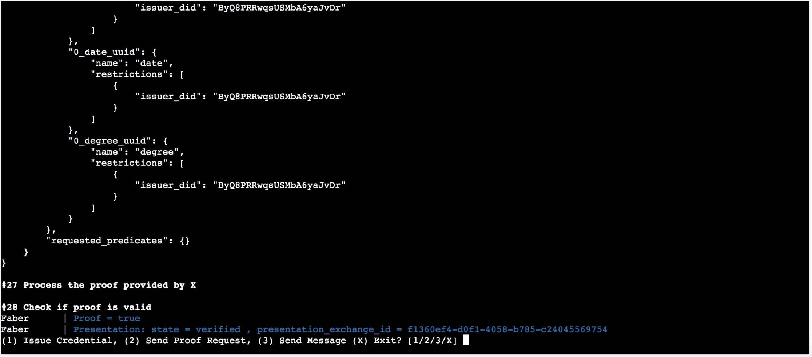
</details>

## Revoke the Credential and Send Another Proof Request

If you have enabled revocation, you can try revoking the credential pending publication (`faber` options `4` and `5`). For the revocation step, You will need the revocation registry identifier and the credential revocation identifier (which is 1 for the first credential you issued), as the Faber agent logged them to the console at credential issue.

Once that is done, try sending another proof request and see what happens! Experiment with immediate and pending publication.

<details>
    <summary>Click here to view screenshot</summary>
    
</details>

## Conclusion

That’s the Faber-Mobile Alice demo. Feel free to play with the Swagger API and experiment further and figure out what an instance of a controller has to do to make things work.

<!-- Docs to Markdown version 1.0β17 -->
