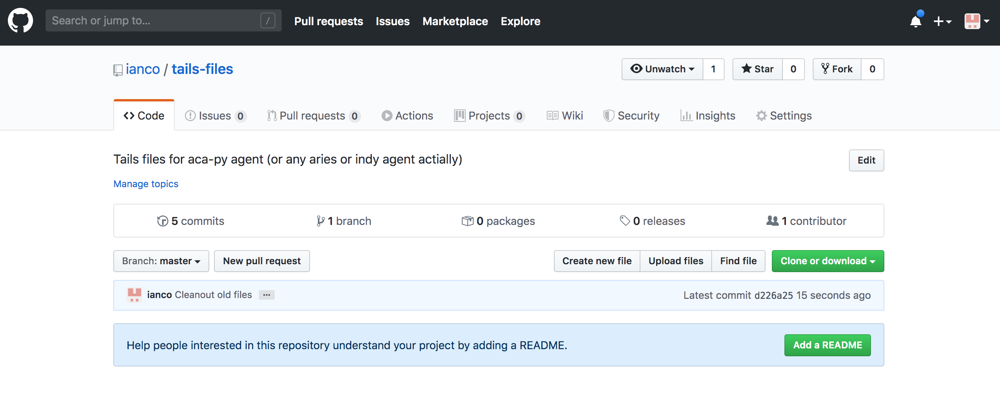
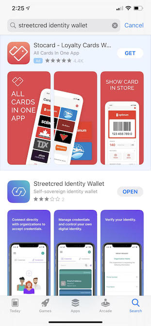
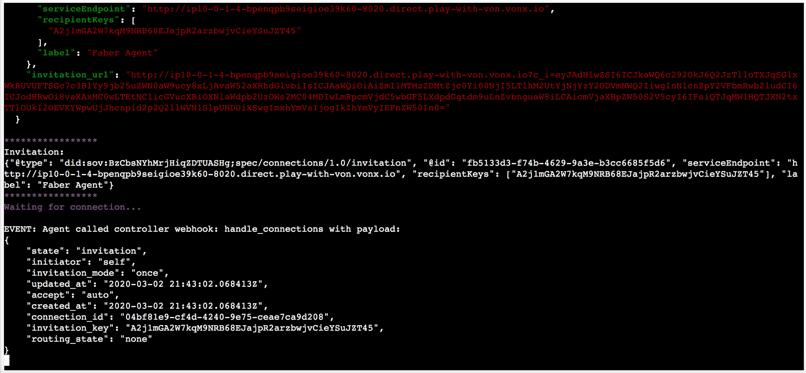
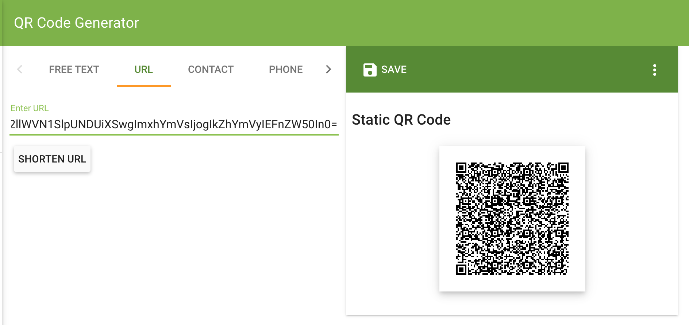
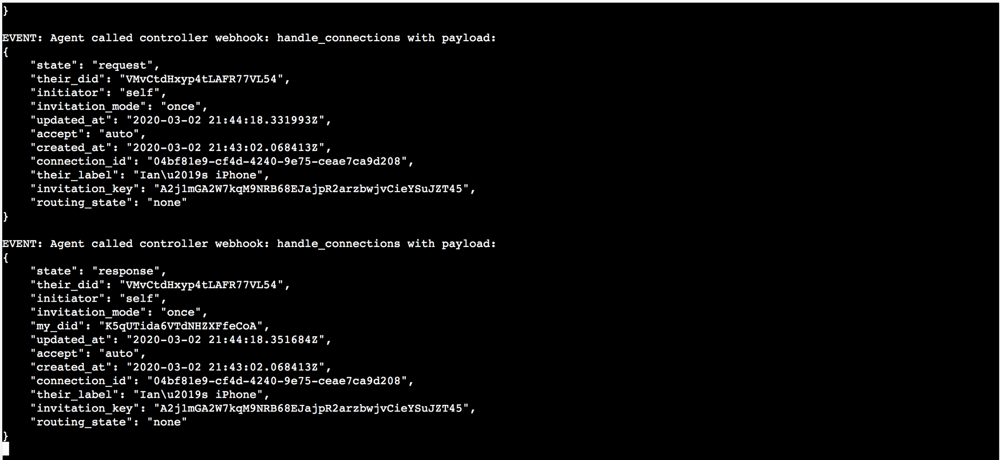
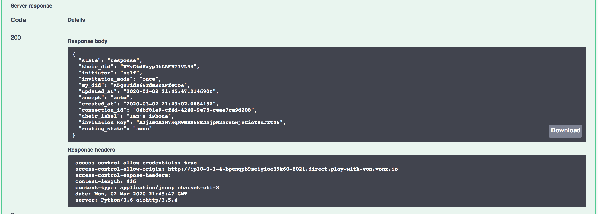
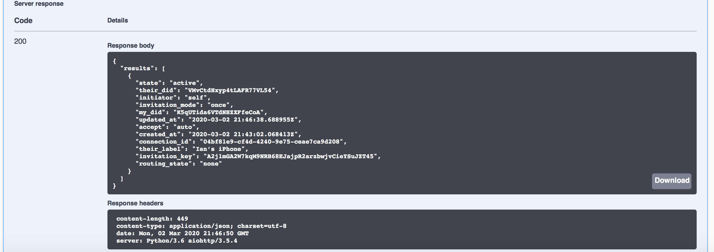

# Aries OpenAPI Mobile Demo <!-- omit in toc -->

You can use the Faber aca-py agent to issue credentials to a mobile wallet.  To do this you need to run the Faber agent on a publicly accessible port (for example you can run the agent on Play With Docker), and you need a compatible wallet.  One available wallet is the Streetcred Identity Agent, which is available on both iOS and Android, and you can read about it [here](https://github.com/bcgov/identity-kit-poc/blob/master/docs/GettingApp.md).

# Contents <!-- omit in toc -->

- [Getting Started](#getting-started)
- [Running in a Browser](#running-in-a-browser)
- [Running in Docker](#running-in-docker)
- [Enabling Revocation](#enabling-revocation)
- [Installing the Streetcred Agent](#installing-the-streetcred-agent)
- [Creating an Invitation](#creating-an-invitation)
- [Converting the Invitation to a QR Code](#converting-the-invitation-to-a-qr-code)
- [Accepting the Invitation with Streetcred](#accepting-the-invitation-with-streetcred)
- [Accepting Streetcred's connection request](#accepting-streetcreds-connection-request)
- [Issuing a Credential](#issuing-a-credential)
- [Accepting the Credential with Streetcred](#accepting-the-credential-with-streetcred)
- [Issuing a Proof Request](#issuing-a-proof-request)
- [Responding to the Proof Request with Streetcred](#responding-to-the-proof-request-with-streetcred)
- [Review the Received Proof](#review-the-received-proof)
- [Revoke the Credential and Send Another Proof Request](#revoke-the-credential-and-send-another-proof-request)
- [Conclusion](#conclusion)

## Getting Started

Make sure you've gone through the [Aries OpenAPI Demo](./AriesOpenAPIDemo.md), as this will give you the background on how to run and interact with an Aries agent.

## Running in a Browser

Run Play With Docker and start your agent using the BCovrin Test network:

```bash
git clone https://github.com/hyperledger/aries-cloudagent-python
cd aries-cloudagent-python/demo
LEDGER_URL=http://test.bcovrin.vonx.io ./run_demo faber --events
```

This is similar to the instructions in the prior "Play with Docker" section, except note that:

- We are using the BCovrin Test network (it has to use the same network as the mobile app)
- We are running in "auto" mode, so we will have to do fewer manual acknowledgements
- Play with Docker exposes the Agent's' port (in this case port 8021 of the container) on a public URL that the mobile app can access

## Running in Docker

An alternative for running locally - left as an excercise for the user - is to use ngrok and then set your agent's endpoint to the ngrok url.

## Enabling Revocation

There are two things you need to do to run with revocation enabled:

1. Setup a public `https` repository to publish the tails files (in this example we will publish to github)
2. Run `faber` with a few extra parameters

Note that the `https` step is required to enable revocation on a mobile wallet, such as StreetCred.

### Setup a Public HTTPS Tails Server (e.g. github)

Create yourself a public github repository called `tails-files` (actually you can use any name but this will be the least friction)

<details>
    <summary>Click here to view screenshot (github.com)</summary>
    
</details>

Clone this repo in your local `/tmp` directory

```bash
$ cd /tmp/
$ git clone https://github.com/ianco/tails-files.git
```

That's it!  You will manually copy tails files here and then commit them to github.

### Run `faber` with a few extra parameters

You have to tell `faber` (a) to enable revocation, and (b) to advertise the location of the tails files in github.

You acomplish both as follows:

```bash
PUBLIC_TAILS_URL=https://github.com/ianco/tails-files/raw/master TAILS_FILE_COUNT=10 LEDGER_URL=http://test.bcovrin.vonx.io ./run_demo faber --events --revocation
```

The `--revocation` flag tells faber to enable revocation and create a revocation registry and tails file.

For `PUBLIC_TAILS_URL`, substitute the location of your own github repository.  You can see this URL in the ledger transaction for the revocation registry.  If you copy & paste the `Tails file location:` url into your browser it should download the tails file.

<details>
    <summary>Click here to view screenshot (ledger)</summary>
    
</details>

For `TAILS_FILE_COUNT`, enter the size of your tails file.  Use a small number to keep things quick!  10 or 20 is fine for this demo.

Note that the tails file is published by the agent itself, you need to manually copy it to github to make it available via https.  More on that step later!

### Copying your tails file to github.com

OK we are now "later" and we will copy our tails file over to our github repo.

On faber startup, look for the following in the logs:

```
Revocation Registry ID: EiqZU8H9QiFchygR5r3FhJ:4:EiqZU8H9QiFchygR5r3FhJ:3:CL:4420:default:CL_ACCUM:b32580f5-ed8c-4e55-a4e6-8da8c02634b2
Revocation Registry Tails File Admin URL: http://127.0.0.1:8021/revocation/registry/EiqZU8H9QiFchygR5r3FhJ:4:EiqZU8H9QiFchygR5r3FhJ:3:CL:4420:default:CL_ACCUM:b32580f5-ed8c-4e55-a4e6-8da8c02634b2/tails-file
Revocation Registry Tails File URL: https://github.com/ianco/tails-files/raw/master/revocation/registry/EiqZU8H9QiFchygR5r3FhJ:4:EiqZU8H9QiFchygR5r3FhJ:3:CL:4420:default:CL_ACCUM:b32580f5-ed8c-4e55-a4e6-8da8c02634b2/tails-file
================
mkdir -p /tmp/tails-files/revocation/registry/EiqZU8H9QiFchygR5r3FhJ:4:EiqZU8H9QiFchygR5r3FhJ:3:CL:4420:default:CL_ACCUM:b32580f5-ed8c-4e55-a4e6-8da8c02634b2/
curl -X GET "http://127.0.0.1:8021/revocation/registry/EiqZU8H9QiFchygR5r3FhJ:4:EiqZU8H9QiFchygR5r3FhJ:3:CL:4420:default:CL_ACCUM:b32580f5-ed8c-4e55-a4e6-8da8c02634b2/tails-file" --output /tmp/tails-files/revocation/registry/EiqZU8H9QiFchygR5r3FhJ:4:EiqZU8H9QiFchygR5r3FhJ:3:CL:4420:default:CL_ACCUM:b32580f5-ed8c-4e55-a4e6-8da8c02634b2/tails-file
================
```

There are two commands in between the "================" markers:

1. Run this to create the folder in your local github repo clone:

```bash
$mkdir -p /tmp/tails-files/revocation/registry/EiqZU8H9QiFchygR5r3FhJ:4:EiqZU8H9QiFchygR5r3FhJ:3:CL:4420:default:CL_ACCUM:b32580f5-ed8c-4e55-a4e6-8da8c02634b2/
```

2. Run this to download the tails file to your local dir (note you will need to "patch in" the server name - it will be the PWD host name for port 8021):

```bash
curl -X GET "http://ip10-0-77-4-bpl64sjschj0j6gkkr60-8021.direct.play-with-von.vonx.io/revocation/registry/EiqZU8H9QiFchygR5r3FhJ:4:EiqZU8H9QiFchygR5r3FhJ:3:CL:4420:default:CL_ACCUM:b32580f5-ed8c-4e55-a4e6-8da8c02634b2/tails-file" --output /tmp/tails-files/revocation/registry/EiqZU8H9QiFchygR5r3FhJ:4:EiqZU8H9QiFchygR5r3FhJ:3:CL:4420:default:CL_ACCUM:b32580f5-ed8c-4e55-a4e6-8da8c02634b2/tails-file
```

3. Commit this file!

```bash
$ git add .
$ git commit -m "New tails file"
$ git push
```

That's it!  You are now serving your tails file on a secure https connection.

## Installing the Streetcred Agent

Search for "Streetcred Identity Wallet" on the App Store or Google Play.

<details>
    <summary>Click here to view screenshot (iOS)</summary>
    
</details>

Start the app and accept the terms of service to create an Agent.

<details>
    <summary>Click here to view screenshot (iOS)</summary>
    
</details>

Enble Face ID (or Android equivalent) to secure the Agent.

<details>
    <summary>Click here to view screenshot (iOS)</summary>
    
</details>

Enable notifications (or else you will have to continually refresh the Agent to get updates).

<details>
    <summary>Click here to view screenshot (iOS)</summary>
    
</details>

Before connecting with the BC Government applications, you must do some additional setup, as follows:

- Go to settings by clicking the menu icon in the top right (the "hamburger" icon—three stacked horizontal lines)
- Click on the "Network" item and from the subsequent list select "BCovrin Test" network.
- Click the back arrow to return to the settings and again to return to the main menu.Streetcred app screen.

<details>
    <summary>Click here to view screenshot (iOS)</summary>
    
</details>

## Creating an Invitation

When the Faber agent starts up it automatically creates an invitation.  We will copy the "url" format of the invitation for the next step.  Copy all the text between the quotes (do not include the quotes) - the copied text should be a properly formatted URL.

<details>
    <summary>Click here to view screenshot</summary>
    
</details>

## Converting the Invitation to a QR Code

To send the invitation to the agent, we need to convert the URl into a QR code.  Your application can do this, but for this demo we will use https://www.the-qrcode-generator.com/

Open up https://www.the-qrcode-generator.com/ in a new browser window, and:

- Select the "URL" option
- Paste your invitation url into the provided input field

<details>
    <summary>Click here to view screenshot</summary>
    
</details>

## Accepting the Invitation with Streetcred

On the Streetcred mobile app, select "SCAN CODE" and point your camera at the generated QR code.  Streetcred should automatically capture the code and ask you to confirm the connection.  GO ahead and confirm.

<details>
    <summary>Click here to view screenshot</summary>
    
</details>

Streetcred will then give you a message that "A connection was added to your wallet".

<details>
    <summary>Click here to view screenshot</summary>
    
</details>
<details>
    <summary>Click here to view screenshot</summary>
    
</details>

## Accepting Streetcred's connection request

At this point Faber has issued an invitation, and you have accpted the invitation and asked Faber to establish a connection to your agent.  Faber must now accept this request.  You can see the Event in the Faber console window.  Find this event, and select and copy the "connection id".

<details>
    <summary>Click here to view screenshot</summary>
    
</details>

Now, in Faber's swagger page (at the top of the console window, click on port `8021` to open the swagger page in a new window) scroll down to the **`POST /connections/{id}/accept-request`** endpoint, paste the connection id and click on "Execute".

<details>
    <summary>Click here to view screenshot</summary>
    
</details>
<details>
    <summary>Click here to view screenshot</summary>
    
</details>

Scroll to the **`GET /connections`** endpoint to check the status of the connection.

<details>
    <summary>Click here to view screenshot</summary>
    
</details>

Note - if the connection status does not update to `active`, try sending a `trust-ping` or `basic-message` on the connection.  This will force a handshake between the agents that whould upate the connection status.

## Issuing a Credential

We will use the Faber console to issue a credential.  (This could be done using the REST API as we have done above, this will be left as an exercise to the user.)

In the Faber console, select option `1` to send a credential to streetcred.

<details>
    <summary>Click here to view screenshot</summary>
    
</details>

### Accepting the Credential with Streetcred

The credential should automatically show up in streetcred - accept the offered credential.

<details>
    <summary>Click here to view screenshot</summary>
    
</details>
<details>
    <summary>Click here to view screenshot</summary>
    
</details>
<details>
    <summary>Click here to view screenshot</summary>
    
</details>

## Issuing a Proof Request

We will use the Faber console to ask Streetcred for a proof.  (This could be done using the REST API as we have done above, this will be left as an exercise to the user.)

In the Faber console, select option `2` to send a proof request to streetcred.

<details>
    <summary>Click here to view screenshot</summary>
    
</details>

## Responding to the Proof Request with Streetcred

In streetcred, respond to the proof

<details>
    <summary>Click here to view screenshot</summary>
    
</details>
<details>
    <summary>Click here to view screenshot</summary>
    
</details>
<details>
    <summary>Click here to view screenshot</summary>
    
</details>

## Review the Received Proof

In the Faber console window, the proof should be received as validated.

<details>
    <summary>Click here to view screenshot</summary>
    
</details>

## Revoke the Credential and Send Another Proof Request

If you have enabled revocation, you can try revoking the credential (`faber` option `4`) - you will need the credential exchnage id from the original credential issuance.

Then try sending another proof request and see what happens in StreetCred!

Note - screenshots not yet provided for this last step.

## Conclusion

That’s the OpenAPI-based tutorial. Feel free to play with the API and learn how it works. More importantly, as you implement a controller, use the OpenAPI user interface to test out the calls you will be using as you go. The list of API calls is grouped by protocol and if you are familiar with the protocols (Aries RFCs) the API call names should be pretty obvious.

One limitation of you being the controller is that you don't see the events from the agent that a controller program sees. For example, you, as Alice's agent, are not notified when Faber initiates the sending of a Credential. Some of those things show up in the terminal as messages, but others you just have to know have happened based on a successful API call.

<!-- Docs to Markdown version 1.0β17 -->
