# Aries OpenAPI Demo <!-- omit in toc -->

What better way to learn about controllers than by actually being one yourself! In this demo, that’s just what happens&mdash;you are the controller. You have access to the full set of API endpoints exposed by an ACA-Py instance, and you will see the events coming from ACA-Py as they happen. Using that information, you'll help Alice's and Faber's agents connect, Faber's agent issue an education credential to Alice, and then ask Alice to prove she possesses the credential. Who knows why Faber needs to get the proof, but it lets us show off more protocols.

# Contents <!-- omit in toc -->

- [Getting Started](#getting-started)
- [Running in a Browser](#running-in-a-browser)
  - [Start the Faber Agent](#start-the-faber-agent)
  - [Start the Alice Agent](#start-the-alice-agent)
- [Running in Docker](#running-in-docker)
  - [Start the Faber Agent](#start-the-faber-agent-1)
  - [Start the Alice Agent](#start-the-alice-agent-1)
  - [Restarting the Docker Containers](#restarting-the-docker-containers)
- [Using the OpenAPI/Swagger User Interface](#using-the-openapiswagger-user-interface)
- [Establishing a Connection](#establishing-a-connection)
  - [Use the Faber Agent to Create an Invitation](#use-the-faber-agent-to-create-an-invitation)
  - [Copy the Invitation created by the Faber Agent](#copy-the-invitation-created-by-the-faber-agent)
  - [Use the Alice Agent to Receive Faber's Invitation](#use-the-alice-agent-to-receive-fabers-invitation)
  - [Tell Alice's Agent to *Accept* the Invitation](#tell-alices-agent-to-accept-the-invitation)
  - [The Faber Agent Gets the Request](#the-faber-agent-gets-the-request)
  - [The Faber Agent Completes the Connection](#the-faber-agent-completes-the-connection)
  - [Review the Connection Status in Alice's Agent](#review-the-connection-status-in-alices-agent)
  - [Review the Connection Status in Faber's Agent](#review-the-connection-status-in-fabers-agent)
- [Basic Messaging Between Agents](#basic-messaging-between-agents)
  - [Sending a message from Alice to Faber](#sending-a-message-from-alice-to-faber)
  - [Receiving a Basic Message (Faber)](#receiving-a-basic-message-faber)
  - [Alice's Agent Verifies that Faber has Received the Message](#alices-agent-verifies-that-faber-has-received-the-message)
- [Preparing to Issue a Credential](#preparing-to-issue-a-credential)
  - [Confirming your Schema and Credential Definition](#confirming-your-schema-and-credential-definition)
  - [Notes](#notes)
- [Issuing a Credential](#issuing-a-credential)
  - [Faber - Preparing to Issue a Credential](#faber---preparing-to-issue-a-credential)
  - [Faber - Issuing the Credential](#faber---issuing-the-credential)
  - [Alice Receives Credential](#alice-receives-credential)
  - [Alice Stores Credential in her Wallet](#alice-stores-credential-in-her-wallet)
  - [Faber Receives Acknowledgment that the Credential was Received](#faber-receives-acknowledgment-that-the-credential-was-received)
  - [Issue Credential Notes](#issue-credential-notes)
  - [Bonus Points](#bonus-points)
- [Requesting/Presenting a Proof](#requestingpresenting-a-proof)
  - [Faber sends a Proof Request](#faber-sends-a-proof-request)
  - [Alice - Responding to the Proof Request](#alice---responding-to-the-proof-request)
  - [Faber - Verifying the Proof](#faber---verifying-the-proof)
  - [Present Proof Notes](#present-proof-notes)
  - [Bonus Points](#bonus-points-1)
- [Conclusion](#conclusion)

## Getting Started

We will get started by opening three browser tabs that will be used throughout the lab. Two will be Swagger UIs for the Faber and Alice agent and one for the public ledger (showing the Hyperledger Indy ledger). As well, we'll keep the terminal sessions where we started the demos handy, as we'll be grabbing information from them as well.

Let's start with the ledger browser. For this demo, we're going to use an open public ledger operated by the BC Government's VON Team. In your first browser tab, go to: [http://dev.greenlight.bcovrin.vonx.io](http://dev.greenlight.bcovrin.vonx.io). This will be called the "ledger tab" in the instructions below.

For the rest of the set up, you can choose to run the terminal sessions in your browser (no local resources needed), or you can run it in Docker on your local system. Your choice, each is covered in the next two sections.

> Note: In the following, when we start the agents we use several special demo settings. The command we use is this: `LEDGER_URL=http://dev.greenlight.bcovrin.vonx.io ./run_demo faber --events --no-auto --bg`. In that:
> 
> - The `LEDGER_URL` environment variable informs the agent what ledger to use.
> - The `--events` option indicates that we want the controller to display the webhook events from ACA-Py in the log displayed on the terminal.
> - The `--no-auto` option indicates that we don't want the ACA-Py agent to automatically handle some events such as connecting. We want the controller (you!) to handle each step of the protocol.
> - The `--bg` option indicates that the docker container will run in the background, so accidentally hitting Ctrl-C won't stop the process.

## Running in a Browser

To run the necessary terminal sessions in your browser, go to the Docker playground service [Play with Docker](https://labs.play-with-docker.com/). Don't know about Play with Docker? Check [this out](https://github.com/cloudcompass/ToIPLabs/blob/master/docs/LFS173x/RunningLabs.md#running-on-play-with-docker) to learn more.

### Start the Faber Agent

In a browser, go to the [Play with Docker](https://labs.play-with-docker.com/) home page, Login (if necessary) and click "Start." On the next screen, click (in the left menu) "+Add a new instance."  That will start up a terminal in your browser. Run the following commands to start the Faber agent.

```bash
git clone https://github.com/hyperledger/aries-cloudagent-python
cd aries-cloudagent-python/demo
LEDGER_URL=http://dev.greenlight.bcovrin.vonx.io ./run_demo faber --events --no-auto --bg

```

Once you are back at the command prompt, we'll use docker's logging capability to see what's being written to the terminal:

```bash
docker logs -f faber
```

Once the Faber agent has started up (with the invite displayed), click the link near the top of the screen `8021`. That will start an instance of the OpenAPI/Swagger user interface connected to the Faber instance. Note that the URL on the OpenAPI/Swagger instance is: `http://ip....8021.direct...`.

**Remember that the OpenAPI/Swagger browser tab with an address containing 8021 is the Faber agent.**

> NOTE: Hit "Ctrl-C" at any time to get back to the command line. When you are done with the command line, you can return to seeing the logs from the Faber agent by running `docker logs -f faber`

<details>
    <summary>Show me a screenshot!</summary>
    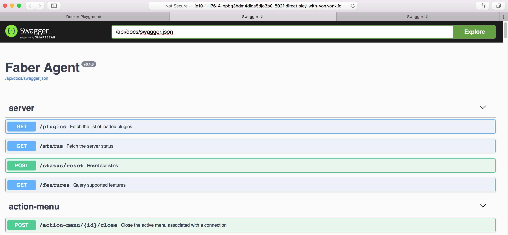
</details>

### Start the Alice Agent

Now to start Alice's agent. Click the "+Add a new instance" button again to open another terminal session. Run the following commands to start Alice's agent:

```bash
git clone https://github.com/hyperledger/aries-cloudagent-python
cd aries-cloudagent-python/demo
LEDGER_URL=http://dev.greenlight.bcovrin.vonx.io ./run_demo alice --events --no-auto --bg

```

Once you are back at the command prompt, we'll use docker's logging capability to see what's being written to the terminal:

```bash
docker logs -f alice
```

You can ignore a message like `WARNING: your terminal doesn't support cursor position requests (CPR).`

Once the Alice agent has started up (with the `invite:` prompt displayed), click the link near the top of the screen `8031`. That will start an instance of the OpenAPI/Swagger User Interface connected to the Alice instance. Note that the URL on the OpenAPI/Swagger instance is: `http://ip....8031.direct...`.

> NOTE: Hit "Ctrl-C" to get back to the command line. When you are done with the command line, you can return to seeing the logs from the Faber agent by running `docker logs -f faber`

**Remember that the OpenAPI/Swagger browser tab with an address containing 8031 is Alice's agent.**

<details>
    <summary>Show me a screenshot!</summary>
    
</details>

You are ready to go. Skip down to the [Using the OpenAPI/Swagger User Interface](#using-the-openapiswagger-user-interface) section.

## Running in Docker

To run the demo on your local system, you must have git, a running Docker installation, and terminal windows running bash. Need more information about getting set up? Click [here](https://github.com/cloudcompass/ToIPLabs/blob/master/docs/LFS173x/RunningLabs.md#running-on-docker-locally) to learn more.

### Start the Faber Agent

To begin running the demo in Docker, open up two terminal windows, one each for Faber’s and Alice’s agent.

In the first terminal window, clone the ACA-Py repo, change into the demo folder and start the Faber agent:

```bash
git clone https://github.com/hyperledger/aries-cloudagent-python
cd aries-cloudagent-python/demo
LEDGER_URL=http://dev.greenlight.bcovrin.vonx.io ./run_demo faber --events --no-auto --bg

```

Once you are back at the command prompt, we'll use docker's logging capability to see what's being written to the terminal:

```bash
docker logs -f faber
```

If all goes well, the agent will show a message indicating it is running. Use the second browser tab to navigate to [http://localhost:8021](http://localhost:8021). You should see an OpenAPI/Swagger user interface with a (long-ish) list of API endpoints. These are the endpoints exposed by the Faber agent.

> NOTE: Hit "Ctrl-C" to get back to the command line. When you are done with the command line, you can return to seeing the logs from the Faber agent by running `docker logs -f faber`

**Remember that the OpenAPI/Swagger browser tab with an address containing 8021 is the Faber agent.**

<details>
    <summary>Show me a screenshot!</summary>
    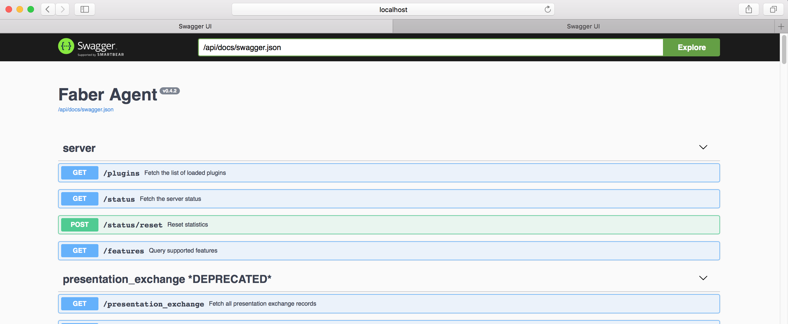
</details>

### Start the Alice Agent

To start Alice's agent, open up a second terminal window and in it, change to the same `demo` directory as where Faber's agent was started above. Once there, start Alice's agent:

``` bash
LEDGER_URL=http://dev.greenlight.bcovrin.vonx.io ./run_demo alice --events --no-auto --bg

```

Once you are back at the command prompt, we'll use docker's logging capability to see what's being written to the terminal:

```bash
docker logs -f alice
```

You can ignore a message like `WARNING: your terminal doesn't support cursor position requests (CPR)` that may appear.

If all goes well, the agent will show a message indicating it is running. Open a third browser tab and navigate to [http://localhost:8031](http://localhost:8031). Again, you should see the OpenAPI/Swagger user interface with a list of API endpoints, this time the endpoints for Alice’s agent.

> NOTE: Hit "Ctrl-C" to get back to the command line. When you are done with the command line, you can return to seeing the logs from the Alice agent by running `docker logs -f alice`


**Remember that the OpenAPI/Swagger browser tab with an address containing 8031 is Alice's agent.**

<details>
    <summary>Show me a screenshot!</summary>
    
</details>

### Restarting the Docker Containers

When you complete the entire demo (**not now!!**), you can need to stop the two agents.  To do that, get to the command line by hitting Ctrl-C and running:

``` bash
docker stop faber
docker stop alice
```

## Using the OpenAPI/Swagger User Interface

Try to organize what you see on your screen to include both the Alice and Faber OpenAPI/Swagger tabs, and both (Alice and Faber) terminal sessions, all at the same time. After you execute an API call in one of the browser tabs, you will see a webhook event from the ACA-Py instance in the terminal window of the other agent. That's a controller's life. See an event, process it, send a response.

From time to time you will want to see what's happening on the ledger, so keep that handy as well. As well, if you make an error with one of the commands (e.g. bad data, improperly structured JSON), you will see the errors in the terminals.

In the instructions that follow, we’ll let you know if you need to be in the Faber, Alice or Indy browser tab. We’ll leave it to you to track which is which.

Using the OpenAPI/Swagger user interface is pretty simple. In the steps below, we’ll indicate what API endpoint you need use, such as **`POST /connections/create-invitation`**. That means you must:

1. scroll to and find that endpoint;
2. click on the endpoint name to expand its section of the UI;
3. click on the `Try it out` button;
4. fill in any data necessary to run the command;
5. click `Execute`;
6. check the response to see if the request worked.

So, the mechanical steps are easy. It’s fourth step from the list above that can be tricky. Supplying the right data and, where JSON is involved, getting the syntax correct - braces and quotes can be a pain. When steps don’t work, start your debugging by looking at your JSON.

Enough with the preliminaries, let’s get started!

## Establishing a Connection

We’ll start the demo by establishing a connection between the Alice and Faber agents. We’re starting there to demonstrate that you can use agents without having a ledger. We won’t be using the Indy public ledger at all for this step. Since the agents communicate using DIDComm messaging and connect by exchanging pairwise DIDs and DIDDocs based on (an early version of) the `did:peer` DID method, a public ledger is not needed.

### Use the Faber Agent to Create an Invitation

In the Faber browser tab, navigate to the **`POST /connections/create-invitation`** endpoint. Replace the sample body with and empty production (`{}`) and execute the call. If successful, you should see a connection id, an invitation, and the invitation URL. The connection ids will be different on each run.

**Hint: set an Alias on the Invitation, this makes it easier to find the Connection later on**

<details>
    <summary>Show me a screenshot - Create Invitation Request</summary>
    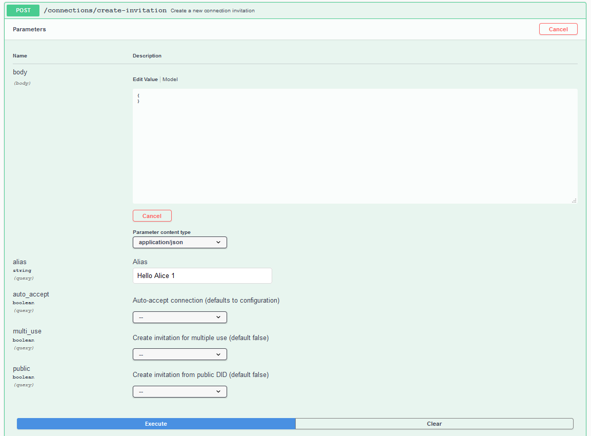
</details>

<details>
    <summary>Show me a screenshot - Create Invitation Response</summary>
    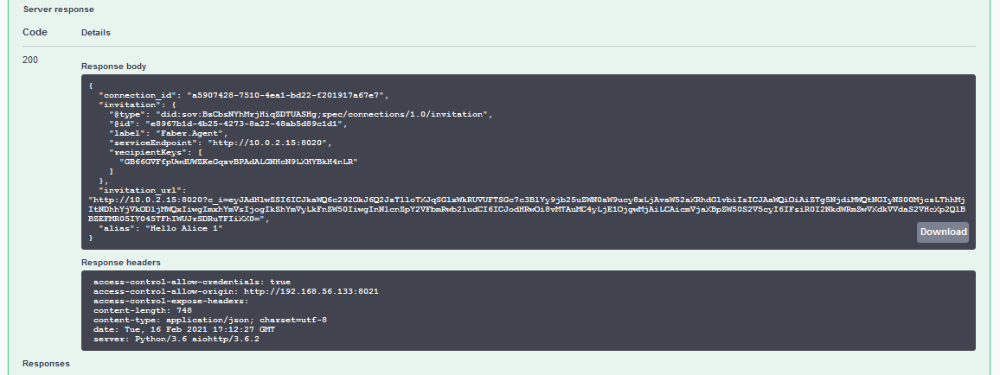
</details>

### Copy the Invitation created by the Faber Agent

Copy the entire block of the `invitation` object, from the curly brackets `{}`, excluding the trailing comma.

<details>
    <summary>Show me a screenshot - Create Invitation Response</summary>
    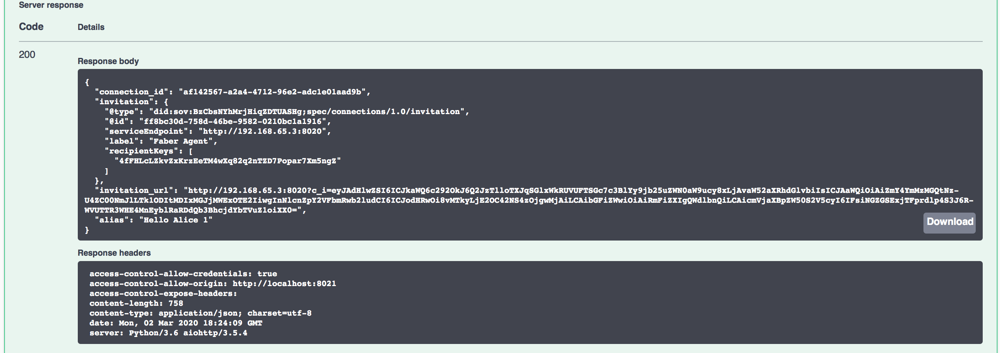
</details>

Before switching over to the Alice browser tab, scroll to and execute  the **`GET /connections`** endpoint to see the list of Faber's connections. You should see a connection with a `connection_id` that is identical to the invitation you just created, and that its state is `invitation`.

<details>
    <summary>Show me a screenshot - Faber Connection Status</summary>
    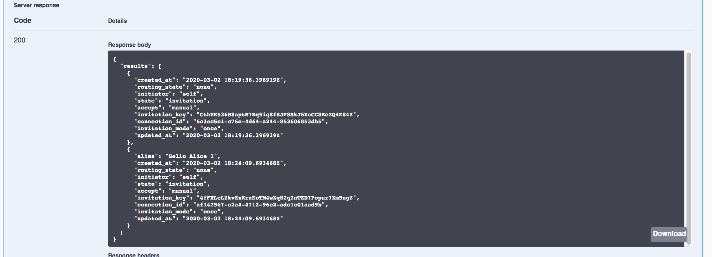
</details>

### Use the Alice Agent to Receive Faber's Invitation

Switch to the Alice browser tab and get ready to execute the **`POST /connections/receive-invitation`** endpoint. Select all of the pre-populated text and replace it with the invitation object from the Faber tab. When you click `Execute` you should get back a connection response with a connection Id, an invitation key, and the state of the connection, which should be `invitation`.

**Hint: set an Alias on the Invitation, this makes it easier to find the Connection later on**

<details>
    <summary>Show me a screenshot - Receive Invitation Request</summary>
    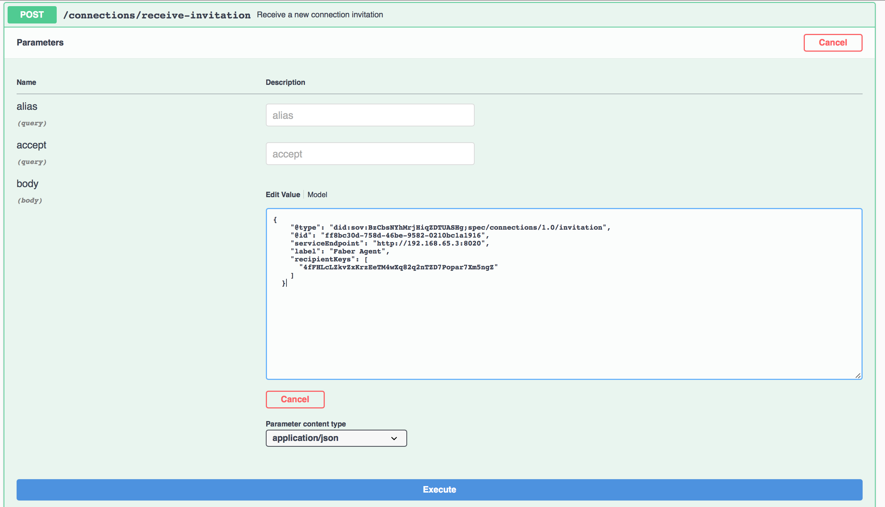
</details>

<details>
    <summary>Show me a screenshot - Receive Invitation Response</summary>
    
</details>

> A key observation to make here. The "copy and paste" we are doing here from Faber's agent to Alice's agent is what is called an "out of band" message. Because we don't yet have a DIDComm connection between the two agents, we have to convey the invitation in plaintext (we can't encrypt it - no channel) using some other mechanism than DIDComm. With mobile agents, that's where QR codes often come in. Once we have the invitation in the receivers agent, we can get back to using DIDComm.

### Tell Alice's Agent to *Accept* the Invitation

At this point Alice has simply stored the invitation in her wallet. You can see the status using the **`GET /connections`** endpoint.

<details>
    <summary>Show me a screenshot</summary>
    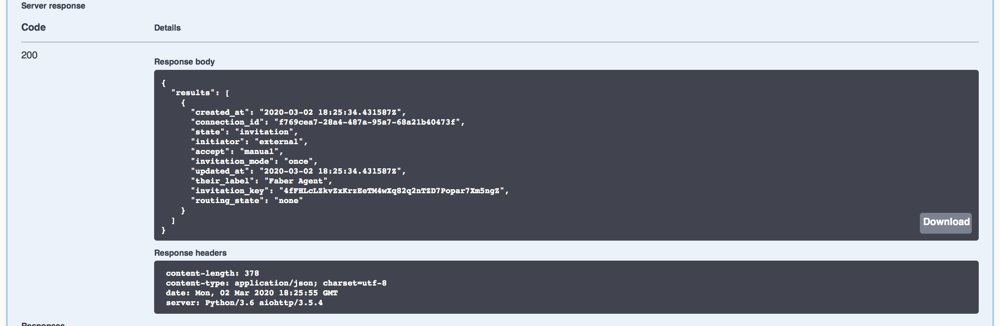
</details>

To complete a connection with Faber, she must accept the invitation and send a corresponding connection request to Faber. Find the `connection_id` in the connection response from the previous **`POST /connections/receive-invitation`** endpoint call. You may note that the same data was sent to the controller as an event from ACA-Py and is visible in the terminal. Scroll to the **`POST /connections/{conn_id}/accept-invitation`** endpoint and paste the `connection_id` in the `id` parameter field (you will have to click the `Try it out` button to see the available URL parameters). The response from clicking `Execute` should show that the connection has a state of `request`.

<details>
    <summary>Show me a screenshot - Accept Invitation Request</summary>
    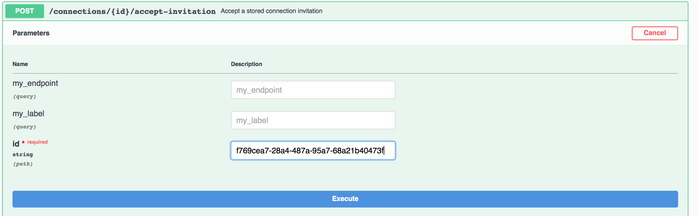
</details>

<details>
    <summary>Show me a screenshot - Accept Invitation Response</summary>
    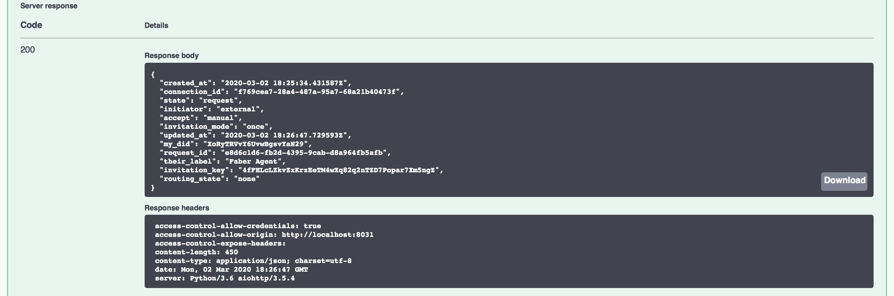
</details>

### The Faber Agent Gets the Request

In the Faber terminal session, an event (a web service callback from ACA-Py to the controller) has been received about the request from Alice. Copy the `connection_id` from the event for the next step.

<details>
    <summary>Show me the event</summary>
    
</details>

Note that the connection ID held by Alice is different from the one held by Faber. That makes sense, as both independently created connection objects, each with a unique, self-generated GUID.

### The Faber Agent Completes the Connection

To complete the connection process, Faber will respond to the connection request from Alice. Scroll to the **`POST /connections/{conn_id}/accept-request`** endpoint and paste the `connection_id` you previously copied into the `id` parameter field (you will have to click the `Try it out` button to see the available URL parameters). The response from clicking the `Execute` button should show that the connection has a state of `response`, which indicates that Faber has accepted Alice's connection request.

<details>
    <summary>Show me a screenshot - Accept Connection Request</summary>
    
</details>

<details>
    <summary>Show me a screenshot - Accept Connection Request</summary>
    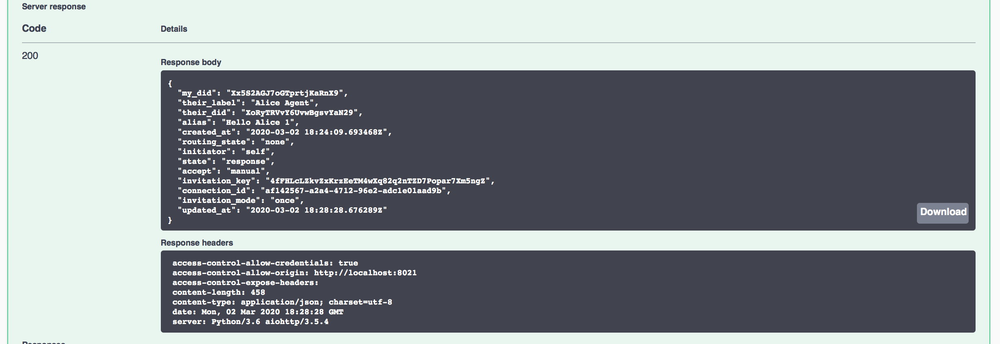
</details>

### Review the Connection Status in Alice's Agent

Switch over to the Alice browser tab.

Scroll to and execute **`GET /connections`** to see a list of Alice's connections, and the information tracked about each connection. You should see the one connection Alice’s agent has, that it is with the Faber agent, and that its state is `active`.

<details>
    <summary>Show me a screenshot - Alice Connection Status</summary>
    
</details>

As with Faber's side of the connection, Alice received a notification that Faber had accepted her connection request.

<details>
    <summary>Show me the event</summary>
    
</details>

### Review the Connection Status in Faber's Agent

You are connected! Switch to the Faber browser tab and run the same **`GET /connections`** endpoint to see Faber's view of the connection. Its state is also `active`. Note the `connection_id`, you’ll need it later in the tutorial.

<details>
    <summary>Show me a screenshot - Faber Connection Status</summary>
    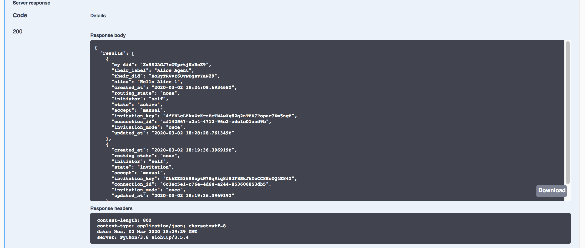
</details>

## Basic Messaging Between Agents

Once you have a connection between two agents, you have a channel to exchange secure, encrypted messages. In fact these underlying encrypted messages (similar to envelopes in a postal system) enable the delivery of messages that form the higher level protocols, such as issuing Credentials and providing Proofs. So, let's send a couple of messages that contain the simplest of context&mdash;text. For this we wil use the Basic Message protocol, [Aries RFC 0095](https://github.com/hyperledger/aries-rfcs/tree/master/features/0095-basic-message).

### Sending a message from Alice to Faber

On Alice's swagger page, scroll to the **`POST /connections/{conn_id}/send-message`** endpoint. Click on `Try it Out` and enter a message in the body provided (for example `{"content": "Hello Faber"}`). Enter the connection id of Alice's connection in the field provided. Then click on `Execute`.

<details>
    <summary>Show me a screenshot</summary>
    
</details>

### Receiving a Basic Message (Faber)

How does Faber know that a message was sent? If you take a look at Faber's console window, you can see that Faber's agent has raised an Event that the message was received:

<details>
    <summary>Show me a screenshot</summary>
    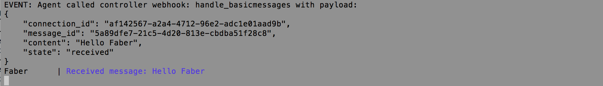
</details>

Faber's controller application can take whatever action is necessary to process this message. It could trigger some application code, or it might just be something the Faber application needs to display to its user (for example a reminder about some action the user needs to take).

### Alice's Agent Verifies that Faber has Received the Message

How does Alice get feedback that Faber has received the message? The same way - when Faber's agent acknowledges receipt of the message, Alice's agent raises an Event to let the Alice controller know:

<details>
    <summary>Show me a screenshot</summary>
    
</details>

Again, Alice's agent can take whatever action is necessary, possibly just flagging the message as having been `received`.

## Preparing to Issue a Credential

The next thing we want to do in the demo is have the Faber agent issue a credential to Alice’s agent. To this point, we have not used the Indy ledger at all. Establishing the connection and messaging has been done with pairwise DIDs based on the `did:peer` method. Verifiable credentials must be rooted in a public DID ledger to enable the presentation of proofs.

Before the Faber agent can issue a credential, it must register a DID on the Indy public ledger, publish a schema, and create a credential definition. In the “real world”, the Faber agent would do this before connecting with any other agents. And, since we are using the handy "./run_demo faber" (and "./run_demo alice") scripts to start up our agents, the Faber version of the script has already:

1. registered a public DID and stored it on the ledger;
2. created a schema and registered it on the ledger;
3. created a credential definition and registered it on the ledger.

The schema and credential definition could also be created through this swagger interface.

We don't cover the details of those actions in this tutorial, but there are other materials available that go through these details.

> To Do: Add a link to directions for doing this manually, and to where in the controller Python code this is done.

### Confirming your Schema and Credential Definition

You can confirm the schema and credential definition were published by going back to the Indy ledger browser tab using Faber's public DID. You may have saved that from a previous step, but if not here is an API call you can make to get that information. Using Faber's swagger page and scroll to the **`GET /wallet/did/public`** endpoint. Click on `Try it Out` and `Execute` and you will see Faber's public DID.

<details>
    <summary>Show me a screenshot</summary>
    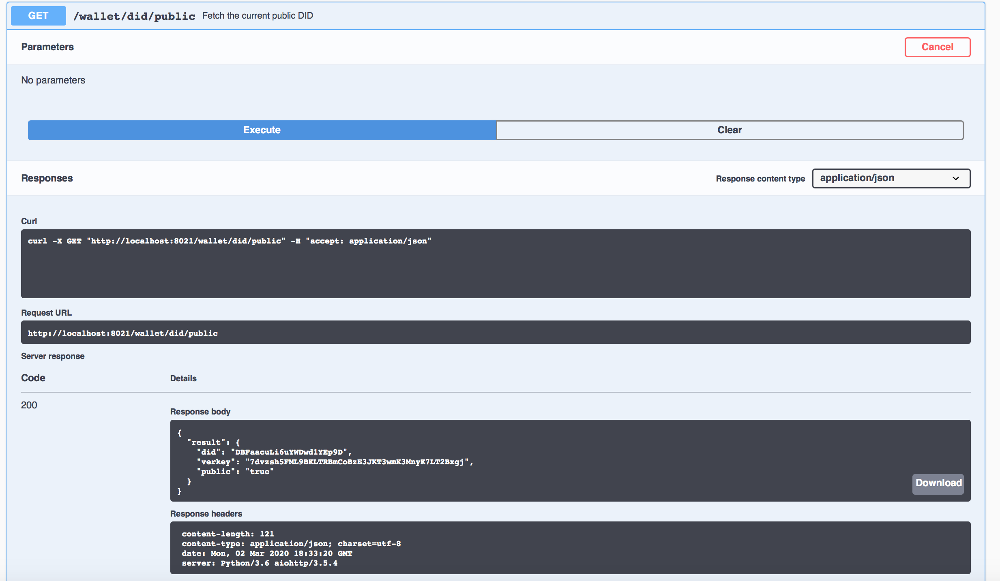
</details>

On the ledger browser of the [BCovrin ledger](http://dev.greenlight.bcovrin.vonx.io), click the `Domain` page, refresh, and paste the Faber public DID into the `Filter:` field:

<details>
    <summary>Show me a screenshot</summary>
    
</details>

The ledger browser should refresh and display the four (4) transactions on the ledger related to this DID:

- the initial DID registration
- registration of the DID endpoint (Faber is an issuer so it has a public endpoint)
- the registered schema
- the registered credential definition

<details>
    <summary>Show me the ledger transactions</summary>
    
    
    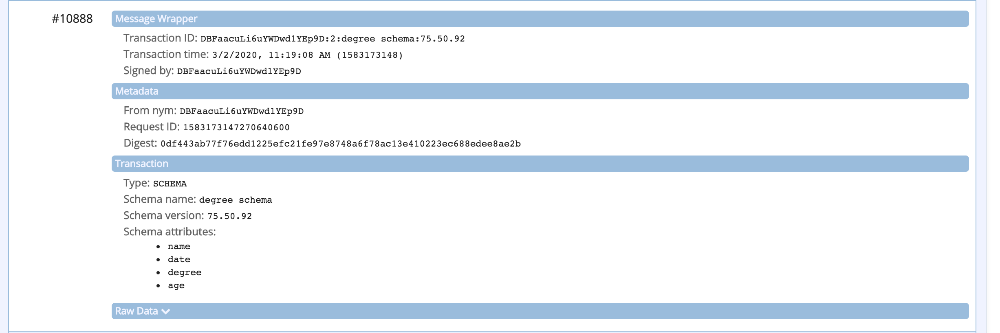
    
</details>

You can also look up the Schema and Credential Definition information using Faber's swagger page. Use the **`GET /schemas/created`** endpoint to get a list of schemas, including the one `schema_id` that the Faber agent has defined. Keep this section of the Swagger page expanded as we'll need to copy the Id as part of starting the issue credential protocol coming next.

<details>
    <summary>Show me a screenshot</summary>
    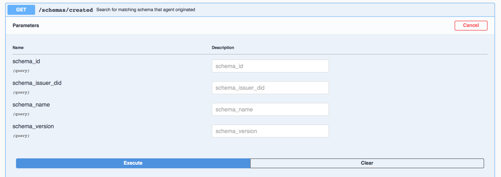
    
</details>

Likewise use the **`GET /credential-definitions/created`** endpoint to get the list of the one (in this case) credential definition id created by Faber. Keep this section of the Swagger page expanded as we'll also need to copy the Id as part of starting the issue credential protocol coming next.

<details>
    <summary>Show me a screenshot</summary>
    
    
</details>

**Hint**: Remember how the schema and credential definitions were created for you as Faber started up? To do it yourself, use the **`POST`** versions of these endpoints. Now you know!

### Notes

The one time setup work for issuing a credential is complete&mdash;creating a DID, schema and credential definition. We can now issue 1 or 1 million credentials without having to do those steps again. Astute readers might note that we did not setup a revocation registry, so we cannot revoke the credentials we issue with that credential definition. You can’t have everything in an "easy" tutorial!

## Issuing a Credential

Triggering the issuance of a credential from the Faber agent to Alice’s agent is done with another API call. In the Faber browser tab, scroll down to the **`POST /issue-credential-2.0/send`** and get ready to (but don’t yet) execute the request. Before execution, you need to update most of the data elements in the JSON. We now cover how to update all the fields.

### Faber - Preparing to Issue a Credential

First, get the connection Id for Faber's connection with Alice. You can copy that from the Faber terminal (the last received event includes it), or scroll up on the Faber swagger tab to the **`GET /connections`** API endpoint, execute, copy it and paste the `connection_id` value into the same field in the issue credential JSON.

<details>
    <summary>Click here to see a screenshot</summary>
    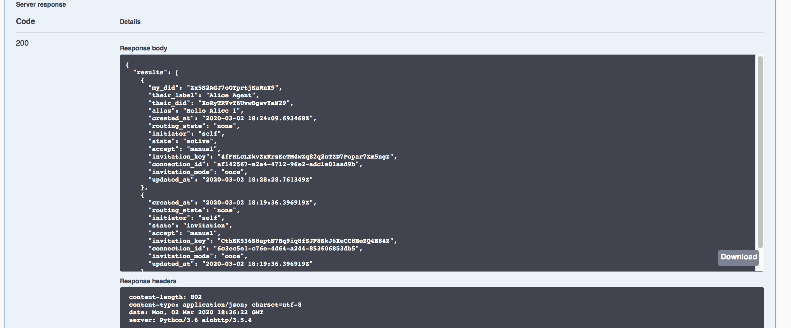
</details>

For the following fields, scroll on Faber's Swagger page to the listed endpoint, execute (if necessary), copy the response value and paste as the values of the following JSON items:

- `issuer_did` the Faber public DID (use **`GET /wallet/DID/public`**), 
- `schema_id` the Id of the schema Faber created (use **`GET /schemas/created`**) and,
- `cred_def_id` the Id of the credential definition Faber created (use **`GET /credential-definitions/created`**)

into the `filter` section's `indy` subsection. Remove the `"dif"` subsection of the `filter` section within the JSON, and specify the remaining indy filter criteria as follows:

- `schema_version`: set to the last segment of the `schema_id`, a three part version number that was randomly generated on startup of the Faber agent. Segments of the `schema_id` are separated by ":"s.
- `schema_issuer_did`: set to the same the value as in `issuer_did`,
- `schema_name`: set to the second last segment of the `schema_id`, in this case `degree schema`

Finally, set the remaining values as follows:
- `auto_remove`: set to `true` (no quotes), see note below
- `comment`: set to any string. It's intended to let Alice know something about the credential being offered.
- `trace`: set to `false` (no quotes). It's for troubleshooting, performance profiling, and/or diagnostics.

By setting `auto_remove` to true, ACA-Py will automatically remove the credential exchange record after the protocol completes. When implementing a controller, this is the likely setting to use to reduce agent storage usage, but implies if a record of the issuance of the credential is needed, the controller must save it somewhere else. For example, Faber College might extend their Student Information System, where they track all their students, to record when credentials are issued to students, and the Ids of the issued credentials.

### Faber - Issuing the Credential

Finally, we need put into the JSON the data values for the `credential_preview` section of the JSON. Copy the following and paste it between the square brackets of the `attributes` item, replacing what is there. Feel free to change the attribute `value` items, but don't change the labels or names:

```
      {
        "name": "name",
        "value": "Alice Smith"
      },
      {
        "name": "timestamp",
        "value": "1234567890"
      },
      {
        "name": "date",
        "value": "2018-05-28"
      },
      {
        "name": "degree",
        "value": "Maths"
      },
      {
        "name": "birthdate_dateint",
        "value": "19640101"
      }
```

(Note that the birthdate above is used to present later on to pass an "age proof".)

OK, finally, you are ready to click `Execute`. The request should work, but if it doesn’t - check your JSON! Did you get all the quotes and commas right?

<details>
    <summary>Show me a screenshot - credential offer</summary>
    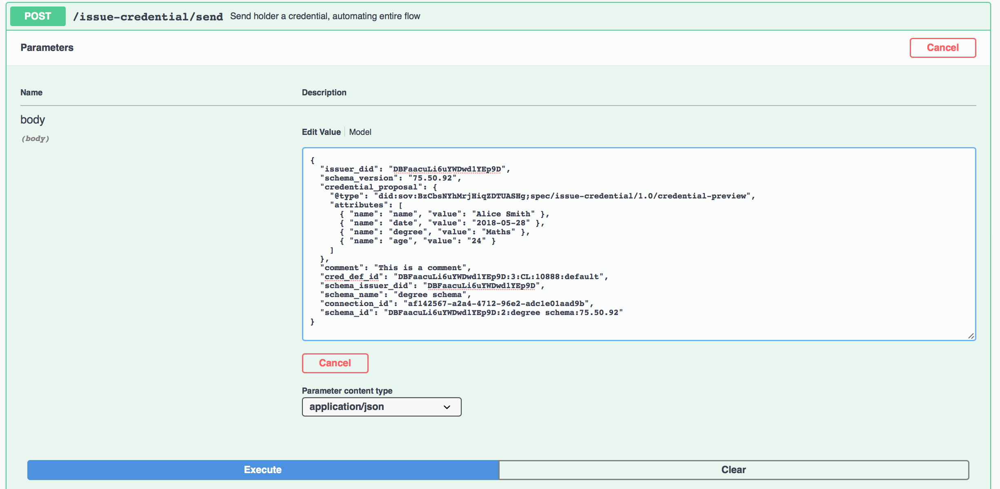
    
</details>

To confirm the issuance worked, scroll up on the Faber Swagger page to the `issue-credential v2.0` section and execute the **`GET /issue-credential-2.0/records`** endpoint. You should see a lot of information about the exchange just initiated.

### Alice Receives Credential

Let’s look at it from Alice’s side. Alice's agent source code automatically handles credential offers by immediately responding with a credential request. Scroll back in the Alice terminal to where the credential issuance started. If you've followed the full script, that is just after where we used the basic message protocol to send text messages between Alice and Faber.

Alice's agent first received a notification of a Credential Offer, to which it responded with a Credential Request. Faber received the Credential Request and responded in turn with an Issue Credential message. Scroll down through the events from ACA-Py to the controller to see the notifications of those messages. Make sure you scroll all the way to the bottom of the terminal so you can continue with the process.

<details>
    <summary>Show me a screenshot - issue credential</summary>
    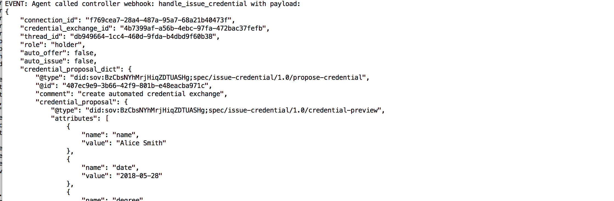
</details>

### Alice Stores Credential in her Wallet

We can check (via Alice's Swagger interface) the issue credential status by hitting the **`GET /issue-credential-2.0/records`** endpoint. Note that within the results, the `cred_ex_record` just received has a `state` of `credential-received`, but not yet `done`. Let's address that.

<details>
    <summary>Show me a screenshot - check credential exchange status</summary>
    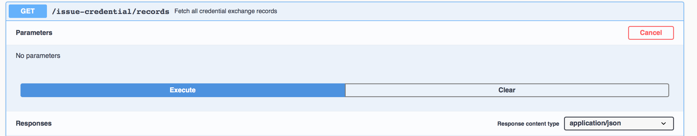
    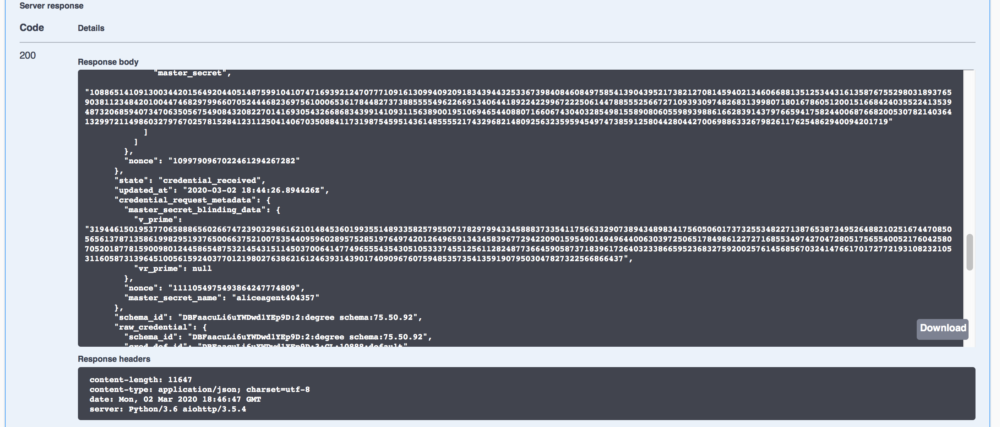
</details>

First, we need the `cred_ex_id` from the API call response above, or from the event in the terminal; use the endpoint **`POST /issue-credential-2.0/records/{cred_ex_id}/store`** to tell Alice's ACA-Py instance to store the credential in agent storage (aka the Indy Wallet). Note that in the JSON for that endpoint we can provide a credential Id to store in the wallet by setting a value in the `credential_id` string. A real controller might use the `cred_ex_id` for that, or use something else that makes sense in the agent's business scenario (but the agent generates a random credential identifier by default).

<details>
    <summary>Show me a screenshot - store credential</summary>
    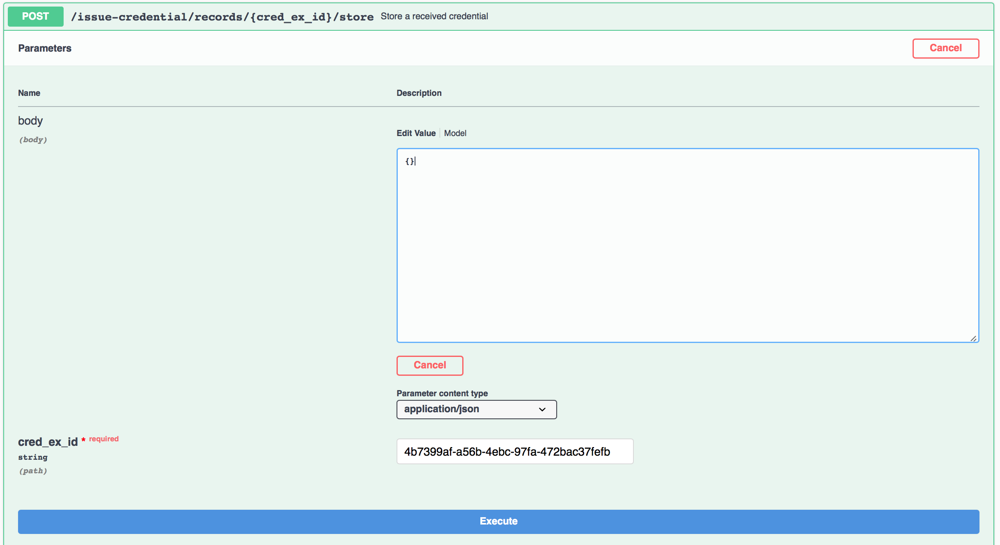
    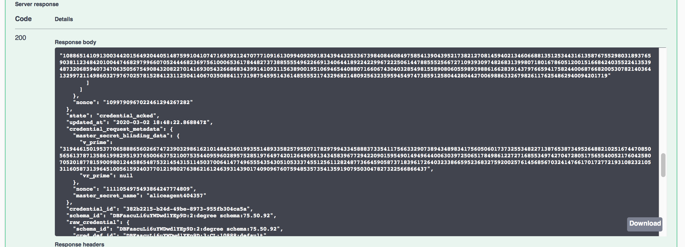
</details>

Now, in Alice’s swagger browser tab, find the `credentials` section and within that, execute the **`GET /credentials`** endpoint. There should be a list of credentials held by Alice, with just a single entry, the credential issued from the Faber agent. Note that the element `referent` is the value of the `credential_id` element used in other calls. `referent` is the name returned in the `indy-sdk` call to get the set of credentials for the wallet and ACA-Py code does not change it in the response.

### Faber Receives Acknowledgment that the Credential was Received

On the Faber side, we can see by scanning back in the terminal that it receive events to notify that the credential was issued and accepted.

<details>
    <summary>Show me Faber's event activity</summary>
    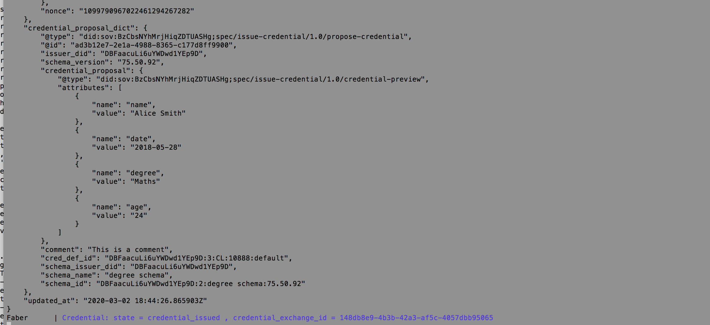
    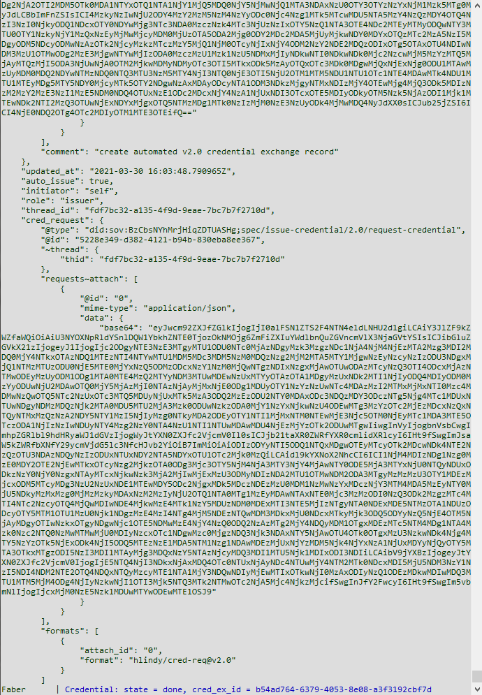
</details>

Note that once the credential processing completed, Faber's agent deleted the credential exchange record from its wallet. This can be confirmed by executing the endpoint **`GET /issue-credential-2.0/records`**

<details>
    <summary>Show me a screenshot</summary>
    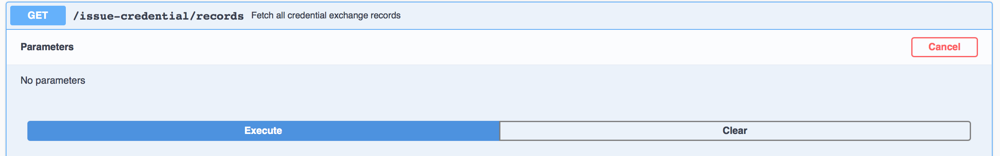
    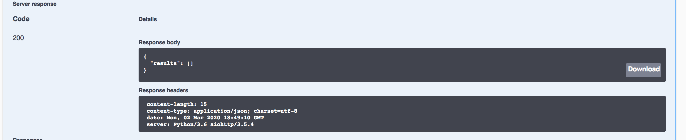
</details>

You’ve done it, issued a credential!  w00t!

### Issue Credential Notes

Those that know something about the Indy process for issuing a credential and the DIDComm `Issue Credential` protocol know that there multiple steps to issuing credentials, a back and forth between the issuer and the holder to (at least) offer, request and issue the credential. All of those messages happened, but the two agents took care of those details rather than bothering the controller (you, in this case) with managing the back and forth.

* On the Faber agent side, this is because we used the **`POST /issue-credential-2.0/send`** administrative message, which handles the back and forth for the issuer automatically. We could have used the other `/issue-credential-2.0/` endpoints to allow the controller to handle each step of the protocol.
* On Alice's agent side, this is because the handler for the `issue_credential_v2_0` event always responds to credential offers with corresponding credential requests.

### Bonus Points

If you would like to perform all of the issuance steps manually on the Faber agent side, use a sequence of the other `/issue-credential-2.0/` messages. Use the **`GET /issue-credential-2.0/records`** to both check the credential exchange state as you progress through the protocol and to find some of the data you’ll need in executing the sequence of requests.

The following table lists endpoints that you need to call ("REST service") and callbacks that your agent will receive ("callback") that your need to respond to. See the [detailed API docs](../AdminAPI.md).

| Protocol Step        | Faber (Issuer)         | Alice (Holder)     | Notes |
| -------------------- | ---------------------- | ------------------ | ----- |
| Send Credential Offer | **`POST /issue-credential-2.0/send-offer`** | | REST service |
| Receive Offer | | <agent_cb>/issue_credential_v2_0/ | callback |
| Send Credential Request | | **`POST /issue-credential-2.0/records/{cred_ex_id}/send-request`** | REST service |
| Receive Request | <agent_cb>/issue_credential_v2_0/ | | callback |
| Issue Credential | **`POST /issue-credential-2.0/records/{cred_ex_id}/issue`** | | REST service |
| Receive Credential | | <agent_cb>/issue_credential_v2_0/ | callback |
| Store Credential | | **`POST /issue-credential-2.0/records/{cred_ex_id}/store`** | REST service |
| Receive Acknowledgement | <agent_cb>/issue_credential_v2_0/ | | callback |
| Store Credential Id | | | application function |

## Requesting/Presenting a Proof

Alice now has her Faber credential. Let’s have the Faber agent send a request for a presentation (a proof) using that credential. This should be pretty easy for you at this point.

### Faber sends a Proof Request

From the Faber browser tab, get ready to execute the **`POST /present-proof-2.0/send-request`** endpoint. After hitting `Try it Now`, erase the data in the block labelled "Edit Value Model", replacing it with the text below. Once that is done, replace in the JSON each instance of `cred_def_id` (there are four instances) and `connection_id` with the values found using the same techniques we've used earlier in this tutorial. Both can be found by scrolling back a little in the Faber terminal, or you can execute API endpoints we've already covered. You can also change the value of the `comment` item to whatever you want.

```jsonc
{
  "comment": "This is a comment about the reason for the proof",
  "connection_id": "e469e0f3-2b4d-4b12-9ac7-293f23e8a816",
  "presentation_request": {
    "indy": {
      "name": "Proof of Education",
      "version": "1.0",
      "requested_attributes": {
        "0_name_uuid": {
          "name": "name",
          "restrictions": [
            {
              "cred_def_id": "SsX9siFWXJyCAmXnHY514N:3:CL:8:faber.agent.degree_schema"
            }
          ]
        },
        "0_date_uuid": {
          "name": "date",
          "restrictions": [
            {
              "cred_def_id": "SsX9siFWXJyCAmXnHY514N:3:CL:8:faber.agent.degree_schema"
            }
          ]
        },
        "0_degree_uuid": {
          "name": "degree",
          "restrictions": [
            {
              "cred_def_id": "SsX9siFWXJyCAmXnHY514N:3:CL:8:faber.agent.degree_schema"
            }
          ]
        },
        "0_self_attested_thing_uuid": {
          "name": "self_attested_thing"
        }
      },
      "requested_predicates": {
        "0_age_GE_uuid": {
          "name": "birthdate_dateint",
          "p_type": "<=",
          "p_value": 20030101,
          "restrictions": [
            {
              "cred_def_id": "SsX9siFWXJyCAmXnHY514N:3:CL:8:faber.agent.degree_schema"
            }
          ]
        }
      }
    }
  }
}
```

(Note that the birthdate requested above is used as an "age proof", the calculation is something like `now() - years(18)`, and the presented birthdate must be on or before this date.  You can see the calculation in action in the `faber.py` demo code.)

Notice that the proof request is using a predicate to check if Alice is older than 18 without asking for her age. Not sure what this has to do with her education level! Click `Execute` and cross your fingers. If the request fails check your JSON!

<details>
    <summary>Show me a screenshot - send proof request</summary>
    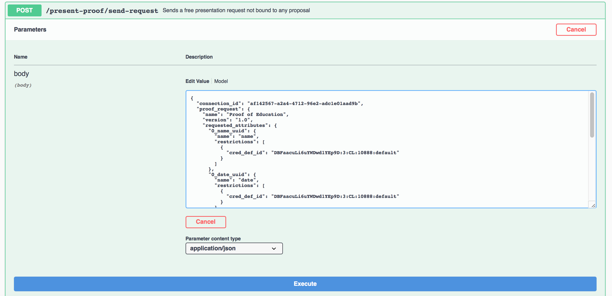
    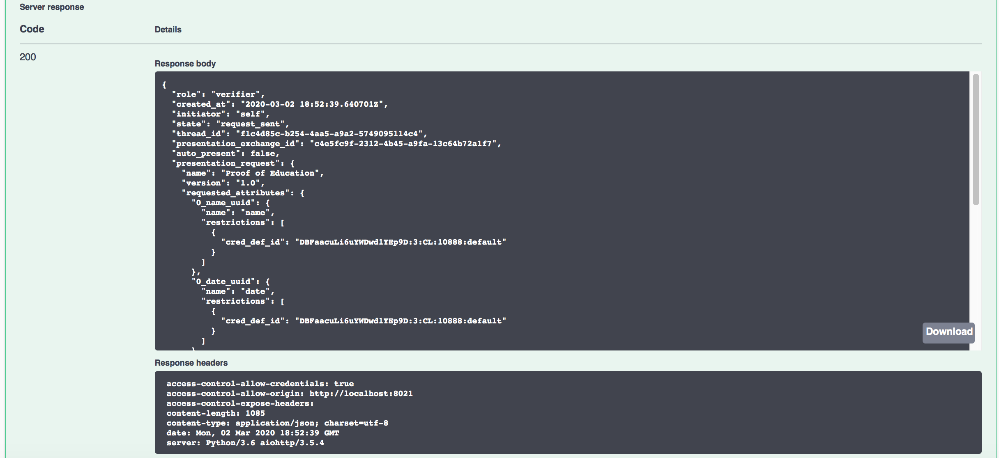
</details>

### Alice - Responding to the Proof Request

As before, Alice receives a webhook event from her agent telling her she has received a Proof Request. In our scenario, the ACA-Py instance automatically selects a matching credential and responds with a Proof.

<details>
    <summary>Show me Alice's event activity</summary>
    
    
</details>

In a real scenario, for example if Alice had a mobile agent on her smartphone, the agent would prompt Alice whether she wanted to respond or not.

### Faber - Verifying the Proof

Note that in the response, the state is `request-sent`. That is because when the HTTP response was generated (immediately after sending the request), Alice's agent had not yet responded to the request. We’ll have to do another request to verify the presentation worked. Copy the value of the `pres_ex_id` field from the event in the Faber terminal and use it in executing the **`GET /present-proof-2.0/records/{pres_ex_id}`** endpoint. That should return a result showing the `state` as `done` and `verified` as `true`. Proof positive!

You can see some of Faber's activity below:

<details>
    <summary>Show me Faber's event activity</summary>
    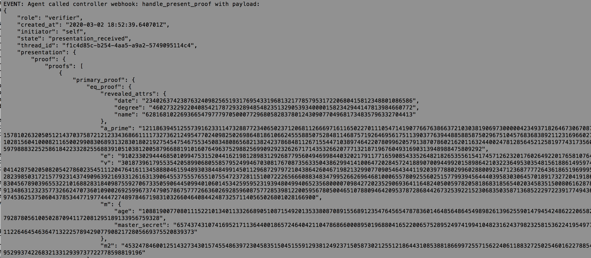
    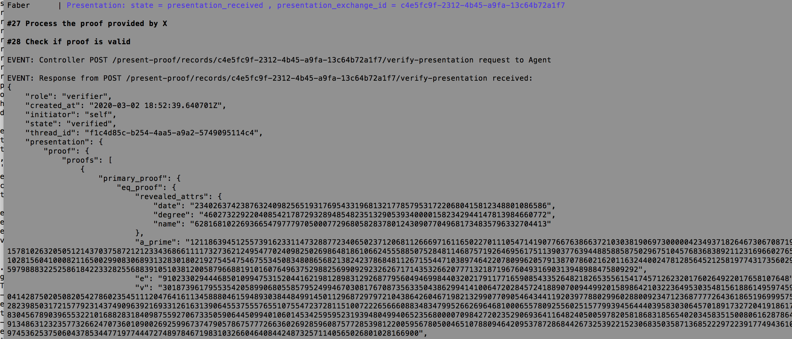
    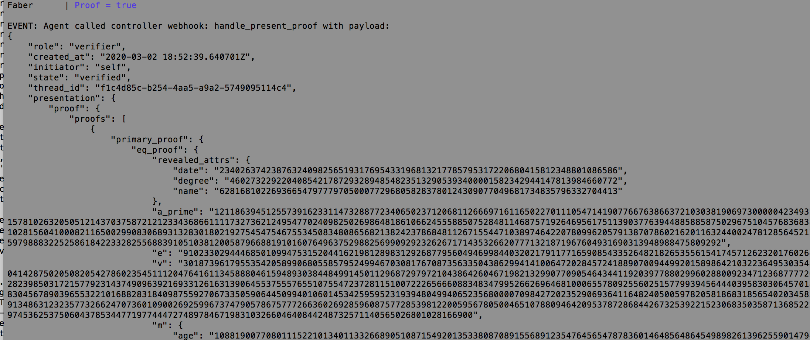
</details>

### Present Proof Notes

As with the issue credential process, the agents handled some of the presentation steps without bothering the controller. In this case, Alice's agent processed the presentation request automatically through its handler for the `present_proof_v2_0` event, and her wallet contained exactly one credential that satisfied the presentation-request from the Faber agent. Similarly, the Faber agent's handler for the event responds automatically and so on receipt of the presentation, it verified the presentation and updated the status accordingly.

### Bonus Points

If you would like to perform all of the proof request/response steps manually, you can call all of the individual `/present-proof-2.0` messages.

The following table lists endpoints that you need to call ("REST service") and callbacks that your agent will receive ("callback") that your need to respond to. See the [detailed API docs](../AdminAPI.md).

| Protocol Step        | Faber (Verifier)       | Alice (Holder/Prover)     | Notes |
| -------------------- | ---------------------- | ------------------------- | ----- |
| Send Proof Request | **`POST /present-proof-2.0/send-request`** | | REST service |
| Receive Proof Request | | <agent_cb>/present_proof_v2_0 | callback |
| Find Credentials | | **`GET /present-proof-2.0/records/{pres_ex_id}/credentials`** | REST service |
| Select Credentials | | | application or user function |
| Send Proof | | **`POST /present-proof-2.0/records/{pres_ex_id}/send-presentation`** | REST service |
| Receive Proof | <agent_cb>/present_proof_v2_0 | | callback |
| Validate Proof | **`POST /present-proof-2.0/records/{pres_ex_id}/verify-presentation`** | | REST service |
| Save Proof | | | application data |

## Conclusion

That’s the OpenAPI-based tutorial. Feel free to play with the API and learn how it works. More importantly, as you implement a controller, use the OpenAPI user interface to test out the calls you will be using as you go. The list of API calls is grouped by protocol and if you are familiar with the protocols (Aries RFCs) the API call names should be pretty obvious.

One limitation of you being the controller is that you don't see the events from the agent that a controller program sees. For example, you, as Alice's agent, are not notified when Faber initiates the sending of a Credential. Some of those things show up in the terminal as messages, but others you just have to know have happened based on a successful API call.

<!-- Docs to Markdown version 1.0β17 -->
