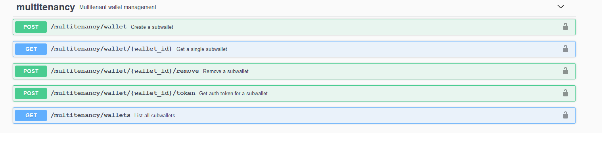

# Aries Cloud Agent Python (ACA-Py) Demos <!-- omit in toc -->

There are several demos available for ACA-Py mostly (but not only) aimed at developers learning how to deploy an instance of the agent and an ACA-Py controller to implement an application.

## Table of Contents <!-- omit in toc -->

- [The Alice/Faber Python demo](#the-alicefaber-python-demo)
  - [Running in a Browser](#running-in-a-browser)
  - [Running in Docker](#running-in-docker)
  - [Running Locally](#running-locally)
    - [Installing Prerequisites](#installing-prerequisites)
    - [Start a local Indy ledger](#start-a-local-indy-ledger)
    - [Genesis File handling](#genesis-file-handling)
    - [Run a local Postgres instance](#run-a-local-postgres-instance)
    - [Optional: Run a von-network ledger browser](#optional-run-a-von-network-ledger-browser)
    - [Run the Alice and Faber Controllers/Agents](#run-the-alice-and-faber-controllersagents)
  - [Follow The Script](#follow-the-script)
    - [Exchanging Messages](#exchanging-messages)
    - [Issuing and Proving Credentials](#issuing-and-proving-credentials)
- [Additional Options in the Alice/Faber demo](#additional-options-in-the-alicefaber-demo)
  - [Revocation](#revocation)
  - [DID Exchange](#did-exchange)
  - [Endorser](#endorser)
  - [Run Indy-SDK Backend](#run-indy-sdk-backend)
  - [Mediation](#mediation)
  - [Multi-ledger](#multi-ledger)
  - [Multi-tenancy](#multi-tenancy)
  - [Multi-tenancy *with Mediation*!!!](#multi-tenancy-with-mediation)
- [Learning about the Alice/Faber code](#learning-about-the-alicefaber-code)
- [OpenAPI (Swagger) Demo](#openapi-swagger-demo)
- [Performance Demo](#performance-demo)
- [Coding Challenge: Adding ACME](#coding-challenge-adding-acme)

## The Alice/Faber Python demo

The Alice/Faber demo is the (in)famous first verifiable credentials demo. Alice, a former student of Faber College ("Knowledge is Good"), connects with the College, is issued a credential about her degree and then is asked by the College for a proof. There are a variety of ways of running the demo. The easiest is in your browser using a site ("Play with VON") that let's you run docker containers without installing anything. Alternatively, you can run locally on docker (our recommendation), or using python on your local machine. Each approach is covered below.

### Running in a Browser

In your browser, go to the docker playground service [Play with Docker](https://labs.play-with-docker.com/). On the title screen, click "Start". On the next screen, click (in the left menu) "+Add a new instance".  That will start up a terminal in your browser. Run the following commands to start the Faber agent:

```bash
git clone https://github.com/hyperledger/aries-cloudagent-python
cd aries-cloudagent-python/demo
LEDGER_URL=http://dev.greenlight.bcovrin.vonx.io ./run_demo faber
```

Now to start Alice's agent. Click the "+Add a new instance" button again to open another terminal session. Run the following commands to start Alice's agent:

```bash
git clone https://github.com/hyperledger/aries-cloudagent-python
cd aries-cloudagent-python/demo
LEDGER_URL=http://dev.greenlight.bcovrin.vonx.io ./run_demo alice
```

Alice's agent is now running.

Jump to the [Follow the Script](#follow-the-script) section below for further instructions.

### Running in Docker

Running the demo in docker requires having a `von-network` (a Hyperledger Indy public ledger sandbox) instance running in docker locally. See the [VON Network Tutorial](https://github.com/bcgov/von-network/blob/main/docs/UsingVONNetwork.md) for guidance
on starting and stopping your own local Hyperledger Indy instance.

Open three `bash` shells. For Windows users, `git-bash` is highly recommended. bash is the default shell in Linux and Mac terminal sessions.

In the first terminal window, start `von-network` by following the [Building and Starting](https://github.com/bcgov/von-network/blob/main/docs/UsingVONNetwork.md#building-and-starting) instructions.

In the second terminal, change directory into `demo` directory of your clone of the Aries Cloud Agent Python repository. Start the `faber` agent by issuing the following command:

``` bash
  ./run_demo faber
```

In the third terminal, change directory into `demo` directory of your clone of the Aries Cloud Agent Python repository. Start the `alice` agent by issuing the following command:

``` bash
  ./run_demo alice
```

Jump to the [Follow the Script](#follow-the-script) section below for further instructions.

### Running Locally

The following is an approach to to running the Alice and Faber demo using Python3 running on a bare machine. There are other ways to run the components, but this covers the general approach.

We don't recommend this approach if you are just trying this demo, as you will likely run into issues with the specific setup of your machine.

#### Installing Prerequisites

We assume you have a running Python 3 environment.  To install the prerequisites specific to running the agent/controller examples in your Python environment, run the following command from this repo's `demo` folder. The precise command to run may vary based on your Python environment setup.

``` bash
pip3 install -r demo/requirements.txt
```

While that process will include the installation of the Indy python prerequisite, you still have to build and install the `libindy` code for your platform. Follow the [installation instructions](https://github.com/hyperledger/indy-sdk#installing-the-sdk) in the indy-sdk repo for your platform.

#### Start a local Indy ledger

Start a local `von-network` Hyperledger Indy network running in Docker by following the VON Network [Building and Starting](https://github.com/bcgov/von-network/blob/main/docs/UsingVONNetwork.md#building-and-starting) instructions.

We strongly recommend you use Docker for the local Indy network until you really, really need to know the details of running an Indy Node instance on a bare machine.

#### Genesis File handling

> Assuming you followed our advice and are using a VON Network instance of Hyperledger Indy, you can ignore this section. If you started the Indy ledger **without** using VON Network, this information might be helpful.

An Aries agent (or other client) connecting to an Indy ledger must know the contents of the `genesis` file for the ledger. The genesis file lets the agent/client know the IP addresses of the initial nodes of the ledger, and the agent/client sends ledger requests to those IP addresses. When using the `indy-sdk` ledger, look for the instructions in that repo for how to find/update the ledger genesis file, and note the path to that file on your local system.

The envrionment variable `GENESIS_FILE` is used to let the Aries demo agents know the location of the genesis file. Use the path to that file as value of the `GENESIS_FILE` environment variable in the instructions below. You might want to copy that file to be local to the demo so the path is shorter.

#### Run a local Postgres instance

The demo uses the postgres database the wallet persistence. Use the Docker Hub certified postgres image to start up a postgres instance to be used for the wallet storage:

``` bash
docker run --name some-postgres -e POSTGRES_PASSWORD=mysecretpassword -d -p 5432:5432 postgres -c 'log_statement=all' -c 'logging_collector=on' -c 'log_destination=stderr'
```

#### Optional: Run a von-network ledger browser

If you followed our advice and are using a VON Network instance of Hyperledger Indy, you can ignore this section, as you already have a Ledger browser running, accessible on http://localhost:9000.

 If you started the Indy ledger **without** using VON Network, and you want to be able to browse your local ledger as you run the demo, clone the [von-network](https://github.com/bcgov/von-network) repo, go into the root of the cloned instance and run the following command, replacing the `/path/to/local-genesis.txt` with a path to the same genesis file as was used in starting the ledger.

``` bash
GENESIS_FILE=/path/to/local-genesis.txt PORT=9000 REGISTER_NEW_DIDS=true python -m server.server
```

#### Run the Alice and Faber Controllers/Agents

With the rest of the pieces running, you can run the Alice and Faber controllers and agents. To do so, `cd` into the `demo` folder your clone of this repo in two terminal windows.

If you are using a VON Network instance of Hyperledger, run the following commands:

``` bash
DEFAULT_POSTGRES=true python3 -m runners.faber --port 8020
```

``` bash
DEFAULT_POSTGRES=true python3 -m runners.alice --port 8030
```

If you started the Indy ledger **without** using VON Network, use the following commands, replacing the `/path/to/local-genesis.txt` with the one for your configuration.

``` bash
GENESIS_FILE=/path/to/local-genesis.txt DEFAULT_POSTGRES=true python3 -m runners.faber --port 8020
```

``` bash
GENESIS_FILE=/path/to/local-genesis.txt DEFAULT_POSTGRES=true python3 -m runners.alice --port 8030
```

Note that Alice and Faber will each use 5 ports, e.g., using the parameter `... --port 8020` actually uses ports 8020 through 8024. Feel free to use different ports if you want.

Everything running?  See the [Follow the Script](#follow-the-script) section below for further instructions.

If the demo fails with an error that references the genesis file, a timeout connecting to the Indy Pool, or an Indy `307` error, it's likely a problem with the genesis file handling. Things to check:

- Review the instructions for running the ledger with `indy-sdk`. Is it running properly?
- Is the `/path/to/local-genesis.txt` file correct in your start commands?
- Look at the IP addresses in the genesis file you are using, and make sure that those IP addresses are accessible from the location you are running the Aries demo
- Check to make sure that all of the nodes of the ledger started. We've seen examples of only some of the nodes starting up, triggering an Indy `307` error.

### Follow The Script

With both the Alice and Faber agents started, go to the Faber terminal window. The Faber agent has created and displayed an invitation. Copy this invitation and paste it at the Alice prompt. The agents will connect and then show a menu of options:

Faber:

```
    (1) Issue Credential
    (2) Send Proof Request
    (3) Send Message
    (4) Create New Invitation
    (T) Toggle tracing on credential/proof exchange
    (X) Exit?
```

Alice:

```
    (3) Send Message
    (4) Input New Invitation
    (X) Exit?
```

#### Exchanging Messages

Feel free to use the "3" option to send messages back and forth between the agents. Fun, eh? Those are secure, end-to-end encrypted messages.

#### Issuing and Proving Credentials

When ready to test the credentials exchange protocols, go to the Faber prompt, enter "1" to send a credential, and then "2" to request a proof.

You don't need to do anything with Alice's agent - her agent is implemented to automatically receive credentials and respond to proof requests.

Note there is an option "2a" to initiate a connectionless proof - you can execute this option but it will only work end-to-end when [connecting to Faber from a mobile agent](AliceGetsAPhone.md).

## Additional Options in the Alice/Faber demo

You can enable support for various ACA-Py features by providing additional command-line arguements when starting up `alice` or `faber`.

Note that when the controller starts up the agent, it prints out the ACA-Py startup command with *all* parameters - you can inspect this command to see what parameters are provided in each case.  For more details on the parameters, just start ACA-Py with the `--help` parameter, for example:

```
./scripts/run_docker start --help
```

### Revocation

To enable support for revoking credentials, run the `faber` demo with the `--revocation` option:

```bash
./run_demo faber --revocation
```

Note that you don't specify this option with `alice` because it's only applicable for the credential `issuer` (who has to enable revocation when creating a credential definition, and explicitely revoke credentials as appropriate; alice doesn't have to do anything special when revocation is enabled).

You need to run an AnonCreds revocation registry tails server in order to support revocation - the details are described in the [Alice gets a Phone](https://github.com/hyperledger/aries-cloudagent-python/blob/master/demo/AliceGetsAPhone.md#run-an-instance-of-indy-tails-server) demo instructions.

Faber will setup support for revocation automatically, and you will see an extra option in faber's menu to revoke a credential:

```
    (1) Issue Credential
    (2) Send Proof Request
    (3) Send Message
    (4) Create New Invitation
    (5) Revoke Credential
    (6) Publish Revocations
    (T) Toggle tracing on credential/proof exchange
    (X) Exit?
  ```

When you issue a credential, make a note of the `Revocation registry ID` and `Credential revocation ID`:

```
Faber      | Revocation registry ID: WGmUNAdH2ZfeGvacFoMVVP:4:WGmUNAdH2ZfeGvacFoMVVP:3:CL:38:Faber.Agent.degree_schema:CL_ACCUM:15ca49ed-1250-4608-9e8f-c0d52d7260c3
Faber      | Credential revocation ID: 1
```

When you revoke a credential you will need to provide those values:

```
[1/2/3/4/5/6/T/X] 5

Enter revocation registry ID: WGmUNAdH2ZfeGvacFoMVVP:4:WGmUNAdH2ZfeGvacFoMVVP:3:CL:38:Faber.Agent.degree_schema:CL_ACCUM:15ca49ed-1250-4608-9e8f-c0d52d7260c3
Enter credential revocation ID: 1
Publish now? [Y/N]: y
```

Note that you need to Publish the revocation information to the ledger.  Once you've revoked a credential any proof which uses this credential will fail to verify.

### DID Exchange

You can enable DID Exchange using the `--did-exchange` parameter for the `alice` and `faber` demos.

This will use the new DID Exchange protocol when establishing connections between the agents, rather than the older Connection protocol.  There is no other affect on the operation of the agents.

Note that you can't (currently) use the DID Exchange protocol to connect with any of the available mobile agents.

### Endorser

This is described in [Endorser.md](Endorser.md)

### Run Indy-SDK Backend

This runs using the older (and not recommended) indy-sdk libraries instead of [Aries Askar](:uhttps://github.com/hyperledger/aries-ask):

```bash
./run_demo faber --wallet-type indy
```

### Mediation

To enable mediation, run the `alice` or `faber` demo with the `--mediation` option:

```bash
./run_demo faber --mediation
```

This will start up a "mediator" agent with Alice or Faber and automatically set the alice/faber connection to use the mediator.

### Multi-ledger

To enable multiple ledger mode, run the `alice` or `faber` demo with the `--multi-ledger` option:

```bash
./run_demo faber --multi-ledger
```

The configuration file for setting up multiple ledgers (for the demo) can be found at `./demo/multiple_ledger_config.yml`.

### Multi-tenancy

To enable support for multi-tenancy, run the `alice` or `faber` demo with the `--multitenant` option:

```bash
./run_demo faber --multitenant
```

(This option can be used with both (or either) `alice` and/or `faber`.)

You will see an additional menu option to create new sub-wallets (or they can be considered to be "virtual agents").

Faber:

```
    (1) Issue Credential
    (2) Send Proof Request
    (3) Send Message
    (4) Create New Invitation
    (W) Create and/or Enable Wallet
    (T) Toggle tracing on credential/proof exchange
    (X) Exit?
```

Alice:

```
    (3) Send Message
    (4) Input New Invitation
    (W) Create and/or Enable Wallet
    (X) Exit?
```

When you create a new wallet, you just need to provide the wallet name. (If you provide the name of an existing wallet then the controller will "activate" that wallet and make it the current wallet.)

```
[1/2/3/4/W/T/X] w

Enter wallet name: new_wallet_12

Faber      | Register or switch to wallet new_wallet_12
Faber      | Created new profile
Faber      | Profile backend: indy
Faber      | Profile name: new_wallet_12
Faber      | No public DID
... etc
```

Note that `faber` will create a public DID for this wallet, and will create a schema and credential definition.

Once you have created a new wallet, you must establish a connection between `alice` and `faber` (remember that this is a new "virtual agent" and doesn't know anything about connections established for other "agents").

In faber, create a new invitation:

```
[1/2/3/4/W/T/X] 4

(... creates a new invitation ...)
```

In alice, accept the invitation:

```
[1/2/3/4/W/T/X] 4

(... enter the new invitation string ...)
```

You can inspect the additional multi-tenancy admin API's (i.e. the "agency API" by opening either agent's swagger page in your browser:

<details>
    <summary>Show me a screenshot - multi-tenancy via admin API</summary>
    
</details>

Note that with multi-tenancy enabled:

- The "base" wallet will have access to this new "agency API" - the agent's admin key, if enabled, must be provided in a header
- "Base wallet" API calls are handled [here](https://github.com/hyperledger/aries-cloudagent-python/blob/244194e68330835e5e2e53cc6c2993899d2437fb/demo/runners/support/agent.py#L606)
- The "sub-wallets" will have access to the "normal" ACA-Py admin API - to identify the sub-wallet, a JWT token must be provided, this token is created upon creation of the new wallet (see: [this code here](https://github.com/hyperledger/aries-cloudagent-python/blob/master/demo/runners/support/agent.py#L378))
- "Sub-wallet" API calls are handled [here](https://github.com/hyperledger/aries-cloudagent-python/blob/244194e68330835e5e2e53cc6c2993899d2437fb/demo/runners/support/agent.py#L632)

Documentation on ACA-Py's multi-tenancy support can be found [here](https://github.com/hyperledger/aries-cloudagent-python/blob/master/Multitenancy.md).

### Multi-tenancy *with Mediation*!!!

There are two options for configuring mediation with multi-tenancy, documented [here](https://github.com/hyperledger/aries-cloudagent-python/blob/master/Multitenancy.md#mediation).

This demo implements option #2 - each sub-wallet is configured with a separate connection to the mediator.

Run the demo (Alice or Faber) specifying *both* options:

```bash
./run_demo faber --multitenant --mediation
```

This works exactly as the *vanilla* multi-tenancy, except that all connections are mediated.

## Learning about the Alice/Faber code

These Alice and Faber scripts (in the `demo/runners` folder) implement the controller and run the agent as a sub-process (see the documentation for `aca-py`). The controller publishes a REST service to receive web hook callbacks from their agent. Note that this architecture, running the agent as a sub-process, is a variation on the documented architecture of running the controller and agent as separate processes/containers.

The controllers for this demo can be found in the [alice.py](runners/alice.py) and [faber.py](runners/faber.py) files. Alice and Faber are instances of the agent class found in [agent.py](runners/support/agent.py).

## OpenAPI (Swagger) Demo

Developing an ACA-Py controller is much like developing a web app that uses a REST API. As you develop, you will want an easy way to test out the behaviour of the API. That's where the industry-standard OpenAPI (aka Swagger) UI comes in. ACA-Py (optionally) exposes an OpenAPI UI in ACA-Py that you can use to learn the ins and outs of the API. This [Aries OpenAPI demo](AriesOpenAPIDemo.md) shows how you can use the OpenAPI UI with an ACA-Py agent by walking through the connectiing, issuing a credential, and presenting a proof sequence.

## Performance Demo

Another example in the `demo/runners` folder is [performance.py](runners/performance.py), that is used to test out the performance of interacting agents. The script starts up agents for Alice and Faber, initializes them, and then runs through an interaction some number of times. In this case, Faber issues a credential to Alice 300 times.

To run the demo, make sure that you shut down any running Alice/Faber agents. Then, follow the same steps to start the Alice/Faber demo, but:

* When starting the first agent, replace the agent name (e.g. `faber`) with `performance`.
* Don't start the second agent (`alice`) at all.

The script starts both agents, runs the performance test, spits out performance results and shuts down the agents. Note that this is just one demonstration of how performance metrics tracking can be done with ACA-Py.

A second version of the performance test can be run by adding the parameter `--routing` to the invocation above. The parameter triggers the example to run with Alice using a routing agent such that all messages pass through the routing agent between Alice and Faber. This is a good, simple example of how routing can be implemented with DIDComm agents.

You can also run the demo against a postgres database using the following:

```bash
./run_demo performance --arg-file demo/postgres-indy-args.yml
```

(Obvs you need to be running a postgres database - the command to start postgres is in the yml file provided above.)

You can tweak the number of credentials issued using the `--count` and `--batch` parameters, and you can run against an Askar database using the `--wallet-type askar` option (or run using indy-sdk using `--wallet-type indy`).

An example full set of options is:

```bash
./run_demo performance --arg-file demo/postgres-indy-args.yml -c 10000 -b 10 --wallet-type askar
```

Or:

```bash
./run_demo performance --arg-file demo/postgres-indy-args.yml -c 10000 -b 10 --wallet-type indy
```

## Coding Challenge: Adding ACME

Now that you have a solid foundation in using ACA-Py, time for a coding challenge. In this challenge, we extend the Alice-Faber command line demo by adding in ACME Corp, a place where Alice wants to work. The demo adds:

* ACME inviting Alice to connect
* ACME requesting a proof of her College degree
* ACME issuing Alice a credential after she is hired.

The framework for the code is in the [acme.py](runners/acme.py) file, but the code is incomplete. Using the knowledge you gained from running demo and viewing the alice.py and faber.py code, fill in the blanks for the code.  When you are ready to test your work:

* Use the instructions above to start the Alice/Faber demo (above).
* Start another terminal session and run the same commands as for "Alice", but replace "alice" with "acme".

All done? Checkout how we added the missing code segments [here](AcmeDemoWorkshop.md).
