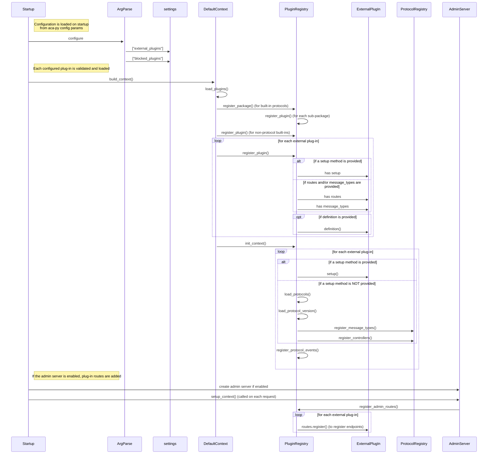

# Deeper Dive: Aca-Py Plug-Ins

## What's in a Plug-In and How does it Work?

Plug-ins are loaded on Aca-Py startup based on the following parameters:

* `--plugin` - identifies the plug-in library to load
* `--block-plugin` - identifies plug-ins (including built-ins) that are *not* to be loaded
* `--plugin-config` - identify a configuration parameter for a plug-in
* `--plugin-config-value` - identify a *value* for a plug-in configuration


The `--plug-in` parameter specifies a package that is loaded by Aca-Py at runtime, and extends Aca-Py by adding support for additional protocols and message types, and/or extending the Admin API with additional endpoints.

The original plug-in design (which we will call the "old" model) explicitly indluded `message_types.py` `routes.py` (to add Admin API's).  But functionality was added later (we'll call this the "new" model) to allow the plug-in to include a generic `setup` package that could perform arbitrary initialization.  The "new" model also includes support for a `definition.py` file that can specify plug-in version information  (major/minor plug-in version, as well as the minimum supported version (if another agent is running an older version of the plug-in)).

You can discover which plug-ins are installed in an aca-py instance by calling (in the "server" section) the `GET /plugins` endpoint.  (Note that this will return all loaded protocols, including the built-ins.  You can call the `GET /status/config` to inspect the Aca-Py configuration, which will include the configuration for the *external* plug-ins.)

### setup method

If a setup method is provided, it will be called.  If not, the `message_types.py` and `routes.py` will be explicitly loaded.

This would be in the `package/module __init__.py`:

```
async def setup(context: InjectionContext):
    pass
```

TODO I couldn't find an implementation of a custom `setup` in any of the existing plug-ins, so I'm not completely sure what are the best practices for this option.

### message_types.py

When loading a plug-in, if there is a `message_types.py` available, Aca-Py will check the following attributes to initialize the protocol(s):

- `MESSAGE_TYPES` - identifies message types supported by the protocol
- `CONTROLLERS` - identifies protocol controllers

### routes.py

If `routes.py` is available, then Aca-Py will call the following functions to initialize the Admin endpoints:

- `register()` - registers routes for the new Admin endpoints
- `register_events()` - registers an events this package will listen for/respond to

### definition.py

If `definition.py` is available, Aca-Py will read this package to determine protocol version information.  An example follows (this is an example that specifies two protocol versions):

```
versions = [
    {
        "major_version": 1,
        "minimum_minor_version": 0,
        "current_minor_version": 0,
        "path": "v1_0",
    },
    {
        "major_version": 2,
        "minimum_minor_version": 0,
        "current_minor_version": 0,
        "path": "v2_0",
    },
]
```

The attributes are:

- `major_version` - specifies the protocol major version
- `current_minor_version` - specifies the protocol minor version
- `minimum_minor_version` - specifies the minimum supported version (if a lower version is installed in another agent)
- `path` - specifies the sub-path within the package for this version


## Loading Aca-Py Plug-Ins at Runtime

The load sequence for a plug-in (the "Startup" class depends on how Aca-Py is running - `upgrade`, `provision` or `start`):



## Developing a New Plug-In

When developing a new plug-in:

- If you are providing a new protocol or defining message types, you *should* include a `definition.py` file.
- If you are providing a new protocol or defining message types, you *should* include a `message_types.py` file.
- If you are providing additional Admin endpoints, you *should* include a `routes.py` file.
- If you are providing any other functionality, you should provide a `setup.py` file to initialize the custom functionality.  No guidance is *currently* available for this option.

### PIP vs Poetry Support

Most Aca-Py plug-ins provide support for installing the plug-in using [poetry](https://python-poetry.org/).  It is *recommended* to include support in your package for installing using *either* pip or poetry, to provide maximum support for users of your plug-in.

### Plug-In Demo

TBD

# Aca-Py Plug-ins

This list was originally published in [this hackmd document](https://hackmd.io/m2AZebwJRkm6sWgO64-5xQ).

| Maintainer  | Name                       | Features                         | Last Update | Link                                                                    |
| ----------- | -------------------------- | -------------------------------- | ----------- | ----------------------------------------------------------------------- |
| BCGov       | Redis Events               | Inbound/Outbound message queue   | Sep 2022    | https://github.com/bcgov/aries-acapy-plugin-redis-events                |
| Hyperledger | Aries Toolbox              | UI for ACA-py                    | Aug 2022    | https://github.com/hyperledger/aries-toolbox                            |
| Hyperledger | Aries ACApy Plugin Toolbox | Protocol Handlers                | Aug 2022    | https://github.com/hyperledger/aries-acapy-plugin-toolbox               |
| Indicio     | Data Transfer              | Specific Data import             | Aug 2022    | https://github.com/Indicio-tech/aries-acapy-plugin-data-transfer        |
| Indicio     | Question & Answer          | Non-Aries Protocol               | Aug 2022    | https://github.com/Indicio-tech/acapy-plugin-qa                         |
| Indicio     | Acapy-plugin-pickup        | Fetching Messages from Mediator  | Aug 2022    | https://github.com/Indicio-tech/acapy-plugin-pickup                     |
| Indicio     | Machine Readable GF        | Governance Framework             | Mar 2022    | https://github.com/Indicio-tech/mrgf                                    |
| Indicio     | Cache Redis                | Cache for Scaleability           | Jul 2022    | https://github.com/Indicio-tech/aries-acapy-cache-redis                 |
| SICPA Dlab  | Kafka Events               | Event Bus Integration            | Aug 2022    | https://github.com/sicpa-dlab/aries-acapy-plugin-kafka-events           |
| SICPA Dlab  | DidComm Resolver           | Unversal Resolver for DIDComm    | Aug 2022    | https://github.com/sicpa-dlab/acapy-resolver-didcomm                    |
| SICPA Dlab  | Universal Resolver         | Multi-ledger Reading             | Jul 2021    | https://github.com/sicpa-dlab/acapy-resolver-universal                  |
| DDX         | mydata-did-protocol        |                                  | Oct 2022    | https://github.com/decentralised-dataexchange/acapy-mydata-did-protocol |
| BCGov       | Basic Message Storage      | Basic message storage (traction) | Dec 2022    | https://github.com/bcgov/traction/tree/develop/plugins/basicmessage_storage |
| BCGov       | Multi-tenant Provider      | Multi-tenant Provider (traction) | Dec 2022    | https://github.com/bcgov/traction/tree/develop/plugins/multitenant_provider |
| BCGov       | Traction Innkeeper         | Innkeeper (traction)             | Feb 2023    | https://github.com/bcgov/traction/tree/develop/plugins/traction_innkeeper |


# Reference

The following links may be helpful or provide additional context for the current plug-in support.  (These are links to issues or pull requests that were raised during plug-in development.)

Configuration params:
  https://github.com/hyperledger/aries-cloudagent-python/issues/1121
  https://hackmd.io/ROUzENdpQ12cz3UB9qk1nA
  https://github.com/hyperledger/aries-cloudagent-python/pull/1226

Loading plug-ins:
  https://github.com/hyperledger/aries-cloudagent-python/pull/1086

Versioning for plug-ins:
  https://github.com/hyperledger/aries-cloudagent-python/pull/443

