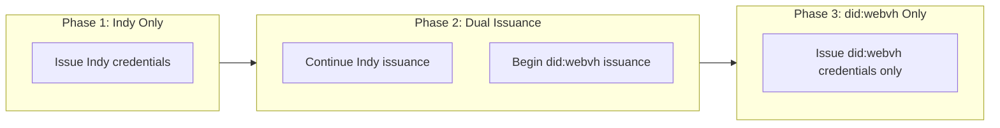

# Migrating AnonCreds Issuance from Indy to did:webvh

This guide walks through the process of transitioning an ACA-Py Issuer from
publishing [AnonCreds] objects on a [Hyperledger Indy] ledger to publishing them
using the [did:webvh] method. The same ACA-Py instance can issue credentials
rooted in both methods simultaneously, so the migration can be done gradually
with no downtime or data loss.

[AnonCreds]: https://www.hyperledger.org/projects/anoncreds
[Hyperledger Indy]: https://www.hyperledger.org/projects/hyperledger-indy
[did:webvh]: https://identity.foundation/didwebvh/

## Why Migrate?

Indy-based AnonCreds requires a Hyperledger Indy blockchain network to store
schemas, credential definitions, and revocation registries. While this model is
proven and reliable, it ties issuers to a specific ledger network and its
governance.

did:webvh offers an alternative Verifiable Data Registry (VDR) for AnonCreds
that is:

- **Ledger-independent** -- AnonCreds objects are published as web-hosted
  resources, removing the dependency on a blockchain network.
- **Web-native** -- Objects are hosted on standard web infrastructure and
  resolved via HTTPS.
- **Trustworthy** -- A witness model provides cryptographic attestation of
  published objects, replacing the endorser/steward trust model of Indy.
- **Portable** -- DIDs can optionally be configured for portability across
  servers.
- **Interoperable** -- Credentials issued with did:webvh use the same AnonCreds
  cryptography; verifiers process them identically to Indy-based credentials.

For technical background on how ACA-Py supports multiple AnonCreds methods, see
[Publishing AnonCreds Objects To Other Ledgers/VDRs](../features/AnonCredsMethods.md).

## Key Differences at a Glance

| Aspect | Indy | did:webvh |
|---|---|---|
| **Identifier format** | `WgWx...:2:name:1.0` (legacy) or `did:indy:sovrin:WgWx...` | `did:webvh:{SCID}:domain:ns:id/resources/{digest}` |
| **Where objects live** | Indy ledger transactions | WebVH server-hosted resources with Data Integrity proofs |
| **Trust model** | Endorser/Steward signs ledger transactions | Witness attests resource publications |
| **Revocation tails files** | Uploaded to a tails server | Uploaded to a tails server (same approach) |
| **ACA-Py API endpoints** | `/anoncreds/*` | `/anoncreds/*` (same endpoints) |
| **Plugin required** | Built-in (`DIDIndyRegistry`, `LegacyIndyRegistry`) | External (`--plugin webvh`) |

The important thing to note is that the ACA-Py admin API endpoints remain the
same. The only difference from a controller's perspective is the `issuerId`
used when creating objects and the format of the resulting identifiers.

## Prerequisites

Before starting the migration, ensure the following are in place:

1. **`askar-anoncreds` wallet type** -- Your ACA-Py instance must be running
   with `--wallet-type askar-anoncreds`. If you are still on the legacy `askar`
   wallet type, complete the
   [AnonCreds Controller Migration](AnoncredsControllerMigration.md) first. See
   also [The askar-anoncreds Wallet Type](AnonCredsWalletType.md) for
   background.

2. **WebVH plugin installed** -- The did:webvh AnonCreds registry is provided
   by the `webvh` plugin in [acapy-plugins]. Install it and load it with
   `--plugin webvh`. See the
   [WebVH plugin README](https://github.com/openwallet-foundation/acapy-plugins/tree/main/webvh)
   for installation instructions.

3. **WebVH server running** -- You need a running instance of
   [didwebvh-server-py](https://github.com/decentralized-identity/didwebvh-server-py)
   to host your DID documents and attested resources.

4. **Witness configured** -- A witness agent (or self-witnessing configuration)
   must be set up to attest DID registrations and resource uploads. See the
   [WebVH plugin Configuration](https://github.com/openwallet-foundation/acapy-plugins/tree/main/webvh#configuration)
   section for details.

[acapy-plugins]: https://github.com/openwallet-foundation/acapy-plugins

## What Can and Cannot Be Migrated

**Cannot be migrated:**

- Existing issued credentials remain Indy-based. Holders keep them as-is
  and verifiers can continue to verify them. There is no mechanism to
  "re-root" an already-issued AnonCreds credential to a different VDR.

**Must be re-created under the new DID:**

- Schemas (same attributes, new `issuerId`)
- Credential definitions (new cred def linked to the new schema)
- Revocation registries (automatically created by ACA-Py when a revocable
  cred def is registered)

**No data loss:**

- Your wallet retains all Indy objects. ACA-Py supports multiple AnonCreds
  registries simultaneously -- the correct registry is selected automatically
  based on the identifier pattern of the object being accessed.

## Migration Strategy: Dual-Issuance Transition

The recommended approach is a phased transition where Indy and did:webvh
issuance run side-by-side:



### Phase 1 -- Current State

You are issuing Indy-based AnonCreds credentials. No changes yet.

### Phase 2 -- Dual Issuance

1. Set up the did:webvh infrastructure (server, witness, plugin) alongside
   your existing Indy configuration.
2. Create a did:webvh DID for your issuer.
3. Re-register your schemas and credential definitions under the new DID.
4. Start issuing new credentials using the did:webvh credential definitions
   for new holders or use cases.
5. Continue issuing Indy credentials for existing holders and verifiers who
   have not yet added did:webvh resolution support.
6. Communicate the transition to your verifier ecosystem so they can prepare
   to resolve did:webvh identifiers.

### Phase 3 -- did:webvh Only

1. Once your verifier ecosystem supports did:webvh resolution, stop issuing
   new Indy credentials.
2. All new issuance uses did:webvh credential definitions.
3. Previously issued Indy credentials remain valid and verifiable for their
   lifetime. They do not need to be re-issued.

## Setting Up did:webvh Issuance

The steps below provide a high-level overview. For detailed configuration
and API payloads, refer to the
[WebVH plugin README](https://github.com/openwallet-foundation/acapy-plugins/tree/main/webvh).

### 1. Install and Configure the Plugin

Add the `webvh` plugin to your ACA-Py startup:

```bash
aca-py start \
  --wallet-type askar-anoncreds \
  --plugin webvh \
  ...
```

### 2. Configure Witness

Configure your agent as a witness (self-witnessing) or connect to an external
witness agent:

```
POST /did/webvh/configuration
```

```json
{
    "server_url": "https://your-webvh-server.example.com",
    "witness": true
}
```

For a controller that relies on an external witness, provide a
`witness_invitation` instead. See the plugin README for the full witness setup
flow.

### 3. Create a did:webvh DID

```
POST /did/webvh/controller/create
```

```json
{
  "options": {
    "namespace": "my-org",
    "identifier": "issuer-01"
  }
}
```

This creates a DID like `did:webvh:{SCID}:your-server.example.com:my-org:issuer-01`.

### 4. Register Schemas

Use the same `/anoncreds/schema` endpoint, but with the new did:webvh DID as
the `issuerId`:

```
POST /anoncreds/schema
```

```json
{
  "schema": {
    "attrNames": ["name", "date", "degree"],
    "issuerId": "did:webvh:{SCID}:your-server.example.com:my-org:issuer-01",
    "name": "Example Credential",
    "version": "1.0"
  }
}
```

The resulting schema ID will be in the format
`did:webvh:{SCID}:your-server.example.com:my-org:issuer-01/resources/{content_digest}`.

### 5. Create Credential Definitions

```
POST /anoncreds/credential-definition
```

```json
{
  "credential_definition": {
    "issuerId": "did:webvh:{SCID}:your-server.example.com:my-org:issuer-01",
    "schemaId": "<schema_id from step 4>",
    "tag": "default"
  },
  "options": {
    "support_revocation": true,
    "revocation_registry_size": 1000
  }
}
```

### 6. Revocation Registries

If the credential definition supports revocation, ACA-Py automatically creates
and publishes two revocation registries, makes one active, and handles rotation
-- exactly the same as with Indy. No additional steps are needed.

### 7. Issue Credentials

Use the standard V2.0 issue-credential endpoints. The only difference is that
the `cred_def_id` in your offer references the did:webvh credential definition
created in step 5.

## Impact on Controllers

- **Same API, different identifiers** -- The `/anoncreds/*` endpoints are
  identical for Indy and did:webvh. The only change is the `issuerId` you
  supply and the format of the returned object IDs.
- **Track your credential definitions** -- During dual issuance, your
  controller needs to know which cred def IDs are Indy-based and which are
  did:webvh-based, so it can offer the correct credential type to each holder.
- **Webhook payloads** -- Webhook events for credential exchange will contain
  the did:webvh identifier formats. Ensure your controller can handle both
  formats during the transition.

## Impact on Verifiers

- **Resolution capability required** -- Verifiers must be able to resolve
  did:webvh identifiers. This means they need either the `webvh` plugin loaded
  or a universal resolver that supports did:webvh.
- **Accept both formats during transition** -- Proof requests should reference
  both Indy and did:webvh credential definition IDs during the dual-issuance
  period, or use attribute-based restrictions that are format-agnostic.
- **No protocol changes** -- The presentation exchange protocol (DIDComm v2,
  present-proof v2) is identical regardless of the underlying VDR. AnonCreds
  is AnonCreds -- the cryptographic operations and proof format are the same.

## Frequently Asked Questions

**Can I use the same schema attributes?**

Yes. Register a new schema with identical `attrNames` under your did:webvh DID.
The schema content is the same; only the `issuerId` and resulting identifier
change.

**Do holders need to do anything?**

No. Existing Indy credentials in holders' wallets continue to work unchanged.
New credentials issued from did:webvh credential definitions are received and
stored normally -- holders do not need any special configuration.

**Can I run Indy and did:webvh issuance simultaneously?**

Yes. ACA-Py's AnonCreds registry automatically routes operations to the correct
registry based on the identifier pattern (`did:indy:*` or legacy Indy format
goes to the Indy registry; `did:webvh:*` goes to the WebVH registry). Both
registries can be active at the same time with no conflicts.

**What happens to my existing Indy credentials after migration?**

They remain valid and verifiable for as long as the Indy ledger they were
published on is operational. Revoking an Indy credential still works through
the Indy revocation registry. The migration only affects *new* issuance.

**Do I need to keep my Indy ledger connection after Phase 3?**

If you have outstanding Indy credentials that may need to be revoked, or if
verifiers may still need to resolve your Indy-based credential definitions,
yes. You can remove the Indy ledger connection only when all Indy credentials
have expired or been revoked and verifiers no longer need to resolve them.
