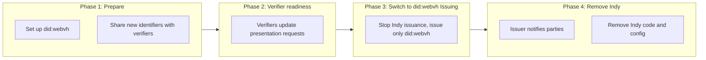

# Transitioning AnonCreds Issuance from Indy to did:webvh

This guide describes how to transition [AnonCreds] **issuance** from a
[Hyperledger Indy] ledger to the [did:webvh] method. It focuses on the issuance
process as a whole: issuer setup, verifier readiness, and the cutover from one
Verifiable Data Registry (VDR) to another.

**Assumption:** All parties in your ecosystem already support did:webvh
technologically. Issuers, holders, and verifiers can resolve did:webvh
identifiers and process AnonCreds rooted in did:webvh. This guide is for when
that readiness is in place and you are moving issuance from Indy to did:webvh.

The recommended approach is a **planned cutover**: you stop issuing from Indy
and start issuing from did:webvh on a chosen date. Existing holders keep their
Indy-rooted credentials; new issuance uses did:webvh. During and after the
cutover, the issuer must continue to **manage already-issued Indy credentials**
(e.g. revocation and other status updates) until those credentials are no longer
in use.

[AnonCreds]: https://www.lfdecentralizedtrust.org/projects/anoncreds
[Hyperledger Indy]: https://www.lfdecentralizedtrust.org/projects/hyperledger-indy
[did:webvh]: https://didwebvh.info

## Why Migrate?

Indy-based AnonCreds requires a Hyperledger Indy blockchain network to store
schemas, credential definitions, and revocation registries. While this model is
proven and reliable, it ties issuers to a specific ledger network and its
governance.

did:webvh offers an alternative Verifiable Data Registry (VDR) for AnonCreds
that is:

- **Ledger-independent** -- AnonCreds objects are published as web-hosted
  resources, removing the dependency on a blockchain network.
- **Web-native** -- Objects are hosted on standard web infrastructure and
  resolved via HTTPS.
- **Trustworthy** -- A witness model provides cryptographic attestation of
  published objects, replacing the endorser/steward trust model of Indy.
- **Portable** -- DIDs can optionally be configured for portability across
  servers.
- **Interoperable** -- Credentials issued with did:webvh use the same AnonCreds
  cryptography; verifiers process them identically to Indy-based credentials.

For technical background on how ACA-Py supports multiple AnonCreds methods, see
[Publishing AnonCreds Objects To Other Ledgers/VDRs](../features/AnonCredsMethods.md).

## Key Differences at a Glance

> **Note:** The did:webvh column below describes the **did:webvh Server AnonCreds
> Method** as implemented by ACA-Py and the WebVH plugin—with namespace (`ns`),
> identifier (`id`), and a defined path to the resource. The did:webvh method
> itself is flexible: it can support "plain" did:webvh DIDs (no extra path
> elements) and other DID URL path schemes. This guide and the table refer to
> the convention used by this implementation, not to a requirement of did:webvh
> in general.

| Aspect | Indy | did:webvh |
|---|---|---|
| **Identifier format** | **Schema (legacy):** `{ledgerPrefix}:2:{name}:{version}` (e.g. `WgWx...:2:ExampleSchema:1.0`). **Cred def (legacy):** `{ledgerPrefix}:3:CL:{seqNo}:{tag}`. **DID:** `did:indy:{namespace}:{id}` (e.g. `did:indy:sovrin:WgWx...`). | `did:webvh:{SCID}:domain:ns:id/resources/{digest}` |
| **Where objects live** | Indy ledger transactions | WebVH server-hosted resources with Data Integrity proofs |
| **Trust model** | Endorser/Steward signs ledger transactions | Witness attests resource publications |
| **Revocation tails files** | Uploaded to a tails server | Uploaded to a tails server (same approach) |
| **ACA-Py API endpoints** | `/anoncreds/*` | `/anoncreds/*` (same endpoints) |
| **Plugin required** | Built-in (`DIDIndyRegistry`, `LegacyIndyRegistry`) | External (`--plugin webvh`) |

The important thing to note is that the ACA-Py admin API endpoints remain the
same. The only difference from a controller's perspective is the `issuerId`
used when creating objects and the format of the resulting identifiers.

## Prerequisites

Before starting the migration, ensure the following are in place:

1. **`askar-anoncreds` wallet type** -- Your ACA-Py instance must be running
   with `--wallet-type askar-anoncreds`. If you are still on the legacy `askar`
   wallet type, complete the
   [AnonCreds Controller Migration](AnonCredsControllerMigration.md) first. See
   also [The askar-anoncreds Wallet Type](AnonCredsWalletType.md) for
   background.

2. **WebVH plugin installed** -- The did:webvh AnonCreds registry is provided
   by the `webvh` plugin in [acapy-plugins]. Install it and load it with
   `--plugin webvh`. See the
   [WebVH plugin README](https://github.com/openwallet-foundation/acapy-plugins/tree/main/webvh)
   for installation instructions.

3. **WebVH server running** -- You need a running instance of
   [didwebvh-server-py](https://github.com/decentralized-identity/didwebvh-server-py)
   to host your DID documents and attested resources.

4. **Witness configured** -- A witness agent (or self-witnessing configuration)
   must be set up to attest DID registrations and resource uploads. See the
   [WebVH plugin Configuration](https://github.com/openwallet-foundation/acapy-plugins/tree/main/webvh#configuration)
   section for details.

[acapy-plugins]: https://github.com/openwallet-foundation/acapy-plugins

## What Can and Cannot Be Migrated

**Cannot be migrated:**

- Existing issued credentials remain Indy-based. Holders keep them as-is
  and verifiers can continue to verify them. There is no mechanism to
  "re-root" an already-issued AnonCreds credential to a different VDR.

**Must be created under the new DID (new objects, same logical content):**

- Schemas (same attributes, new `issuerId`)
- Credential definitions (new cred def linked to the new schema)
- Revocation registries (automatically created by ACA-Py when a revocable
  cred def is registered)

**No data loss:**

- Your wallet retains all Indy objects. ACA-Py supports multiple AnonCreds
  registries simultaneously -- the correct registry is selected automatically
  based on the identifier pattern of the object being accessed.

## Migration Strategy: Planned Cutover

The recommended approach is to **switch issuance** from Indy to did:webvh in one
planned cutover. During and after the transition, some holders have Indy-rooted
credentials (issued before the switch) and some have did:webvh-rooted
credentials (issued after). You do not issue the same credential from both
VDRs at the same time. The issuer must continue to **manage already-issued Indy
credentials** — including revocation and other status updates — until they are
fully phased out.


```mermaid
flowchart LR
    subgraph phase1 ["Phase 1: Prepare"]
        Setup["Set up did:webvh"]
        Share["Share new identifiers with verifiers"]
    end
    subgraph phase2 ["Phase 2: Verifier readiness"]
        Wait["Verifiers update presentation requests"]
    end
    subgraph phase3 ["Phase 3: Switch to did:webvh Issuing"]
        Cutover["Stop Indy issuance, issue only did:webvh"]
    end
    subgraph phase4 ["Phase 4: Remove Indy"]
        Notify["Issuer notifies parties"]
        Remove["Remove Indy code and config"]
    end
    phase1 --> phase2 --> phase3 --> phase4
```

### Phase 1 -- Prepare

You are currently issuing Indy-based AnonCreds credentials. Prepare the
did:webvh side without changing issuance yet:

1. Set up the did:webvh infrastructure (server, witness, plugin) alongside
   your existing Indy configuration.
2. Create a did:webvh DID for your issuer.
3. Register your schemas and credential definitions under the new DID (these
   are new objects with the same logical content; only the `issuerId` and
   resulting identifiers change).
4. **Share the new did:webvh identifiers with verifiers** (credential
   definition IDs, schema IDs, etc.) so they can add them to their
   presentation requests. During this period, the did:webvh objects exist but
   are **not** used for general issuance. Limited testing (e.g. issuing a
   credential or two to verify the pipeline) is acceptable.

### Phase 2 -- Verifier readiness

Verifier readiness requires two things. First, verifiers need **updated
libraries** that support resolving credentials via the did:webvh AnonCreds
method (so they can resolve and validate did:webvh-rooted credentials).
Second, they must **update their presentation requests** to add the
equivalent did:webvh identifiers as an alternative (OR) to the current Indy
identifiers—so that a wallet receiving the request can respond with whichever
credential it is holding (Indy-rooted or did:webvh-rooted). Give verifiers
time to do both. A presentation request can restrict on **issuer (DID)**,
**schema**, and/or **credential definition**; in each case, add the
corresponding did:webvh identifier alongside the existing Indy one so that
either type satisfies the request. Once verifiers can resolve did:webvh and
have updated their presentation requests, you can schedule the cutover.

**Example — presentation request restrictions:**

Before cutover (Indy only), a verifier might restrict on a single credential
definition:

```json
"restrictions": [
  { "cred_def_id": "WgWxqztrNooG92RXvxSTWv:3:CL:20:tag" }
]
```

After updating for the transition (accept Indy or did:webvh), the verifier
includes both identifiers so that credentials from either VDR are accepted:

```json
"restrictions": [
  { "cred_def_id": "WgWxqztrNooG92RXvxSTWv:3:CL:20:tag" },
  { "cred_def_id": "did:webvh:zQ3sh...:example.com:my-org:issuer-01/resources/abc123" }
]
```

Alternatively, restrictions can be expressed by **issuer** (`issuer_id`) or
**schema** (`schema_id`); in each case, add the corresponding did:webvh
identifier so that credentials rooted in either Indy or did:webvh satisfy the
request.

### Phase 3 -- Switch to did:webvh Issuing

1. On the chosen date, **stop issuing new Indy credentials**. All new
   issuance uses did:webvh credential definitions only.
2. Previously issued Indy credentials remain valid and verifiable for their
   lifetime. They do not need to be re-issued. The issuer must **continue to
   manage** those Indy credentials (e.g. process revocation and other status
   updates) for as long as they are in use.

### Phase 4 -- Remove Indy

When all Indy credentials have been revoked (or have expired), the issuer
notifies all parties—especially verifiers—that Indy credentials are no longer
in use. Issuers and verifiers can then, at their leisure, remove both the code
and the presentation-request configuration that uses or references Indy-rooted
credentials. Verifiers should do this only after all credential types they
accept have been converted to did:webvh (or otherwise no longer depend on Indy).
At that point the issuer can remove the Indy ledger connection.

## Setting Up did:webvh Issuance

The steps below provide a high-level overview. For detailed configuration
and API payloads, refer to the
[WebVH plugin README](https://github.com/openwallet-foundation/acapy-plugins/tree/main/webvh).

### 1. Install and Configure the Plugin

Add the `webvh` plugin to your ACA-Py startup:

```bash
aca-py start \
  --wallet-type askar-anoncreds \
  --plugin webvh \
  ...
```

### 2. Configure Witness

Configure your agent as a witness (self-witnessing) or connect to an external
witness agent:

```
POST /did/webvh/configuration
```

```json
{
    "server_url": "https://your-webvh-server.example.com",
    "witness": true
}
```

For a controller that relies on an external witness, provide a
`witness_invitation` instead. See the plugin README for the full witness setup
flow.

### 3. Create a did:webvh DID

```
POST /did/webvh/controller/create
```

```json
{
  "options": {
    "namespace": "my-org",
    "identifier": "issuer-01"
  }
}
```

This creates a DID like `did:webvh:{SCID}:your-server.example.com:my-org:issuer-01`.

### 4. Register Schemas

Use the same `/anoncreds/schema` endpoint, but with the new did:webvh DID as
the `issuerId`:

```
POST /anoncreds/schema
```

```json
{
  "schema": {
    "attrNames": ["name", "date", "degree"],
    "issuerId": "did:webvh:{SCID}:your-server.example.com:my-org:issuer-01",
    "name": "Example Credential",
    "version": "1.0"
  }
}
```

The resulting schema ID will be in the format
`did:webvh:{SCID}:your-server.example.com:my-org:issuer-01/resources/{content_digest}`.

### 5. Create Credential Definitions

```
POST /anoncreds/credential-definition
```

```json
{
  "credential_definition": {
    "issuerId": "did:webvh:{SCID}:your-server.example.com:my-org:issuer-01",
    "schemaId": "<schema_id from step 4>",
    "tag": "default"
  },
  "options": {
    "support_revocation": true,
    "revocation_registry_size": 1000
  }
}
```

### 6. Revocation Registries

If the credential definition supports revocation, ACA-Py automatically creates
and publishes two revocation registries, makes one active, and handles rotation
-- exactly the same as with Indy. No additional steps are needed.

### 7. Issue Credentials

Use the standard V2.0 issue-credential endpoints. The only difference is that
the `cred_def_id` in your offer references the did:webvh credential definition
created in step 5.

## Impact on Controllers

- **Same API, different identifiers** -- The `/anoncreds/*` endpoints are
  identical for Indy and did:webvh. The only change is the `issuerId` you
  supply and the format of the returned object IDs.
- **After cutover** -- Once you switch to did:webvh issuance, new credential
  offers use did:webvh credential definition IDs. Existing Indy credentials in
  holders' wallets continue to work; no re-issue is required. The controller
  must continue to manage already-issued Indy credentials (e.g. revocation and
  status updates) for as long as they remain in use.
- **Webhook payloads** -- Webhook events for credential exchange will contain
  the did:webvh identifier formats. Ensure your controller can handle both
  formats during and after the transition (e.g. for any Indy credentials still
  in use).

## Impact on Verifiers

- **Readiness assumed** -- This guide assumes verifiers already support
  did:webvh (resolution and AnonCreds processing). Before the issuer cuts over,
  verifiers should add the new did:webvh credential definition and schema IDs
  to their presentation requests so they accept credentials rooted in either
  VDR during the transition.
- **Accept both formats during transition** -- After cutover, some holders will
  present Indy-rooted credentials (issued before) and some did:webvh-rooted
  (issued after). Proof requests should reference both Indy and did:webvh
  credential definition IDs, or use attribute-based restrictions that are
  format-agnostic.
- **No protocol changes** -- The presentation exchange protocol (DIDComm v2,
  present-proof v2) is identical regardless of the underlying VDR. AnonCreds
  is AnonCreds -- the cryptographic operations and proof format are the same.

## Frequently Asked Questions

**Can I use the same schema attributes?**

Yes. Register a new schema with identical `attrNames` under your did:webvh DID.
The schema content is the same; only the `issuerId` and resulting identifier
change. These are new objects, not "re-registered" ones.

**Do holders need to do anything?**

This guide assumes holders already support did:webvh (storage and presentation of
did:webvh-rooted AnonCreds). Existing Indy credentials in holders' wallets
continue to work unchanged. New credentials issued from did:webvh credential
definitions are received and stored normally.

**Why a planned cutover instead of issuing from both VDRs at once?**

Once the ecosystem supports did:webvh, the recommended path is to switch
issuance in one cutover. Issuing the same credential from both Indy and
did:webvh at the same time is not recommended for a given credential
definition; it complicates lifecycle and verifier logic. After the switch,
support Indy only for revocation of existing credentials.

**What happens to my existing Indy credentials after the switch?**

They remain valid and verifiable for as long as the Indy ledger they were
published on is operational. Revoking an Indy credential still works through
the Indy revocation registry. The transition only affects *new* issuance.

**Do I need to keep my Indy ledger connection after Phase 3?**

If you have outstanding Indy credentials that may need to be revoked, or if
verifiers may still need to resolve your Indy-based credential definitions,
yes. You can remove the Indy ledger connection only when all Indy credentials
have expired or been revoked and verifiers no longer need to resolve them.

**Does this model apply to other VDR or format transitions?**

The pattern described here — prepare new identifiers, share with verifiers,
then switch issuance and phase out the old VDR — can be adapted when
transitioning between other credential formats or Verifiable Data Registries.
This document applies it specifically to Indy → did:webvh.
