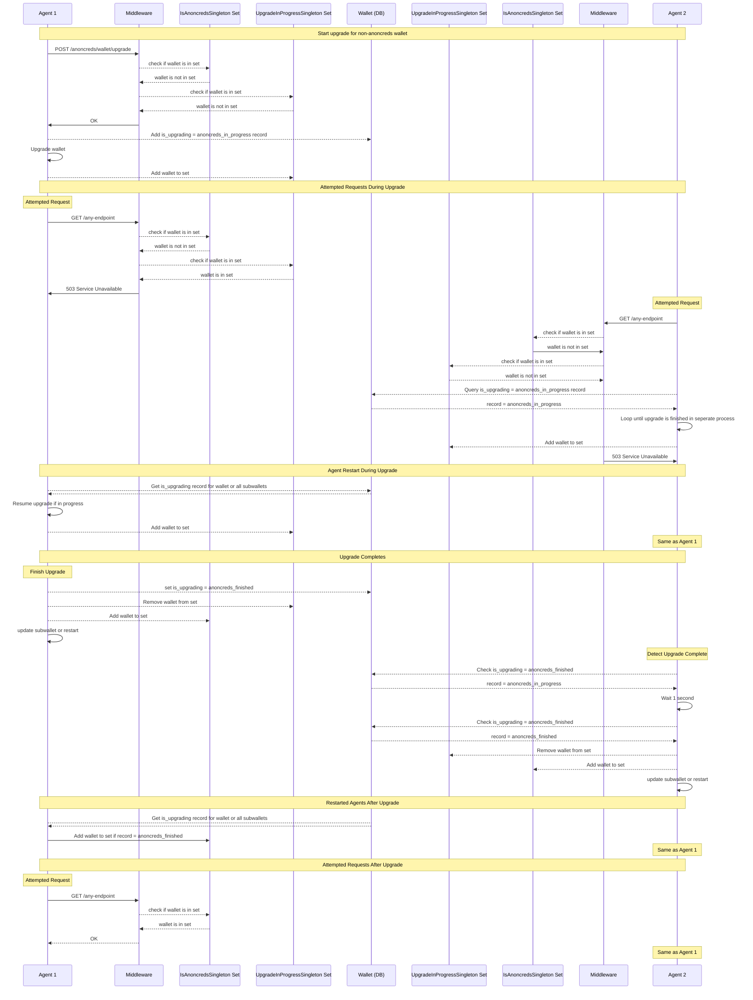

# Upgrade via API Design

## Design Goals

To isolate an upgrade process and trigger it via API the following pattern was designed to handle multitenant scenarios. It includes an is_upgrading record in the wallet(DB) and a middleware to prevent requests during the upgrade process.

## Flow

The diagram below describes the sequence of events for the anoncreds upgrade process which it was designed, but the architecture can be used for any upgrade process.

## Example

An example of the implementation can be found via the anoncreds upgrade components.

- `aries_cloudagent/wallet/routes.py` in the `upgrade_anoncreds` controller 
- the upgrade code in `wallet/anoncreds_upgrade.py`
- the middleware in `admin/server.py` in the `upgrade_middleware` function
- the singleton sets in `wallet/singletons.py`
- the startup process in `core/conductor.py` in the `check_for_wallet_upgrades_in_progress` function
