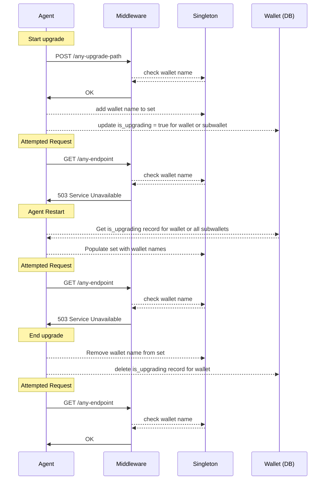

# Upgrade via API Design

To isolate an upgrade process and trigger it via API the following pattern was designed to handle multitenant scenarios. It includes a per instance memory singleton and an is_upgrading record in the wallet(DB) and a middleware to prevent requests during the upgrade process.

#### To use this mehanism you simply need to set the upgrading record in the wallet (DB) and add the wallet name to the singleton set. The middleware will prevent requests from being processed until the upgrade process is finished. After the upgrade process is finished you must remove the wallet name from the set and delete the upgrading record in the wallet (DB).

##### An example can be found via the anoncreds upgrade `aries_cloudagent/wallet/routes.py` in the `upgrade_anoncreds` controller.