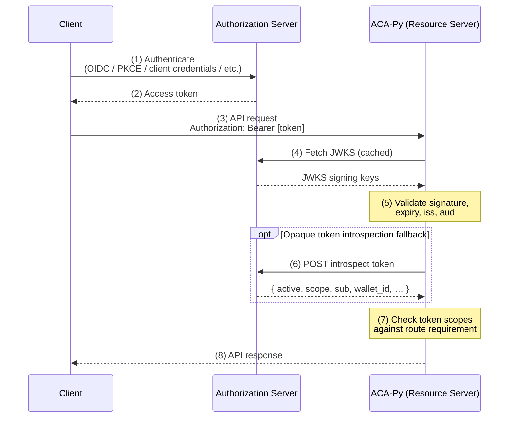

# OAuth2 Resource Server Authentication <!-- omit in toc -->

ACA-Py can be configured to act as an **OAuth2 Resource Server**, delegating all authentication and authorisation to an external **Authorization Server (AS)** such as Keycloak, Auth0, or any other OIDC-compliant provider. This replaces the built-in API key and the ACA-Py-issued multitenant JWT with access tokens that the AS issues directly to callers.

## Table of Contents <!-- omit in toc -->

- [Overview](#overview)
- [Request Flow](#request-flow)
- [Scopes](#scopes)
- [Configuration](#configuration)
  - [Startup Parameters](#startup-parameters)
  - [Environment Variables](#environment-variables)
  - [Token Validation Modes](#token-validation-modes)
- [Multitenancy and the `wallet_id` Claim](#multitenancy-and-the-wallet_id-claim)
- [Annotating Routes with Scopes](#annotating-routes-with-scopes)
- [Authorization Server Setup Guidance](#authorization-server-setup-guidance)
  - [Keycloak Example](#keycloak-example)
  - [Keycloak Hostname and Issuer](#keycloak-hostname-and-issuer)
- [Demo: Docker Compose with Keycloak](#demo-docker-compose-with-keycloak)
  - [Scripts](#scripts)
- [Migrating from API Key / ACA-Py JWT](#migrating-from-api-key--aca-py-jwt)
- [Limitations](#limitations)

---

## Overview

In the traditional ACA-Py security model there are two mechanisms for protecting the Admin API:

| Mode | Parameter | Token issuer |
|---|---|---|
| API key | `--admin-api-key` | n/a — static shared secret |
| Multitenant JWT | `multitenant.jwt_secret` | ACA-Py itself |

Both modes are binary — a caller is either fully authorised or not. There is no concept of scopes or roles.

The OAuth2 Resource Server mode introduces a third option:

| Mode | Parameter | Token issuer |
|---|---|---|
| OAuth2 RS | `--oauth-jwks-uri` / `--oauth-introspection-endpoint` | External AS |

When OAuth2 RS mode is active:

- ACA-Py **never issues tokens** — the `create_auth_token` multitenant endpoint is not used.
- ACA-Py **never stores or validates a shared secret** for bearer tokens.
- The AS is the sole authority on who may call which endpoints.
- Individual routes declare the **minimum scope** required to access them.

---

## Request Flow



  JWT validation occurs on every request; introspection is only used for opaque tokens or when JWT decoding falls back to introspection. JWKS keys are cached in memory by `PyJWKClient` so the round-trip to the AS only occurs when the key set changes.

---

## Scopes

ACA-Py uses the `scope` claim from the access token. Scopes are space-separated strings following the convention `acapy:<resource>[:<action>]`.

| Scope | Intended use |
|---|---|
| `acapy:admin` | Full administrative access — wallet management, server config, ledger operations |
| `acapy:tenant` | Tenant-level access — credentials, connections, presentations for a specific sub-wallet |
| `acapy:tenant:read` | Read-only tenant access |
| `acapy:wallet:create` | Permission to create new sub-wallets only |

### Scope-to-decorator mapping

Route handlers are annotated with one of two authentication decorators. In OAuth mode each decorator enforces a minimum scope:

| Decorator | OAuth scope required | Legacy auth |
|---|---|---|
| `@admin_authentication` | `acapy:admin` | `x-api-key` or insecure mode |
| `@tenant_authentication` | `acapy:tenant` **or** `acapy:admin` | Bearer JWT or `x-api-key` |

A request passes scope enforcement if it holds **at least one** of the required scopes. `acapy:admin` implies full access and satisfies both decorators. All `/multitenancy/*` routes use `@admin_authentication` and therefore require `acapy:admin`.

---

## Configuration

### Startup Parameters

| Parameter | Description |
|---|---|
| `--oauth-jwks-uri <url>` | JWKS endpoint of the AS. ACA-Py fetches and caches signing keys from here to validate JWT access tokens locally. |
| `--oauth-issuer <issuer>` | Expected value of the `iss` claim. Tokens with a different issuer are rejected. |
| `--oauth-audience <audience>` | Expected value of the `aud` claim. Optional but recommended for production. |
| `--oauth-introspection-endpoint <url>` | RFC 7662 introspection endpoint. Used as a fallback for opaque tokens, or as the sole validation method when `--oauth-jwks-uri` is not set. |
| `--oauth-introspection-client-id <id>` | Client ID for HTTP Basic Auth on the introspection endpoint. |
| `--oauth-introspection-client-secret <secret>` | Client secret for HTTP Basic Auth on the introspection endpoint. |

When any of `--oauth-jwks-uri` or `--oauth-introspection-endpoint` is provided, **neither `--admin-api-key` nor `--admin-insecure-mode` is required**.

Example startup using JWKS validation:

```bash
aca-py start \
  --admin 0.0.0.0 8031 \
  --oauth-jwks-uri https://auth.example.com/realms/acapy/protocol/openid-connect/certs \
  --oauth-issuer https://auth.example.com/realms/acapy \
  --oauth-audience acapy-resource-server \
  --multitenant \
  --multitenant-admin \
  ...
```

Example startup using introspection only (for opaque tokens):

```bash
aca-py start \
  --admin 0.0.0.0 8031 \
  --oauth-introspection-endpoint https://auth.example.com/oauth/introspect \
  --oauth-introspection-client-id acapy-rs \
  --oauth-introspection-client-secret <secret> \
  ...
```

### Environment Variables

Each parameter has a corresponding environment variable:

| Parameter | Environment variable |
|---|---|
| `--oauth-jwks-uri` | `ACAPY_OAUTH_JWKS_URI` |
| `--oauth-issuer` | `ACAPY_OAUTH_ISSUER` |
| `--oauth-audience` | `ACAPY_OAUTH_AUDIENCE` |
| `--oauth-introspection-endpoint` | `ACAPY_OAUTH_INTROSPECTION_ENDPOINT` |
| `--oauth-introspection-client-id` | `ACAPY_OAUTH_INTROSPECTION_CLIENT_ID` |
| `--oauth-introspection-client-secret` | `ACAPY_OAUTH_INTROSPECTION_CLIENT_SECRET` |

### Token Validation Modes

**JWT via JWKS (recommended)**

ACA-Py uses `PyJWKClient` (bundled with `pyjwt >= 2.x`) to fetch signing keys from the JWKS endpoint and validate tokens locally. Signature, expiry, issuer, and audience are all checked. Supported algorithms: RS256/384/512, ES256/384/512, PS256/384/512.

**Introspection fallback**

If JWKS validation fails with a decode error (e.g. the token is opaque, not a JWT) and `--oauth-introspection-endpoint` is configured, ACA-Py falls back to RFC 7662 introspection. The introspection response must include `"active": true`; the `scope` field is used for scope enforcement.

**Combined mode**

Providing both `--oauth-jwks-uri` and `--oauth-introspection-endpoint` gives you JWT-first validation with opaque token fallback. This covers deployments where the AS issues different token types to different clients.

---

## Multitenancy and the `wallet_id` Claim

In multitenant deployments, ACA-Py needs to know which sub-wallet a request should be routed to. With the built-in JWT this was encoded as `wallet_id` in the token payload. With external OAuth tokens, the AS must include a **custom claim** named `wallet_id` containing the ACA-Py sub-wallet UUID.

When ACA-Py receives a request:

1. The access token is validated (JWKS or introspection).
2. The `wallet_id` claim is read from the token.
3. The corresponding `WalletRecord` is loaded from storage.
4. The request is executed in that wallet's profile context.

If `wallet_id` is absent from the token, the request runs against the **base wallet** (suitable for admin operations with `acapy:admin` scope).

### Provisioning flow

1. An admin caller (holding `acapy:admin` scope) creates a sub-wallet via `POST /multitenancy/wallet`. A `wallet_key` must be provided even when `key_management_mode` is `managed` — ACA-Py stores and manages the key but Askar requires one at creation time.
2. ACA-Py returns the new `wallet_id` in the response.
3. The operator configures the AS to embed that `wallet_id` as a custom claim in tokens issued to the corresponding user or client.

In Keycloak this is done with a **Protocol Mapper** of type *Hardcoded Claim*:
- Token Claim Name: `wallet_id`
- Claim Value: `<the ACA-Py wallet UUID>`
- Add to access token: enabled

---

## Annotating Routes with Scopes

Use the `require_scope` decorator from `acapy_agent.admin.decorators.auth`. It must be stacked **inside** `tenant_authentication` (or `admin_authentication`) so that authentication is checked before scope enforcement.

```python
from acapy_agent.admin.decorators.auth import require_scope, tenant_authentication

@docs(tags=["credential"], summary="Issue a credential")
@tenant_authentication
@require_scope("acapy:tenant", "acapy:admin")
async def credential_issue(request: web.Request) -> web.Response:
    ...
```

A request passes if its token contains **any one** of the listed scopes. To require a scope that only admins hold, list only `"acapy:admin"`.

The `scopes` set, `sub`, and `wallet_id` claims are available inside handlers via:

```python
context = request["context"]
scopes: set = context.metadata.get("scopes", set())
subject: str = context.metadata.get("sub")
wallet_id: str = context.metadata.get("wallet_id")
```

---

## Authorization Server Setup Guidance

### Keycloak Example

1. **Create a Realm** (e.g. `acapy`).

2. **Create a Client** representing ACA-Py as the resource server:
   - Client ID: `acapy-resource-server`
   - Access Type: `bearer-only`
   - This client does not issue tokens — it is used only as the audience target.

3. **Create Client Scopes** for each ACA-Py scope:
   - `acapy:admin`
   - `acapy:tenant`
   - `acapy:tenant:read`
   - `acapy:wallet:create`
   - Set *Include in Token Scope* to enabled on each.

4. **Create Clients for callers**:

   - **Admin / controller** (server-to-server): confidential client, `client_credentials` grant, assign `acapy:admin` as default scope. Add an *Audience* protocol mapper pointing to `acapy-resource-server`.
   - **Tenant service account** (server-to-server): confidential client, `client_credentials` grant, assign `acapy:tenant` as default scope. Add an *Audience* mapper and a *Hardcoded Claim* mapper for `wallet_id`.
   - **End-user client** (browser): public client, authorization code + PKCE, assign `acapy:tenant` as default scope. Add *Audience* and `wallet_id` mappers as above.

5. **Configure ACA-Py**:
   ```
   --oauth-jwks-uri  https://<keycloak-host>/realms/acapy/protocol/openid-connect/certs
   --oauth-issuer    https://<keycloak-host>/realms/acapy
   --oauth-audience  acapy-resource-server
   ```

### Keycloak Hostname and Issuer

The `iss` claim in a Keycloak-issued token reflects the URL from which the token was requested. In containerised deployments, clients outside the container network hit Keycloak on a host-accessible URL (e.g. `http://localhost:8080`) while ACA-Py reaches Keycloak on an internal Docker network URL (e.g. `http://keycloak:8080`). These produce different `iss` values, causing `--oauth-issuer` validation to fail.

The recommended fix is to set `KC_HOSTNAME` in Keycloak so that the `iss` claim always uses a single canonical URL regardless of which network interface handled the request:

```yaml
# docker-compose.yml — Keycloak service
environment:
  KC_HOSTNAME: localhost
  KC_HOSTNAME_PORT: "8080"
  KC_HOSTNAME_STRICT: "false"
```

Then set `--oauth-issuer` to match that canonical URL:

```bash
--oauth-issuer http://localhost:8080/realms/acapy
```

ACA-Py's `--oauth-jwks-uri` can still use the internal Docker network hostname for the JWKS fetch — issuer validation is a string comparison against the `iss` claim and requires no network call.

---

## Demo: Docker Compose with Keycloak

A self-contained demo is provided in [`demo/demo-authserver/`](../../demo/demo-authserver/). It starts three services:

| Service | Image | Purpose |
|---|---|---|
| `keycloak` | `quay.io/keycloak/keycloak:24` | Authorization Server, pre-loaded with the `acapy` realm |
| `wallet-db` | `postgres:16` | ACA-Py wallet storage |
| `acapy` | Built from repo | ACA-Py configured as an OAuth2 Resource Server |

**Quick start:**

```bash
cd demo/demo-authserver
podman compose up --build      # or docker compose up --build

# In a second terminal, once all services are healthy:
./scripts/setup-tenant.sh
```

### Scripts

All scripts read common settings from a `.env` file if present and default sensibly otherwise.

| Script | Description |
|---|---|
| `setup-tenant.sh` | Creates an ACA-Py sub-wallet using an admin token, then updates the Keycloak `wallet-id` claim on the `acapy-tenant-demo` client. Must be run before the tenant scripts. |
| `get-admin-token.sh` | Obtains an admin token via `client_credentials` grant for `acapy-controller` and prints the decoded claims and raw token. |
| `get-tenant-token.sh` | Obtains a tenant token via `client_credentials` grant for a confidential tenant client (defaults to `acapy-tenant-demo`). Prints decoded claims including `wallet_id`. |
| `get-user-token.sh` | Creates a demo user in Keycloak (if needed) and performs a full **authorization code + PKCE** flow. Prints a Keycloak login URL to open in the browser; a local callback server on port 9999 receives the code and exchanges it for a token. |

**Example usage after `setup-tenant.sh`:**

```bash
# Server-to-server admin token
./scripts/get-admin-token.sh

# Server-to-server tenant token (confidential client)
./scripts/get-tenant-token.sh

# Browser-based user token (public client, PKCE)
./scripts/get-user-token.sh

# Call ACA-Py with a token
TOKEN=$(./scripts/get-admin-token.sh | grep -A1 "Access token:" | tail -1)
curl -s -H "Authorization: Bearer $TOKEN" http://localhost:8031/multitenancy/wallets | jq .
```

---

## Migrating from API Key / ACA-Py JWT

| Before | After |
|---|---|
| `--admin-api-key <key>` | Remove; add `--oauth-jwks-uri` (and/or introspection params) |
| `--admin-insecure-mode` | Remove; configure OAuth |
| `--multitenant-jwt-secret <secret>` | Still required by the multitenant subsystem but unused for token validation in OAuth mode |
| `POST /multitenancy/wallet/{id}/token` | Clients obtain tokens from the AS directly |
| `X-API-Key: <key>` request header | `Authorization: Bearer <token>` request header |
| `@admin_authentication` on admin routes | Unchanged decorator; now enforces `acapy:admin` scope in OAuth mode |
| `@tenant_authentication` on tenant routes | Unchanged decorator; now enforces `acapy:tenant` or `acapy:admin` scope in OAuth mode |

---

## Limitations

- **Unmanaged wallets are not supported in OAuth mode.** The ACA-Py-issued JWT could carry a `wallet_key` for wallets whose keys are not stored by ACA-Py. An OAuth access token from an external AS must not contain cryptographic wallet keys; use managed wallets (`key_management_mode: managed`) with OAuth.
- **WebSocket authentication** uses the same bearer token presented in the initial HTTP upgrade request. In-message `x-api-key` re-authentication is not available in OAuth mode.
- **JWKS key rotation** is handled automatically by `PyJWKClient`'s built-in cache, which re-fetches the key set when a token references an unknown key ID (`kid`). No ACA-Py restart is required.
