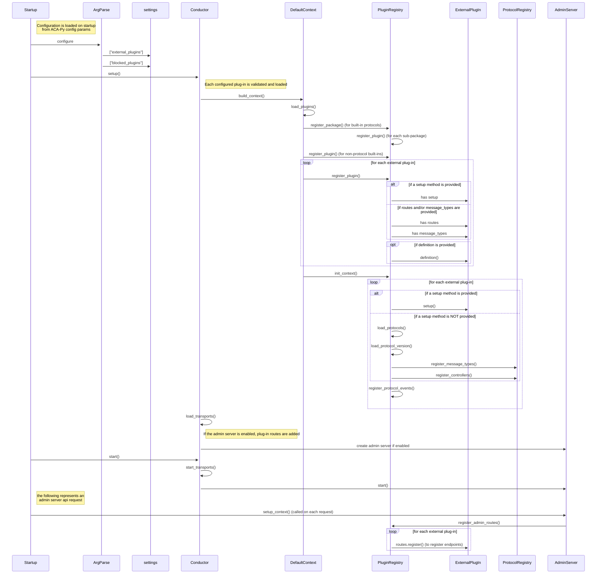

# Deeper Dive: ACA-Py Plug-Ins

ACA-Py plugins enable standardized extensibility without overloading the core ACA-Py code base. Plugins may be features that you create specific to your deployment, or that you deploy from the [ACA-Py Plugins "Store"](https://plugins.aca-py.org). Visit the Plugins Store to find all of the open source plugins that have been contributed.

## What's in a Plug-In and How Does They Work?

Plug-ins are loaded on ACA-Py startup based on the following parameters:

- `--plugin` - identifies the plug-in library to load
- `--block-plugin` - identifies plug-ins (including built-ins) that are *not* to be loaded
- `--plugin-config` - identify a configuration parameter for a plug-in
- `--plugin-config-value` - identify a *value* for a plug-in configuration

The `--plug-in` parameter specifies a package that is loaded by ACA-Py at runtime, and extends ACA-Py by adding support for additional protocols and message types, and/or extending the Admin API with additional endpoints.

The original plug-in design (which we will call the "old" model) explicitly included `message_types.py` `routes.py` (to add Admin API's).  But functionality was added later (we'll call this the "new" model) to allow the plug-in to include a generic `setup` package that could perform arbitrary initialization.  The "new" model also includes support for a `definition.py` file that can specify plug-in version information  (major/minor plug-in version, as well as the minimum supported version (if another agent is running an older version of the plug-in)).

You can discover which plug-ins are installed in an ACA-Py instance by calling (in the "server" section) the `GET /plugins` endpoint.  (Note that this will return all loaded protocols, including the built-ins.  You can call the `GET /status/config` to inspect the ACA-Py configuration, which will include the configuration for the *external* plug-ins.)

### setup method

If a setup method is provided, it will be called.  If not, the `message_types.py` and `routes.py` will be explicitly loaded.

This would be in the `package/module __init__.py`:

```python
async def setup(context: InjectionContext):
    pass
```

TODO I couldn't find an implementation of a custom `setup` in any of the existing plug-ins, so I'm not completely sure what are the best practices for this option.

### message_types.py

When loading a plug-in, if there is a `message_types.py` available, ACA-Py will check the following attributes to initialize the protocol(s):

- `MESSAGE_TYPES` - identifies message types supported by the protocol
- `CONTROLLERS` - identifies protocol controllers

### routes.py

If `routes.py` is available, then ACA-Py will call the following functions to initialize the Admin endpoints:

- `register()` - registers routes for the new Admin endpoints
- `register_events()` - registers an events this package will listen for/respond to

### definition.py

If `definition.py` is available, ACA-Py will read this package to determine protocol version information.  An example follows (this is an example that specifies two protocol versions):

```json
versions = [
    {
        "major_version": 1,
        "minimum_minor_version": 0,
        "current_minor_version": 0,
        "path": "v1_0",
    },
    {
        "major_version": 2,
        "minimum_minor_version": 0,
        "current_minor_version": 0,
        "path": "v2_0",
    },
]
```

The attributes are:

- `major_version` - specifies the protocol major version
- `current_minor_version` - specifies the protocol minor version
- `minimum_minor_version` - specifies the minimum supported version (if a lower version is installed in another agent)
- `path` - specifies the sub-path within the package for this version

## Loading ACA-Py Plug-Ins at Runtime

The load sequence for a plug-in (the "Startup" class depends on how ACA-Py is running - `upgrade`, `provision` or `start`):



## Developing a New Plug-In

When developing a new plug-in:

- If you are providing a new protocol or defining message types, you *should* include a `definition.py` file.
- If you are providing a new protocol or defining message types, you *should* include a `message_types.py` file.
- If you are providing additional Admin endpoints, you *should* include a `routes.py` file.
- If you are providing any other functionality, you should provide a `setup.py` file to initialize the custom functionality.  No guidance is *currently* available for this option.

### PIP vs Poetry Support

Most ACA-Py plug-ins provide support for installing the plug-in using [poetry](https://python-poetry.org/).  It is *recommended* to include support in your package for installing using *either* pip or poetry, to provide maximum support for users of your plug-in.

### Plug-In Demo

TBD

## ACA-Py Plug-ins Repository

Checkout the "Plugins" tab in the [ACA-Py Plugins "Store"](https://plugins.aca-py.org) to find a list of plugins that might be useful in your deployment. Instructions are included for how you can contribute your plugin to the list.

## References

The following links may be helpful or provide additional context for the current plug-in support.  (These are links to issues or pull requests that were raised during plug-in development.)

Configuration params:

- https://github.com/openwallet-foundation/acapy/issues/1121
- https://hackmd.io/ROUzENdpQ12cz3UB9qk1nA
- https://github.com/openwallet-foundation/acapy/pull/1226

Loading plug-ins:

- https://github.com/openwallet-foundation/acapy/pull/1086

Versioning for plug-ins:

- https://github.com/openwallet-foundation/acapy/pull/443
