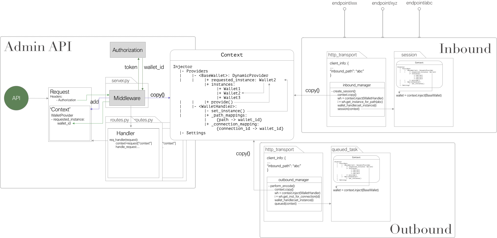
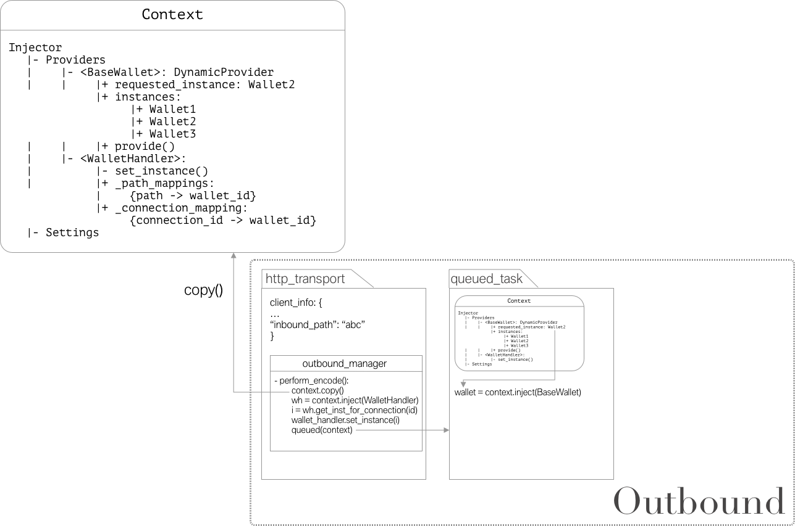

# Multitenancy Aries Agent

[toc]


## Running ACA-Py as Multi Wallet Agent

### Starting the agent

to start the agent in a multi wallet setup you need to pass the following flags during start:

`-it http_custodial`

`--plugin aries_cloudagent.wallet_handler`

### Handling multiple wallets

After starting the agent is prepopulated with a `base` wallet based on the options passed to the start command. 

#### Create new wallet

To add a new wallet to the handled agent you need to post a request to the following endpoint:

```
POST /wallet
```


#### Perform requests for a wallet

To specify for what wallet a request to the admin api should be performed you need to pass the wallet name to the `Wallet` header.

*Note* Accessing the swagger doc and the `OPTIONS` method does not require a wallet to be specified.


#### Creating connections

As the current version uses specific endpoint pahts to associate incoming messages to a wallet 4 new admin API endpoints have been created:

-  `POST /connections/invite-with-endpoint`
-  `POST /connections/receive-invitation-with-endpoint`
-  `POST /connections/{id}/accept-invitation-with-endpoint`
-  `POST /connections/{id}/accept-request-with-endpoint`


Thesse endpoints tell the agent explicitly to create a new endpoint for a connection. If the incoming messages can be associated to a wallet based on the send key they will become obsolete.


#### Re-open wallet

If the agent shuts down, you need to re open a wallet by performing the 

```
POST /wallet
```

endpoint again with the same body as for the initial commit.

## General Concept

The general idea of an aries agent handling multiple wallets is simple. One agent is deployed in the cloud and many entities can open a wallet which is managed by this agent. This means the agent holds a couple of wallet instances and maps incoming messages and controller requests to the correct wallet.

The main conceptual trade-off is between sovereignty of the wallet owner and capabilities of the agent. The more functionallity the agent can perform the more power it has over the wallet. There are a couple of settings with different levels of sovereignty and functionality:

1. **Autonomous Agent**: For an autonomous agent the user once opens a wallet at the agent by passing an identifier and a wallet key to the agent. After this initial opening the agent keeps the wallet open and has continous access to the wallet.

    *This can be achieved in ACA-Py by passing a wallet config during creation of a wallet and enabling the agent to handle multiple wallets. The wallet instance will be kept open until the agent is shut down.**

    - Functionality: Here the good thing is that the agent can easily perform any task necessary to carry out the Aries protocols
    - Sovereignty: The user needs to fully trust the agent as it has full access and encryption power to the wallet

2. **Semi-Autonomous Agent**: A semi-autonomous agent can perform every functionality and has access to a wallet just like a autonomous agent. The difference is that it needs to ask for permission from the user to access the wallet.

    - Functionality: The agent has the same functionality as the autonomous agent but for every task it wants to perform it needs to talk to the controller to obtain a key or token which enables to access the wallet.
    - Sovereignty: The user obtains more sovereignty as he confirms every task the agents wants to perform (given a sensible implementation of the wallet-access-mechanism )

3. **Relaying Agent:** A relaying agent has no autonomy at all. The user keeps the wallet at some place which the agent can only access via a specific interface. The agent has no possibility to access the wallet or encrypt data stored inside the wallet.

    *This would need a new wallet "plugin" for the ACA-Py agent which wraps the necessary interface to communicate to a remotely stored wallet.*

    - Functionality: The agent handles the messaging with other agents according to the Aries protocols. For each data it needs to obtain it has to ask the user for the data from the wallet.
    - Sovereignty: The user is in full control

More solutions in-between are possible.


## Architecture




### Admin API

To be able to use the admin API with multiple wallets each request might need to use a different wallet. To prevent that one requests overwrites the wallet inside another request which is waiting for some async coroutine each request needs it's individual local context with a different wallet requested in the `DynamicProvider` for the wallet class. To accomplish that a middleware checks the authorisation in the header of the request and obtains (somehow - best with a plugable authorization module -) the corresponding wallet for that request. Than the global context is copied and the `requested_instance` of the wallet provider is set according to the authorization. The request can than be handled as for the one-wallet-agent.


### Inbound Messages

To enable the agent to associate an inbound message with the correct wallet, for communication a new inbound path `default_endpoint/sha256(wallet_name+num(connections))` is created and passed to the agent which participates in that communication. If the agent receives a message he uses the endpoint to which the message is posted to check (by querying the `wallet_handler`) with what wallet the message can be received. In `create_session()` of the inbound manager the global context is copied, adapted for the correct wallet and passed to the session which handles the incoming message.


### Outbound Messages

Outbound messages are always associated to a specific connection. The `wallet_handler` keeps a mapping of connections to wallets so that it can return the correct wallet for any connection. Similar as for inbound messages the `outbound_manager` uses this functionallity to adapt a copied context with the correct wallet inside `perform_encode()` and pass it to the `queued` object. The following functionallity than picks up the correct wallet during injection and works as always.




### Persistance


#### Wallets

✅ The wallets themselfes are persisted automatically by the existing storage implementation (tested only with Postgresql plugin).

#### Wallet List

☑️ The agent needs to keep track about its handled wallets, which are stored during runtime in the `_instances` list of the `DynamicProvider` used for injecting the wallet instances. 

*This list could be stored in the metadata of a base wallet (wallet specified at startup)*

#### Endpoint - Wallet mapping:

✅ Each path (postfix of endpoint) of a specifc connection is stored in the metadata of the did used for that specific connection. During adding of a wallet the `wallet_handler` checks each stored did for the `path` field in its metadata and adds it to the mapping.

#### Endpoints for Invitations

☑️ Endpoints for invitations are currently not persisted as they are not associated with a did during sending the invitation. As soon as an invitation is accepted the endpoint is saved in the did which was used to establish the conection. This is not necessarily a big issue 

#### Connection - Wallet mapping:

✅ Connections are already stored in the wallet storage so when we (re)add a wallet to the agent we just need to query for all connections stored for that wallet and add them to the mapping.


Used frameworks inside aiohttp:

- [Middlewares](https://docs.aiohttp.org/en/stable/web_advanced.html#middlewares)
- [Local Request Storage](https://docs.aiohttp.org/en/stable/web_advanced.html#request-s-storage)


## ToDo:

- [ ] Make custodial agent work with multiple containers
- [ ] Wallet list persistance
- [ ] Different webhook targets for wallets?


## Open Questions/Topics

- **CachedProviders**:

    To enable different wallets in the injection objects which use a cached provider (e.g. Ledger, Storage) the caching has been disabled (CachedProviders are not used anymore). This could either be left as is (no caching) or the CachedProvider is adapted so that it can cache multiple instances (similar to DynamicProvider).

- `Default`-Wallet:

    Currently the wallet specified during startup (just like for the non custodial setting) is used as default wallet. This is not necessary. To approaches are possible:

    - There is one "main"/"default" wallet with admin rights (e.g. to create, delete custodial wallets)
    - There is no such thing and custodial wallets register themselfes with the agent (how is access management handled?)


## Main Changes:

- `wallet/provider.py`:
    - If `wallet_handler` is registered as plugin provider is changed to `DynamicProvider` which holds multiple instances instead of the one by the `CachedProvider` and provides the instance specified in the `requested_instance` field which can be set by the `wallet_handler`. 

#### Changes for Admin API

- `server.py`

    - importing wallets
    - Middleware added which based on condition (wallet_hanlder registered as plugin) creates a new context for each request, to specify the correct wallet or hands the global context to the request in `request["context"]`

- `routes.py` [every]

    Using the "individual" context of the request (provided by middleware) instead of the global
    `request.app["request_context"]` --> `request["context"]`

- Replacement routes for:

    - `/connections/create-invitation`
    - `/connections/{id}/accept-invitation` 
    - `/connections/{id}/accept-request-with-endpoint` 

    To create a individual inbound bath for each connection.

#### Changes for inbound communication

- `/transport/inbound/manager`:
    - in `create_session` the global context is duplicated and passed to the session as local context and the wallet_handler is imported to set the correct wallet for the inbound message.

#### Changes for outbound communication

- `/transport/outbound/manager`:

    - in `perform_encode` the global context is duplicated and passed to the queued task as local context and the wallet_handler is imported to set the correct wallet in the local context to handle the outbound message.

    


