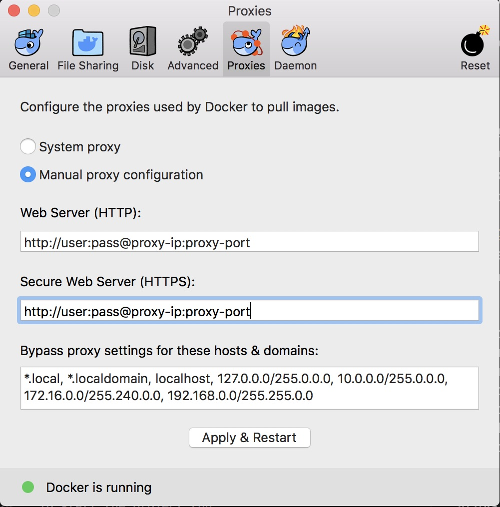

# Running behind corporate proxy

The following instructions provide details on how you can build and run von projects behind corporate proxy.

## Finding proxy server info

If you're using .pac file, just open the file with a text editor, and you should be able to find the proxy server's ip address and port number.

## Running on MacOS

There are three places you would need to configure proxy settings.

### Docker server

In order to pull images, you'll need to configure the proxies used by Docker server. Open "Preferences" window, on "Proxies" tab click "Manual proxy configuration". Fill in the info like below.



## Configure docker client proxy settings

Create or edit the file ~/.docker/config.json in the home directory of the user which starts containers, to include the.

```
{
 "proxies":
 {
   "default":
   {
     "httpProxy": "http://proxy-server-ip:port",
     "noProxy": "localhost,127.0.0.0/8,*.local,host.docker.internal"
   }
 }
}
```

"host.docker.internal" is a special DNS name which resolves to the internal IP address used by the host, you'll need to bypass the proxies. When you create or start new containers, the environment variables are set automatically within the container.

## Configure shell proxy settings

Create or edit ~/.profile to include or run manually on a command line:

```
export http_proxy=http://proxy-server-ip:port
export https_proxy=http://proxy-server-ip:port
export no_proxy=localhost,127.0.0.0/8,*.local,*.domain
```

## Running on Windows

To be continued.
